# Los Luminoso - Report

  

# Universdiad Peruana de Ciencias Aplicadas

# INGENIERÍA DE SISTEMAS DE SOFTWARE

### Ciclo: 5

## CURSO: SI729 Desarrollo de Aplicaciones Open Source | SECCIÓN SW57

Profesor: Velazquez Nuñez, Angel Augusto

# Proyecto de curso

## Informe del TF

#### StartUp: Los Luminosos

#### Producto: MedSystem

### Integrantes:

| Integrantes                         | Codigo     |
| ----------------------------------- | ---------- |
| Altamirano Saenz, Jorge Armando     | U202215888 |
| Flores Manrique, Sebastian Enrique  | U201611430 |
| Guimaraes Escalante, Carlos Eduardo | U202210364 |
| Gutierrez Zumaeta, Manuel Alonso    | U201611430 |
| Montes Figueroa, Juan Eduardo       | U202210775 |

#### Ciclo 2024-01

##### Abril, 2024

---

# Registro de Versiones del informe

<table>
  <thead>
    <tr>
        <th>Versión</th>
        <th>Fecha</th>
        <th>Autor</th>
        <th>Descripción de modificación</th>
    </tr>
  </thead>
  <tbody>
  <tr>
      <td><strong>0.1</strong></td>
      <td>Miércoles 10 de Abril</td>
      <td>
        <ul>
          <li>Flores Manrique, Sebastian Enrique</li>
          <li>Altamirano Saenz, Jorge Armando</li>
          <li>Guimaraes Escalante, Carlos Eduardo</li>
          <li>Gutierrez Zumaeta, Manuel Alonso</li>
          <li>Montes Figueroa, Juan Eduardo	</li>
        </ul>
      </td>
      <td>
        Se han incluído los siguientes capítulos:
        <ul>
          <li>Capítulo I: Introducción</li>
          <li>Capítulo II: Requirements Elicitation & Analysis</li>
          <li>Capítulo III: Requirements Specification</li>
          <li>Capítulo IV: Product Design</li>
          <li>Avance del Capítulo V: Product Implementation, Validation & Deployment hasta el punto 5.2.1.8</li>
          <li>Avance de Conclusiones, Bibliografía y Anexos</li>
        </ul>
      </td>
  </tr>
  <tr>
      <td><strong>0.2</strong></td>
      <td>Viernes 3 de mayo</td>
      <td>
        <ul>
          <li>Flores Manrique, Sebastian Enrique</li>
          <li>Altamirano Saenz, Jorge Armando</li>
          <li>Guimaraes Escalante, Carlos Eduardo</li>
          <li>Gutierrez Zumaeta, Manuel Alonso</li>
          <li>Montes Figueroa, Juan Eduardo	</li>
        </ul>
      </td>
      <td>
        Se han incluído los siguientes capítulos:
        <ul>
          <li>Frontend</li>
          <li>Avance del Capítulo V: Sprint 2</li>
        </ul>
      </td>
  </tr>
  <tr>
      <td><strong>0.3</strong></td>
      <td>Domingo 9 de Junio</td>
      <td>
        <ul>
          <li>Flores Manrique, Sebastian Enrique</li>
          <li>Altamirano Saenz, Jorge Armando</li>
          <li>Guimaraes Escalante, Carlos Eduardo</li>
          <li>Gutierrez Zumaeta, Manuel Alonso</li>
          <li>Montes Figueroa, Juan Eduardo	</li>
        </ul>
      </td>
      <td>
        Se han incluído los siguientes capítulos:
        <ul>
          <li>Backend</li>
          <li>Avance del Capítulo V: Sprint 3</li>
	  <li>Entrevistas de validacion</li>
        </ul>
      </td>
  </tr>
  <tr>
      <td><strong>0.4</strong></td>
      <td>Miercoles 26 de Junio</td>
      <td>
        <ul>
          <li>Flores Manrique, Sebastian Enrique</li>
          <li>Altamirano Saenz, Jorge Armando</li>
          <li>Guimaraes Escalante, Carlos Eduardo</li>
          <li>Gutierrez Zumaeta, Manuel Alonso</li>
          <li>Montes Figueroa, Juan Eduardo	</li>
        </ul>
      </td>
      <td>
        Se han incluído los siguientes capítulos:
        <ul>
          <li>Backend y Frontend</li>
          <li>Avance del Capítulo V: Sprint 4</li>
	  <li>Deployment del frontend y backend</li>
        </ul>
      </td>
  </tr>
  </tbody>
</table>

---

# Project Report Collaboration Insights

- Link del repositorio de la documentacion: [https://github.com/LosLuminosos-SW57/FinalProject.git](https://github.com/LosLuminosos-SW57/FinalProject.git)
- Link del repositoiro del frontend: [https://github.com/LosLuminosos-SW57/medSystem-FrontEnd](https://github.com/LosLuminosos-SW57/medSystem-FrontEnd)
- Link del repositorio del backend: [https://github.com/LosLuminosos-SW57/medSystem-Backend](https://github.com/LosLuminosos-SW57/medSystem-Backend)

A lo largo del proyecto, el equipo ha estado comprometido en la creación del informe en diferentes fases. Las tareas principales para la TB1 han abarcado:

- La realización de una investigación del negocio y la problemática a resolver, recopilando información relevante de fuentes confiables que nos permitieron comprender mejor el sector y las necesidades de los usuarios.
- La redacción de los capítulos del informe, incluyendo la descripción de la startup, el perfil de la solución, los segmentos objetivo, los competidores, las entrevistas, el needfinding, la especificación de requerimientos y el diseño del producto.
- La revisión y corrección de los capítulos del informe, asegurando la coherencia y calidad del contenido.

(Imagenes de los commits cada entrega)

- TB1

  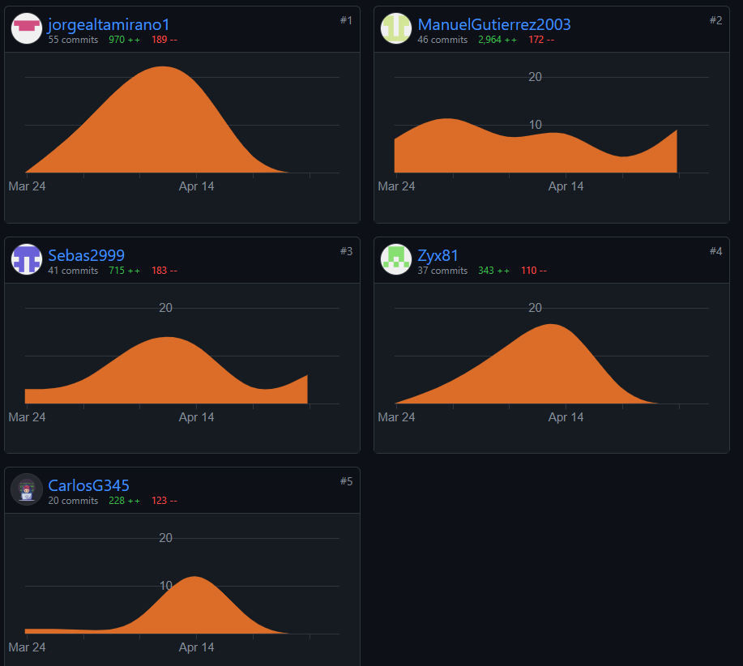
- TP

  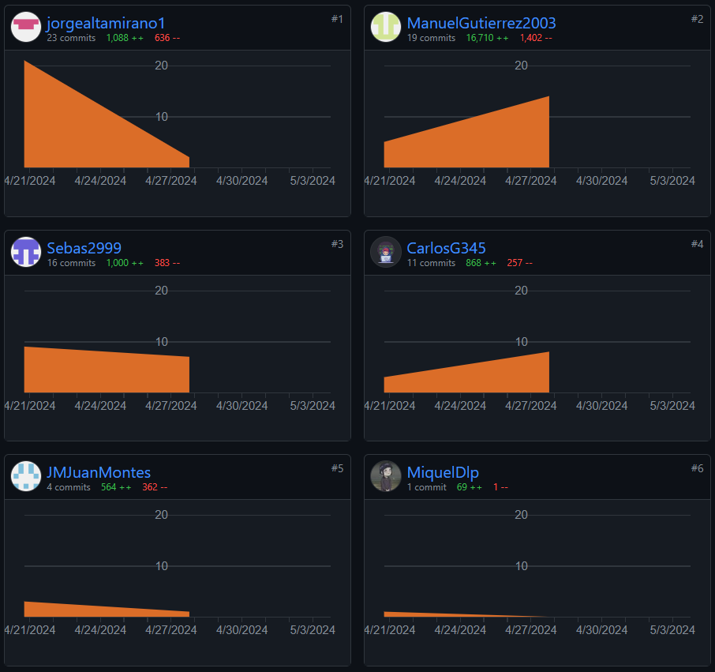
- TB2

  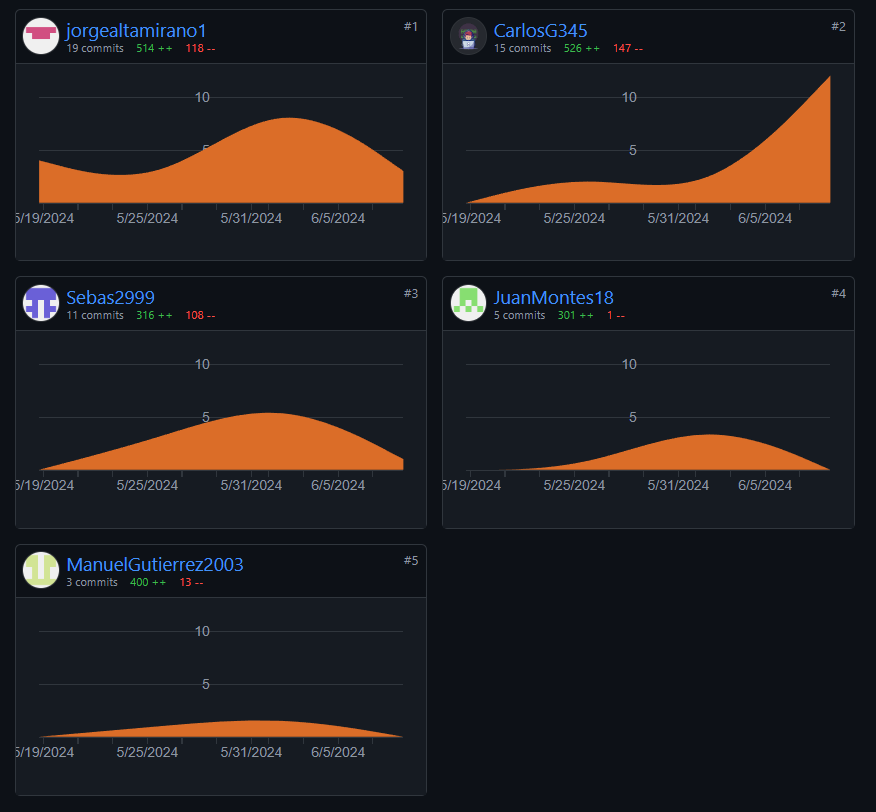
- TF

  - Frontend
  
    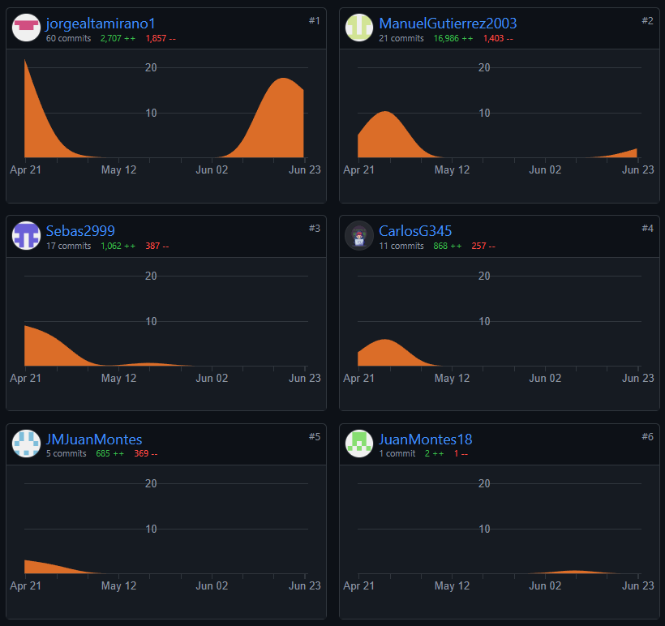
  - Backend
  
    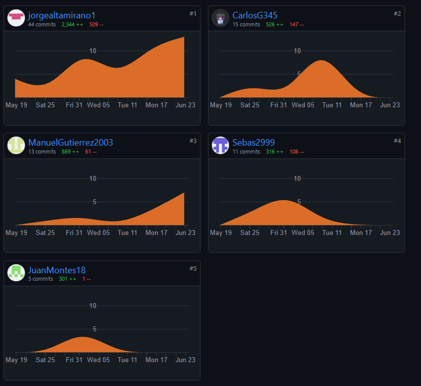

---

# Contenido

- [Student Outcome](#student-outcome)

- [Capítulo I: Introducción](#capítulo-i-introducción)

- [1.1. Startup Profile](#11-startup-profile)
  - [1.1.1. Descripción de la Startup](#111-descripción-de-la-startup)
  - [1.1.2. Perfiles de integrantes del equipo](#112-perfiles-de-integrantes-del-equipo)
- [1.2. Solution Profile](#12-solution-profile)

  - [1.2.1 Antecedentes y problemática](#121-antecedentes-y-problemática)
  - [1.2.2 Lean UX Process.](#122-lean-ux-process)
    - [1.2.2.1. Lean UX Problem Statements.](#1221-lean-ux-problem-statements)
    - [1.2.2.2. Lean UX Assumptions.](#1222-lean-ux-assumptions)
    - [1.2.2.3. Lean UX Hypothesis Statements.](#1223-lean-ux-hypothesis-statements)
    - [1.2.2.4. Lean UX Canvas.](#1224-lean-ux-canvas)

- [1.3. Segmentos objetivo](#13-segmentos-objetivo)

- [Capítulo II: Requirements Elicitation & Analysis](#capítulo-ii-requirements-elicitation--analysis)

- [2.1. Competidores](#21-competidores)

  - [2.1.1. Análisis competitivo]()
  - [2.1.2. Estrategias y tácticas frente a competidores](#211-análisis-competitivo)

- [2.2. Entrevistas](#22-entrevistas)

  - [2.2.1. Diseño de entrevistas](#221-diseño-de-entrevistas)
  - [2.2.3. Análisis de entrevistas](#223-análisis-de-entrevistas)

- [2.3. Needfinding](#23-needfinding)

  - [2.3.1. User Personas](#231-user-personas)
  - [2.3.2. User Task Matrix](#232-user-task-matrix)
  - [2.3.3. User Journey Mapping](#233-user-journey-mapping)
  - [2.3.4. Empathy Mapping](#234-empathy-mapping)
  - [2.3.5. As-is Scenario Mapping](#235-as-is-scenario-mapping)

- [2.4. Ubiquitous Language](#24-ubiquitous-language)

- [Capítulo III: Requirements Specification](#capítulo-iii-requirements-specification)

- [3.1. To-Be Scenario Mapping](#31-to-be-scenario-mapping)

- [3.2. User Stories](#32-user-stories)

- [3.3. Impact Mapping](#33-impact-mapping)

- [3.4. Product Backlog](#34-product-backlog)

- [Capítulo IV: Product Design](#capítulo-iv-product-design)

- [4.1. Style Guidelines](#41-style-guidelines)

  - [4.1.1. General Style Guidelines](#411-general-style-guidelines)
  - [4.1.2. Web Style Guidelines](#412-web-style-guidelines)

- [4.2. Information Architecture](#42-information-architecture)

  - [4.2.1. Organization Systems](#421-organization-systems)
  - [4.2.2. Labeling Systems](#422-labeling-systems)
  - [4.2.3. SEO Tags and Meta Tag](#423-seo-tags-and-meta-tags)
  - [4.2.4. Searching Systems](#424-searching-systems)
  - [4.2.5. Navigation Systems](#425-navigation-systems)

- [4.3. Landing Page UI Design](#43-landing-page-ui-design)

  - [4.3.1. Landing Page Wireframe](#431-landing-page-wireframe)
  - [4.3.2. Landing Page Mock-up](#432-landing-page-mock-up)

- [4.4. Web Applications UX/UI Design](#44-web-applications-uxui-design)

  - [4.4.1. Web Applications Wireframes](#441-web-applications-wireframes)
  - [4.4.2. Web Applications Wireflow Diagrams](#442-web-applications-wireflow-diagrams)
  - [4.4.2. Web Applications Mock-ups](#442-web-applications-mock-ups)
  - [4.4.3. Web Applications User Flow Diagrams](#443-web-applications-user-flow-diagrams)

- [4.5. Web Applications Prototyping](#45-web-applications-prototyping)

- [4.6. Domain-Driven Software Architecture](#46-domain-driven-software-architecture)

  - [4.6.1. Software Architecture Context Diagram](#461-software-architecture-context-diagram)
  - [4.6.2. Software Architecture Container Diagrams](#462-software-architecture-container-diagrams)
  - [4.6.3. Software Architecture Components Diagrams](#463-software-architecture-components-diagrams)

- [4.7. Software Object-Oriented Design](#47-software-object-oriented-design)

  - [4.7.1. Class Diagrams](#471-class-diagrams)
  - [4.7.2. Class Dictionary](#472-class-dictionary)

- [4.8. Database Design](#48-database-design)

  - [4.8.1. Database Diagram](#481-database-diagram)

- [Capítulo V: Product Implementation, Validation & Deployment](#capítulo-v-product-implementation-validation--deployment)

- [5.1. Software Configuration Management](#51-software-configuration-management)

  - [5.1.1. Software Development Environment Configuration](#511-software-development-environment-configuration)
  - [5.1.2. Source Code Management](#512-source-code-management)
  - [5.1.3. Source Code Style Guide & Conventions](#513-source-code-style-guide--conventions)
  - [5.1.4. Software Deployment Configuration](#514-software-deployment-configuration)

- [5.2. Landing Page, Services & Applications Implementation](#52-landing-page-services--applications-implementation)

  - [5.2.1. Sprint 1](#521-sprint-1)
    - [5.2.1.1. Sprint Planning 1](#5211-sprint-planning-1)
    - [5.2.1.2. Sprint Backlog 1](#5212-sprint-backlog-1)
    - [5.2.1.3. Development Evidence for Sprint Review](#5213-development-evidence-for-sprint-review)
    - [5.2.1.4. Testing Suite Evidence for Sprint Review](#5214-testing-suite-evidence-for-sprint-review)
    - [5.2.1.5. Execution Evidence for Sprint Review](#5215-execution-evidence-for-sprint-review)
    - [5.2.1.6. Services Documentation Evidence for Sprint Review](#5216-services-documentation-evidence-for-sprint-review)
    - [5.2.1.7. Software Deployment Evidence for Sprint Review](#5217-software-deployment-evidence-for-sprint-review)
    - [5.2.1.8. Team Collaboration Insights during Sprint](#5218-team-collaboration-insights-during-sprint)
  - [5.2.2. Sprint 2](#522-sprint-2)
    - [5.2.2.1. Sprint Planning 2](#5221-sprint-planning-2)
    - [5.2.2.2. Sprint Backlog 2](#5222-sprint-backlog-2)
    - [5.2.2.3. Development Evidence for Sprint Review](#5223-development-evidence-for-sprint-review)
    - [5.2.2.4. Testing Suite Evidence for Sprint Review](#5224-testing-suite-evidence-for-sprint-review)
    - [5.2.2.5. Execution Evidence for Sprint Review](#5225-execution-evidence-for-sprint-review)
    - [5.2.2.6. Services Documentation Evidence for Sprint Review](#5226-services-documentation-evidence-for-sprint-review)
    - [5.2.2.7. Software Deployment Evidence for Sprint Review](#5227-software-deployment-evidence-for-sprint-review)
    - [5.2.2.8. Team Collaboration Insights during Sprint](#5228-team-collaboration-insights-during-sprint)
  - [5.2.3. Sprint 3](#523-sprint-3)
    - [5.2.3.1. Sprint Planning 3](#5231-sprint-planning-3)
    - [5.2.3.2. Sprint Backlog 3](#5232-sprint-backlog-3)
    - [5.2.3.3. Development Evidence for Sprint Review](#5233-development-evidence-for-sprint-review)
    - [5.2.3.4. Testing Suite Evidence for Sprint Review](#5234-testing-suite-evidence-for-sprint-review)
    - [5.2.3.5. Execution Evidence for Sprint Review](#5235-execution-evidence-for-sprint-review)
    - [5.2.3.6. Services Documentation Evidence for Sprint Review](#5236-services-documentation-evidence-for-sprint-review)
    - [5.2.3.7. Software Deployment Evidence for Sprint Review](#5237-software-deployment-evidence-for-sprint-review)
    - [5.2.3.8. Team Collaboration Insights during Sprint](#5238-team-collaboration-insights-during-sprint)
  - [5.2.4. Sprint 4](#524-sprint-4)
    - [5.2.4.1. Sprint Planning 4](#5241-sprint-planning-4)
    - [5.2.4.2. Sprint Backlog 4](#5242-sprint-backlog-4)
    - [5.2.4.3. Development Evidence for Sprint Review](#5243-development-evidence-for-sprint-review)
    - [5.2.4.4. Testing Suite Evidence for Sprint Review](#5244-testing-suite-evidence-for-sprint-review)
    - [5.2.4.5. Execution Evidence for Sprint Review](#5245-execution-evidence-for-sprint-review)
    - [5.2.4.6. Services Documentation Evidence for Sprint Review](#5246-services-documentation-evidence-for-sprint-review)
    - [5.2.4.7. Software Deployment Evidence for Sprint Review](#5247-software-deployment-evidence-for-sprint-review)
    - [5.2.4.8. Team Collaboration Insights during Sprint](#5248-team-collaboration-insights-during-sprint)

- [5.3. Validation Interviews](#53-validation-interviews)

  - [5.3.1. Diseño de Entrevistas](#531-diseño-de-entrevistas)
  - [5.3.2. Registro de Entrevistas](#532-registro-de-entrevistas)
  - [5.3.3. Evaluaciones según heurísticas](#533-evaluaciones-según-heurísticas)

- [5.4. Video About-the-Product](#54-video-about-the-product)

- [Conclusiones](#conclusiones)

  - [Conclusiones y recomendaciones](#conclusiones-y-recomendaciones)

- [Video About-the-Team](#video-about-the-team)

- [Bibliografía](#bibliografía)

- [Anexos](#anexos)

---

# Student Outcome

Criterio: Capacidad de comunicarse efectivamente con un rango de audiencias.
En el siguiente cuadro se describe las acciones realizadas y enunciados de
conclusiones por parte del grupo, que permiten sustentar el haber alcanzado el logro
del ABET – EAC - Student Outcome 3

| Criterio específico                                                                                                                                                                    | Acciones realizadas                                                                                                                                                                                                                                                                                                                                                                                                                                                                                                                                                                                                                                                                                                                                                                                                                                                                                                                                                                                                                                                                                                                                                                                                                                                                                                                                                                                                                                                                                                                                                                                                                                                                                                                                                                                                                                                                                                                                                                                                                                                                                                                                                                                                                                                                                                                                                                                                                                                                                                                                                                                                                                                                                                                                                                                                                                                                                                                                                                                                                                                                                                                                                                                                                                                                                                                                                                                                                                                                                                                                                                                                                                                                                                                                                                                                                                                                                                                                                                                                                                                                                                                                                                                                                                                                                                                                                                                                                                                                                                                                                                                                                                                                                                                                                                                                                                                                                                                                                                                                                               | Conclusiones                                                                                                                                                                                                                                                                                                                                                                                                        |
| -------------------------------------------------------------------------------------------------------------------------------------------------------------------------------------- | ------------------------------------------------------------------------------------------------------------------------------------------------------------------------------------------------------------------------------------------------------------------------------------------------------------------------------------------------------------------------------------------------------------------------------------------------------------------------------------------------------------------------------------------------------------------------------------------------------------------------------------------------------------------------------------------------------------------------------------------------------------------------------------------------------------------------------------------------------------------------------------------------------------------------------------------------------------------------------------------------------------------------------------------------------------------------------------------------------------------------------------------------------------------------------------------------------------------------------------------------------------------------------------------------------------------------------------------------------------------------------------------------------------------------------------------------------------------------------------------------------------------------------------------------------------------------------------------------------------------------------------------------------------------------------------------------------------------------------------------------------------------------------------------------------------------------------------------------------------------------------------------------------------------------------------------------------------------------------------------------------------------------------------------------------------------------------------------------------------------------------------------------------------------------------------------------------------------------------------------------------------------------------------------------------------------------------------------------------------------------------------------------------------------------------------------------------------------------------------------------------------------------------------------------------------------------------------------------------------------------------------------------------------------------------------------------------------------------------------------------------------------------------------------------------------------------------------------------------------------------------------------------------------------------------------------------------------------------------------------------------------------------------------------------------------------------------------------------------------------------------------------------------------------------------------------------------------------------------------------------------------------------------------------------------------------------------------------------------------------------------------------------------------------------------------------------------------------------------------------------------------------------------------------------------------------------------------------------------------------------------------------------------------------------------------------------------------------------------------------------------------------------------------------------------------------------------------------------------------------------------------------------------------------------------------------------------------------------------------------------------------------------------------------------------------------------------------------------------------------------------------------------------------------------------------------------------------------------------------------------------------------------------------------------------------------------------------------------------------------------------------------------------------------------------------------------------------------------------------------------------------------------------------------------------------------------------------------------------------------------------------------------------------------------------------------------------------------------------------------------------------------------------------------------------------------------------------------------------------------------------------------------------------------------------------------------------------------------------------------------------------------------------------------------- | ------------------------------------------------------------------------------------------------------------------------------------------------------------------------------------------------------------------------------------------------------------------------------------------------------------------------------------------------------------------------------------------------------------------- |
| Comunica oralmente sus ideas y/o resultados con objetividad a públicos de diferentes especialidades y niveles jerárquicos, en el marco del desarrollo de un proyecto de ingeniería.    | Altamirano Saenz, Jorge Armando _TB1_ Compartí todas mis ideas durante las reuniones de equipo para desarrollar el proyecto. Además, llevé a cabo una entrevista con un potencial usuario, explicándole el propósito de la misma y la información que necesitaba obtener. _TP1_ En este segundo entregable, continúo comunicando mis ideas y resultados de manera objetiva a diversas audiencias en el marco del proyecto de ingeniería. Conforme avanzamos en el desarrollo del proyecto, adapto mi mensaje para satisfacer las necesidades particulares de cada audiencia, garantizando la claridad y exactitud en mis comunicaciones en todo momento. _TB2_ Para este entregable colabore con uno de mis compañeros para hacer uno de los endpoints, ademas que tambien diseñe las preguntas para las entrevistas de validadcion. _TF1_   Flores Manrique, Sebastian Enrique _TB1_ Participé en reuniones semanales con el equipo de desarrollo, compartiendo actualizaciones sobre el progreso del proyecto y discutiendo los próximos pasos. _TP1_ En mi trayectoria como estudiante de ingeniería, he adquirido la habilidad de expresar mis conceptos y hallazgos de forma nítida y imparcial a distintas audiencias, sin importar su campo de especialización o posición jerárquica. En el transcurso de proyectos, he demostrado la capacidad de comunicar información técnica de manera clara y fácil de entender, ajustando mi mensaje según las necesidades y nivel de conocimiento de quienes me escuchan. _TB2_ En este entregable me me dedique a implementar uno de los endpoints con sus respectivos metodos, y use un enfoque de Domain Drive Design. _TF1_   Guimaraes Escalante, Carlos Eduardo _TB1_ Presenté actualizaciones detalladas sobre el progreso del desarrollo, discutiendo los hitos alcanzados y los próximos pasos a seguir. Durante estas reuniones, aseguré una comunicación clara y efectiva. _TP1_ Demostré habilidades efectivas de comunicación al presentar informes detallados sobre el progreso del desarrollo, destacando los hitos alcanzados y delineando los próximos pasos a seguir. Mi capacidad para garantizar una comunicación clara y efectiva durante estas reuniones facilitó una comprensión mutua y una coordinación eficiente entre los miembros del equipo. _TB2_ En este entregable desarrolle de manera efectivas los endpoints correspondiente utilizando un enfoque de Domain Driven Design para una correcta estructuracion del proyecto _TF1_   Gutierrez Zumaeta, Manuel Alonso _TB1_ Presenté el proyecto de ingeniería de software a mis compañeros de equipo en una sesión de revisión, explicando los conceptos clave y respondiendo preguntas. _TP1_ Demostré habilidades efectivas de presentación al exponer el proyecto de ingeniería de software ante mis compañeros de equipo durante una sesión de revisión. Durante esta presentación, expliqué los conceptos clave de manera clara y concisa, y respondí de manera satisfactoria a las preguntas planteadas, contribuyendo así al entendimiento general del proyecto por parte del equipo. _TB2_ Mi enfoque en esta etapa del proyecto fue facilitar la integración de las funcionalidades del backend. Me encargué de organizar reuniones para enseñarles a mis compañeros de equipo las nuevas funcionalidades que se iban añadiendo o cambiando. _TF1_   Montes Figueroa, Juan Eduardo _TB1_ Presenté las nuevas actualizaciones de los componentes del informe redactados y recopilé comentarios y sugerencias de mis compañeros de equipo. _TP1_ Facilité la revisión y mejora continua del informe al presentar las nuevas actualizaciones de los componentes ante mis compañeros de equipo. Durante esta sesión, recopilé activamente comentarios y sugerencias, promoviendo así un proceso colaborativo que enriqueció el contenido y la calidad del informe. _TB2_ Para esta entrega he participado en la implementacion de uno de los endpoints de nuestro trabajo _TF1_                                                                                                                                                                                                                                                                                                                                                                                                                                                                                                                                                                                                                                                                                                                                                                                                                                                                                                     | Todos los integrantes del grupo colaboraron eficazmente en un proyecto de ingeniería, compartiendo ideas, implementando endpoints y ajustando comunicaciones según la audiencia. Utilizamos un enfoque de Domain Driven Design y trabajamos activamente en mejorar la interacción y el entendimiento dentro del equipo a través de presentaciones y reuniones, facilitando así el desarrollo continuo del proyecto. |
| Comunica en forma escrita ideas y/o resultados con objetividad a públicos de diferentes especialidades y niveles jerárquicos, en el marco del desarrollo de un proyecto de ingeniería. | Altamirano Saenz, Jorge Armando _TB1_ Redacté las ideas más importantes de cada componente que me correspondía trabajar, luego tras recopilar información de fuentes externas, terminé de completar cada uno de los puntos. _TP1_ Demostré habilidades de comunicación escrita al redactar de manera objetiva las ideas principales de cada componente asignado en el proyecto de ingeniería. Después de recopilar información de fuentes externas pertinentes, completé de manera precisa y detallada cada punto, asegurando la claridad y la objetividad en la presentación de los resultados. _TB2_ En esta tercera fase, continué con el desarrollo del backend y realicé entrevistas de validación, documentando detalladamente los avances y desafíos en informes técnicos. _TF1_ En esta entrega hice la implementación de la seguridad basada en tokens en nuestro trabajo en el backend y frontend, además también colabore en la corrección de algunas partes de la documentación.  Flores Manrique, Sebastian Enrique _TB1_ Trabajé en estrecha colaboración con otros estudiantes dentro del equipo de proyecto. Esto implicó comunicar eficazmente ideas y resultados a personas con diferentes antecedentes y conocimientos técnicos, asegurando una comprensión mutua y una integración fluida de los diferentes componentes del proyecto. _TP1_ Desarrollé habilidades efectivas de colaboración al trabajar estrechamente con otros estudiantes dentro del equipo de proyecto de ingeniería. Esta colaboración requirió una comunicación eficaz de ideas y resultados a individuos con diversos antecedentes y niveles de conocimientos técnicos, lo que facilitó una comprensión mutua y una integración fluida de los diferentes componentes del proyecto para alcanzar los objetivos comunes. _TB2_ Para este entregable, redacté varios documentos que detallan el proceso de desarrollo del backend, incluyendo desafíos y soluciones propuestas, esto a mantener informados a todos los miembros del equipo y facilitaron discusiones constructivas sobre cómo mejorar nuestro trabajo. _TF1_ Para este ultimo entregable revise la documentación del proyecto he hice las correcciones según el feedback que dio el profesor, también colabora con mi demás compañeros en algunas partes de la implementación de código  Guimaraes Escalante, Carlos Eduardo _TB1_ Redacté informes técnicos claros y concisos que comunicaban de manera objetiva las ideas y los resultados del proyecto de ingeniería. Estos informes estaban destinados a públicos de diferentes especialidades y niveles jerárquicos, asegurando que la información fuera accesible y comprensible para todos los interesados. _TP1_ Elaboré informes técnicos claros y concisos que transmitían de manera objetiva las ideas y resultados del proyecto de ingeniería, dirigidos a audiencias con diversas especialidades y niveles jerárquicos. Garanticé que la información fuera accesible y comprensible para todos los interesados, facilitando así una comunicación efectiva y una comprensión mutua dentro del contexto del proyecto. _TB2_ Continué escribiendo informes claros sobre nuestro progreso en el backend. Mis informes estaban bien estructurados y adaptados para asegurar que se pueda entender el estado del proyecto y los problemas técnicos enfrentados, facilitando la toma de decisiones informadas. _TF1_ Implemente un nuevo bounded context en el frontend y backend con la ayuda de mis compañeros que el servicio cumpla con los servicios ofrecidos en la landing page, además que también he hecho correcciones en la documentación.  Gutierrez Zumaeta, Manuel Alonso _TB1_ Participé en la redacción de distintas partes del informe, poniendo énfasis en el diseño y la creación de historias de usuario. Asimismo, me encargué de redactar la sección que abordaba a nuestros competidores y sus tácticas. _TP1_ Contribuí activamente en la redacción de varias secciones del informe, centrándome especialmente en el diseño y la elaboración de historias de usuario. Además, asumí la responsabilidad de redactar la sección que analizaba a nuestros competidores y sus estrategias, garantizando así una presentación completa y bien fundamentada del contexto competitivo dentro del informe del proyecto. _TB2_ En este sprint, redacté sobre el desarrollo y las pruebas del backend, asegurándome de documentar cada paso. Presenté la información de manera que fuera fácil de seguir para todos, contribuyendo al entendimiento y alineación del equipo respecto a los objetivos del proyecto. _TF1_ Para esta ultima entrega colabora en la implementación de un nuevo bounded context, elabore sus respectivos endpoints tanto en el frontend y backend y por ultimo realice correcciones a la documentación.  Montes Figueroa, Juan Eduardo _TB1_ Me enfoqué en investigar a fondo el tema relevante para el proyecto de ingeniería, utilizando fuentes confiables y actualizadas. Luego, realicé un análisis crítico de la información recopilada para identificar las ideas clave y los resultados relevantes. _TP1_ Demostré un compromiso con la investigación exhaustiva al profundizar en el tema relevante para el proyecto de ingeniería, empleando fuentes confiables y actualizadas. Posteriormente, llevé a cabo un análisis crítico de la información recolectada para discernir las ideas principales y los resultados pertinentes, contribuyendo así a una comprensión sólida y fundamentada del contexto del proyecto. _TB2_ Este tercer entregable involucró redactar documentos detallados sobre nuestras últimas actualizaciones y el estado del desarrollo del backend, enfocándome en clarificar cada punto.    _TF1_ En esta entrega realize los métodos CRUD para los endpoints del nuevo bounded context, también colabore en la corrección de la documentación en la parte de los technical stories |Todos los integrantes del grupo colaboraron contribuyeron significativamente a un proyecto de ingeniería a través de comunicación eficaz, colaboración intensa y documentación detallada. Cada uno se enfocó en redactar y desarrollar componentes del backend, mejorar la comunicación interna, y asegurar la comprensión y coordinación dentro del equipo, manteniendo una clara alineación con los objetivos del proyecto.|

---

# Capítulo I: Introducción

## 1.1. Startup Profile

### 1.1.1. Descripción de la Startup

Los luminosos es una startup creada por estudiantes de la Facultad de Ingeniería de la carrera de Ingeniería de Software. Esta empresa tiene el propósito de desarrollar una solución web con el uso de tecnologías modernas para la ayuda de los procesos que se tienen presente en una consultoría de traumatología. Con la aplicación web MedSystem se logrará satisfacer estas necesidad por parte de los especialistas de traumatología y los clientes.

| **Misión**                                                                                                                                                                                                                                | **Visión**                                                                                                                                                                                                                                                              |
| ----------------------------------------------------------------------------------------------------------------------------------------------------------------------------------------------------------------------------------------- | ----------------------------------------------------------------------------------------------------------------------------------------------------------------------------------------------------------------------------------------------------------------------- |
| La misión de Los Luminosos es facilitar la atención médica en la especialización de traumatología a través de MedSystem para mejorar los procesos de una consultoría y la experiencia de los especialistas o doctores y de los pacientes. | Nuestra visión es ser reconocidos por nuestra capacidad de mejorar la atención médica por medio de soluciones tecnológicas que mejoren la eficiencia de los distintos servicios que ofrece el área de traumatología, además de mejorar el servicio hacia los pacientes. |

---

### 1.1.2. Perfiles de integrantes del equipo

|                                                                                          | Miembros del equipo                 | Código de estudiante | Carrera                | Conocimientos/Habilidades                                                                                                                                                                                                                                                                                                                                                                                                                                                                                                                                                                           |
| ---------------------------------------------------------------------------------------- | ----------------------------------- | -------------------- | ---------------------- | --------------------------------------------------------------------------------------------------------------------------------------------------------------------------------------------------------------------------------------------------------------------------------------------------------------------------------------------------------------------------------------------------------------------------------------------------------------------------------------------------------------------------------------------------------------------------------------------------- | 
| 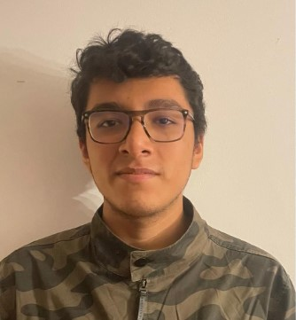     | Gutierrez Zumaeta Manuel Alonso     | u202112353           | Ingeniería de Software | Soy un estudiante de la carrera de ingeniería de software de la UPC, tengo 20 años. Tengo experiencia usando lenguajes de programación como C++, Python y JS. Además puedo ayudar al equipo en todas las tareas que se realicen para lograr un resultado óptimo.                                                                                                                                                                                                                                                                                                                                    |
|      | Guimaraes Escalante, Carlos Eduardo | u202210364           | Ingeniería de Software | Soy estudiante de la carrera de Ingeniería de Software, estoy cursando el tercer ciclo de mi carrera y tengo 17 años. Soy una persona responsable y puntual, por lo que me gusta terminar y presentar los trabajos en los tiempos establecidos. Siempre me ha gustado la innovación y la creación de nuevas ideas. Estoy capacitado en algunos temas de edición de videos, y me considero bueno en programación. Voy a aportar al grupo de manera proactiva e intentaré aportar ideas que ayuden a mejorar el trabajo, siempre intentando mantener un ambiente positivo dentro del área de trabajo. |

|   | Altamirano Saenz, Jorge Armando     | u202215888           | Ingeniería de Software | Me llamo Jorge Altamirano, tengo 19 años. Tengo conocimientos en programación en los lenguajes de C++, Python, Java y C# básico. Me considero una persona responsable e investigadora y creo que puedo aportar con ideas propias al equipo.                                                                                                                                                                                                                                                                                                                                                         |     
| 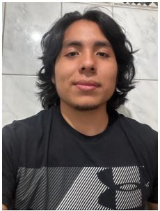       | Montes Figueroa, Juan Eduardo       | u202210775           | Ingeniería de Software | Mi nombre es Juan Montes, tengo 19 años, tengo conocimientos en C++, asimismo poseo conocimientos básicos en Java y también en diseño de imágenes tanto en aplicaciones complicadas como Photoshop hasta páginas webs que te dan funciones similares. Puedo aportar en el equipo con ideas, confianza y atención a los detalles.                                                                                                                                                                                                                                                                    |     
|  | Flores Manrique, Sebastian Enrique  | u201611430           | Ingeniería de Software | Soy estudiante de la carrera de Ingeniería de software. Actualmente cursando el quinto ciclo de la carrera. Me considero una persona responsable y dispuesto a ayudar en lo que haga falta. Tengo conocimientos en lenguaje de programación de C++, Python y un poco de conocimiento en desarrollo web.                                                                                                                                                                                                                                                                                             |

## 1.2 Solution Profile

### 1.2.1. Antecedentes y problemática

Muchos pacientes necesitan atención que requiere una toma de decisiones conjunta entre múltiples actores y/o servicios. La evaluación de interconsultas es tediosa e ineficaz debido a la estructura actual de atención en la mayoría de los consultorios y clínicas. Los pacientes con diabetes de pie que están hospitalizados en los pabellones de medicina son un ejemplo típico en el que la demora en los procedimientos o intervenciones quirúrgicas realizadas por los servicios de traumatología puede resultar en complicaciones graves e incluso en la muerte del paciente.

La Encuesta Nacional de Hogares (ENAHO) de 2022 revela que 7 de cada 10 personas que necesitaron atención médica no la obtuvieron . El 35 % de ellos mencionó demoras como la razón principal, mientras que razones como distancia y falta de seguro solo fueron citadas por el 13 % y el 3 %, respectivamente.

La situación actual enfatiza la importancia de una solución tecnológica que facilite la comunicación entre pacientes y especialistas, optimice el seguimiento de tratamientos, centralice el almacenamiento de historias clínicas y simplifique la gestión de citas. Además, se vuelve necesario incorporar consultas virtuales y recordatorios automáticos de citas para mejorar la accesibilidad y la eficiencia de la atención médica en el campo de la traumatología.

Se aplica la técnica 5W-2H que permite analizar las necesidades de nuestros usuarios al realizar una reflexión de las características principales de la situación general. Presentamos la información obtenida de las respuestas a las preguntas planteadas en la técnica.

- **What(¿Qué?)**

  El problema radica en la falta de un sistema integral y automatizado en el área de traumatología, lo que resulta en largos tiempos de espera para programar consultas, cirugías y exámenes. Esto afecta la experiencia del paciente y puede obstaculizar su recuperación.

- **When(¿Cuándo?)**

  El problema se manifiesta en el momento en que los pacientes requieren atención médica traumatológica, especialmente en situaciones que demandan decisiones rápidas y coordinadas entre múltiples actores. Las demoras pueden ocurrir en cualquier momento del proceso de atención, desde la consulta inicial hasta la realización de procedimientos o intervenciones quirúrgicas.

- **Where(¿Dónde?)**

  Los problemas se observan en la atención médica traumatológica, tanto en consultorios como en clínicas. Específicamente, se destacan situaciones como la evaluación de interconsultas y la gestión de citas, donde la estructura actual de atención presenta deficiencias.

- **Who(¿Quién?)**

  El problema afecta tanto a pacientes como a especialistas en traumatología, así como a otros actores involucrados en el proceso de atención médica, como personal administrativo y de apoyo.

- **Why(¿Por qué?)**

  El problema surge debido a la falta de comunicación eficiente entre los diferentes actores involucrados, la falta de centralización en el almacenamiento de historias clínicas, la complejidad en la gestión de citas y la falta de acceso a la atención médica oportuna.

- **How(¿Cómo?)**

  El problema se diferencia del estado óptimo por la presencia de demoras en la atención, complicaciones graves para los pacientes y una falta de accesibilidad generalizada. La tendencia indica una necesidad creciente de soluciones tecnológicas que mejoren la comunicación, la gestión de datos y la accesibilidad en la atención traumatológica.

- **How much(¿Cuánto?)**

  La Encuesta Nacional de Hogares (ENAHO) de 2022 revela que 7 de cada 10 personas que necesitaron atención médica no la obtuvieron, lo que indica que una gran cantidad de personas son afectadas por problemas de acceso y gestión en el área de salud. Los costos asociados pueden ser significativos, tanto en términos de salud pública como en la calidad de vida de los pacientes y la eficiencia de los servicios médicos.

### 1.2.2. Lean UX Process

### 1.2.2.1. Lean UX Problem Statements

El estado actual de la atención médica en el campo de la traumatología se ha centrado principalmente en la prestación de servicios tradicionales, lo que ha resultado en demoras significativas en los procedimientos, interconsultas ineficaces y una falta de accesibilidad para muchos pacientes. Lo que los productos/servicios existentes no logran abordar es la integración efectiva de tecnología para facilitar la comunicación entre doctores y pacientes, optimizar el seguimiento de tratamientos, centralizar el almacenamiento de historias clínicas y simplificar la gestión de citas.

Nuestro producto, MedSystem, abordará esta brecha mediante el desarrollo de una solución web innovadora que aprovecha tecnologías modernas. Nos enfocaremos en proporcionar una plataforma que permita a los pacientes sacar citas en línea, acceder fácilmente a su historial médico, realizar consultas virtuales y recibir recordatorios automáticos de citas. Además, facilitaremos la comunicación fluida entre doctores y pacientes, así como entre doctores, para mejorar la coordinación del cuidado.

Nuestro enfoque inicial será dirigirnos tanto a doctores especialistas en traumatología como a pacientes con necesidades específicas de atención médica traumatológica, como aquellos con lesiones deportivas, fracturas o condiciones crónicas relacionadas. Sabremos que tenemos éxito cuando veamos una disminución significativa en las demoras en los procedimientos, un aumento en la satisfacción del paciente, una mayor eficiencia en la coordinación del cuidado y una mejora en la accesibilidad general a la atención médica en el campo de la traumatología.

### 1.2.2.2. Lean UX Assumptions

- **Business outcomes:**

  1. El usuario necesita optimizar la gestión de citas y procesos en el área de traumatología de manera eficiente.
  2. Las necesidades del usuario se resolverán a través de una aplicación web integrada en línea que permite programar citas, cirugías, exámenes y seguimiento de tratamientos.
  3. Los usuarios son pacientes que buscan atención en el área de traumatología y profesionales médicos especializados en el tratamiento.
  4. El usuario desea una interfaz fácil de usar para reservar citas, acceder a los registros médicos y comunicarse con los proveedores de atención médica.
  5. A través de nuestro servicio, los usuarios también pueden obtener consultas virtuales, recordatorios automáticos de citas y análisis de datos para mejorar los procesos.
  6. Ganaré dinero cobrando a los proveedores de atención médica tarifas de suscripción por el uso de la plataforma y posiblemente ofreciendo características premium por un cargo adicional.
  7. Mi competencia principal es el software de programación de citas independientes y los sistemas de gestión hospitalaria actuales.
  8. Con una solución más completa y específicamente diseñada para la atención traumatológica, que incluye características como consultas virtuales y recordatorios automáticos, venceremos a la competencia.
  9. Mi mayor riesgo es la resistencia de los proveedores de atención médica a adoptar nuevas tecnologías o integrarlas en sus sistemas existentes.
  10. Mediante la capacitación y el soporte extensivos al personal de atención médica durante el proceso de incorporación y la demostración de los claros beneficios del uso de la plataforma, reduciremos el riesgo.

- **User Assumptions:**

  - **¿Quién es el usuario?**

    Pacientes que necesitan atención traumatológica y médicos especializados en el área.

  - **¿Dónde encaja nuestro producto en su trabajo o vida?**

    El producto servirá como un lugar central para administrar citas traumatológicas, registros médicos y comunicación entre pacientes y proveedores de atención médica.

  - **¿Qué problema tiene nuestro producto? ¿Cómo se resuelve?**

    Reduce los tiempos de espera, facilita la programación de citas, centraliza los registros médicos para una toma de decisiones informada y permite consultas virtuales para mayor comodidad.

  - **¿Cuándo y cómo es usado nuestro producto?**

    Los usuarios pueden acceder a la plataforma desde una variedad de dispositivos, como computadoras de escritorio y teléfonos inteligentes, para reservar citas, revisar registros médicos y comunicarse con proveedores de atención médica desde casa, el trabajo o en movimiento.

  - **¿Qué características son importantes?**

    La programación de citas, el acceso a los registros médicos, las consultas virtuales y los recordatorios automáticos de citas mejoran la experiencia del paciente y el proceso de atención traumatológica.

  - **¿Cómo debe verse nuestro producto y comportarse?**

    El producto debe tener una interfaz limpia e intuitiva, ser fácil de navegar e integrarse perfectamente con los sistemas de atención médica actuales para los proveedores de atención médica. Además, debe ser fácil de usar y accesible para pacientes de todos los grupos demográficos.

- **User Benefits:**

  - **Acceso rápido y fácil a la atención médica en traumatología:** Los usuarios pueden obtener atención médica de forma rápida y sencilla, lo que les permite abordar sus necesidades de salud de manera oportuna.
  - **Gestión eficiente de citas y procesos médicos:** Los usuarios pueden gestionar sus citas y procesos médicos de manera eficiente, lo que reduce los tiempos de espera y mejora la organización en la clínica.
  - **Comunicación fluida entre pacientes y especialistas:** Los usuarios pueden comunicarse de manera fluida con los especialistas médicos, lo que facilita la discusión de problemas de salud y la obtención de orientación médica adecuada.
  - **Centralización de registros médicos para una toma de decisiones informada:** Los usuarios tienen acceso a sus registros médicos centralizados, lo que les permite tomar decisiones informadas sobre su salud y tratamiento en colaboración con los especialistas.

- **Business Assumptions:**

  - Existe demanda de un sistema de programación y gestión de citas simplificado en consultorios de traumatología.
  - Las instituciones médicas están dispuestas a adoptar nuevas tecnologías para mejorar sus procesos de programación de citas y gestión de pacientes.
  - Las consultas virtuales son efectivas para satisfacer las necesidades de pacientes y profesionales médicos en traumatología.
  - Las características y beneficios de la plataforma conducirán a una mayor eficiencia y una mayor satisfacción del paciente, lo que resultará en rentabilidad para el negocio.

- **Features:**
  - **Programación de citas en línea:** Permite a los usuarios reservar citas de manera conveniente a través de una interfaz fácil de usar.
  - **Consulta Virtual:** Permite a los usuarios tener consultas con especialistas médicos de forma remota mediante llamadas de video o audio.
  - **Historias clínicas centralizadas:** Proporciona a los usuarios acceso seguro a su historial médico, resultados de pruebas y planes de tratamiento.
  - **Recordatorios automatizados de citas:** Envía recordatorios automatizados a los usuarios por correo electrónico o SMS para notificarles sobre citas próximas.
  - **Canales de comunicación seguros:** Facilita la comunicación entre usuarios y profesionales médicos mientras se mantiene la seguridad de los datos y la confidencialidad del paciente.

### 1.2.2.3. Lean UX Hypothesis Statements

- Creemos que los tiempos de espera se reducirán significativamente si los pacientes puede programar citas de manera rápida y eficiente a través de una plataforma en línea
- Creemos que la comunicación entre especialistas mejorará si se implementa un sistema para compartir historias clínicas y procesos médicos de manera rápida y efectiva
- Creemos que la experiencia del paciente mejorará si se ofrecen consultas virtuales y recordatorios automáticos de citas

### 1.2.2.4. Lean UX Canvas

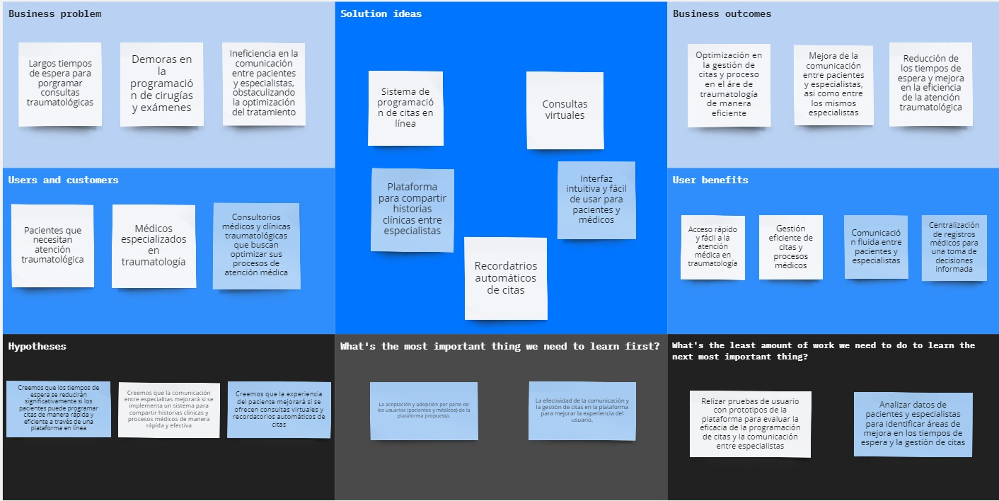

### 1.3. Segmentos objetivo

Nuestros segmentos objetivos en este se dividen en tres grupos fundamentales. Como primer segmento contamos con los pacientes que son los que han sufrido algún tipo de accidente y requieren una atención en el área de traumatología. En segundo lugar serían los médicos especialistas en el área de traumatología que requerirán de nuestro sistema para la gestión de sus citas y establecer una buena comunicación entre sus demás colegas de profesión, o laboratorios para una correcta coordinación de algún proceso que se lleve a cabo con el paciente. Por último están las consultorías o laboratorios quienes recibirán la información del paciente, brindada por los doctores, incluyendo procedimientos que requiera el paciente ya sea un tratamiento o algún tipo de examen.

---

 

# Capítulo II: Requirements Elicitation & Analysis

## 2.1 Competidores

### 2.1.1 Analisis Competitivo

<table>
  <tr>
    <th colspan="6" valign="top">Competitive Analysis Landscape</th>
  </tr>
  <tr>
    <td colspan="2" valign="top">¿Por qué llevar a cabo este análisis?</td>
    <td colspan="4" valign="top">El objetivo de este análisis es identificar las características de los competidores y encontrar maneras de diferenciarnos.</td>
  </tr>
  <tr>
    <td colspan="2" rowspan="2" valign="top">Startup y Competidores</td>
    <td valign="top">MedSystem</td>
    <td valign="top">Home Medical Management</td>
    <td valign="top">LOLIMSA</td>
    <td valign="top">SAMA</td>
  </tr>
  <tr>
    <td valign="top">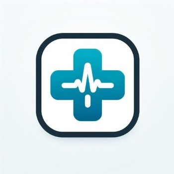</td>
    <td valign="top"></td>
    <td valign="top"></td>
    <td valign="top">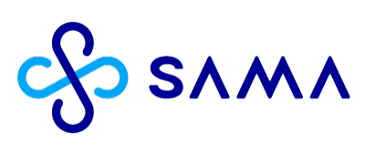</td>
  </tr>
  <tr>
    <td rowspan="2" valign="top">Perfil</td>
    <td valign="top">Overview</td>
    <td valign="top">Plataforma de gestión de procesos de un consultorio o clínica, que cuenta con diferentes funcionalidades para pacientes, doctores y laboratorios.</td>
    <td valign="top">Es una compañía que a través de una plataforma digital y sus profesionales, asegura la ejecución y calidad del servicio de salud domiciliaria.</td>
    <td valign="top">Es una empresa de software médico con soluciones tecnológicas para la gestión de centros médicos como clínicas y hospitales, farmacias y cadenas de farmacias y clínicas veterinarias. </td>
    <td valign="top">Es un consorcio de inversión dedicado a brindar servicios integrales de salud, especializados en la seguridad y salud en el trabajo. Contamos con distintas sedes a lo largo del norte del país, las cuales cuentan con el respaldo de la acreditación DIGESA/MINSA.
</td>

  </tr>
  <tr>
    <td valign="top">Ventaja competitiva ¿Qué valor ofrece a los clientes?</td>
    <td valign="top">Cuenta con distintas funcionalidades como un sistema de gestión de citas en línea que permita a los pacientes y doctores programar fácilmente consultas, programación de cirugías ,exámenes y seguimientos de tratamiento o recuperaciones.</td>
    <td valign="top">Utilizan inteligencia artificial e innovación para mejorar el servicio a los pacientes y facilitar la atención a los profesionales y prestadores de salud.</td>
    <td valign="top">Reduce entre 10 y 20% tus costos hospitalarios utilizando las mejores prácticas de Health Management con LOLCLI, el software de gestión hospitalaria más completo de Latinoamérica.</td>
    <td valign="top">Organización que orienta todos sus esfuerzos en realizar un servicio médico de calidad a través de la presentación de resultados confiables.</td>
  </tr>
  <tr>
    <td rowspan="2" valign="top">Perfil de Marketing</td>
    <td valign="top">Mercado objetivo</td>
    <td valign="top">Consultorio, clínicas y hospitales.</td>
    <td valign="top">Prestadores de salud, pacientes y personal médico</td>
    <td valign="top">Clínicas y hospitales</td>
    <td valign="top">Hospitales y clínicas</td>
  </tr>
  <tr>
    <td valign="top">Estrategias de marketing</td>
    <td valign="top">Publicidad por redes sociales y campañas.</td>
    <td valign="top">Publicidad por redes sociales.</td>
    <td valign="top">Publicidad por redes sociales.</td>
    <td valign="top">Publicidad por redes sociales.</td>
  </tr>
  <tr>
    <td rowspan="3" valign="top">Perfil de Producto</td>
    <td valign="top">Productos & Servicios</td>
    <td valign="top">Una plataforma para gestionar las citas médicas, programar cirugías, exámenes y seguimiento de tratamientos. Además, la plataforma almacena el historial clínico de los pacientes.</td>
    <td valign="top">Un software basado en el diseño centrado en el paciente, con información integrada, que utiliza la geolocalización y la valoración del servicio, como forma de optimizar la gestión del modelo.</td>
    <td valign="top">Software de gestión hospitalaria, impulsado por una plataforma de software de última generación que controla al detalle todas las actividades, desde que el paciente ingresa hasta que se retira del establecimiento</td>
    <td valign="top">Servicios integrales de salud:
-Exámenes médicos ocupacionales
-Monitores ocupacionales
-Vigilancia médica ocupacional
-Análisis de laboratorio
-radiografias digitales
</td>
  </tr>
  <tr>
    <td valign="top">Precios & Costos</td>
    <td valign="top">Varían según características de la clínica, con opciones de suscripción mensual o anual.</td>
    <td valign="top">Varían según el producto y pueden incluir tarifas de suscripción o costos de licencia.</td>
    <td valign="top">Los precios varían según el producto y pueden incluir tarifas de suscripción mensuales o costos de licencia.</td>
    <td valign="top">Los precios varían según el tamaño del hospital o clínica y las características específicas de la solución, con opciones de suscripción mensual o anual</td>
  </tr>
  <tr>
    <td valign="top">Canales de distribución (Web y/o Móvil)</td>
    <td valign="top">Principalmente a través de su sitio web oficial</td>
    <td valign="top">Principalmente a través de su sitio web, con posibilidad de acceso móvil. </td>
    <td valign="top">Principalmente a través de su sitio web oficial.</td>
    <td valign="top">Principalmente a través de su sitio web oficial.</td>
  </tr>
  <tr>
    <td rowspan="4" valign="top">Análisis SWOT</td>
    <td valign="top">Fortalezas</td>
    <td valign="top">
    	Ofrece una solución integral para la gestión de procesos en consultorios y clínicas, lo que incluye funcionalidades específicas para pacientes, médicos y laboratorios. Esta centralización de información puede mejorar la eficiencia operativa y la coordinación entre todas las partes involucradas en el proceso de atención médica.
    </td>
    <td valign="top">
       Ofrece cuidados personalizados en el hogar, generando satisfacción y lealtad. Su enfoque centrado en el paciente y su capacidad de adaptación son ventajas.
    </td>
    <td valign="top">
        Cuenta con amplia experiencia en software médico y ofrece soluciones integrales y personalizadas respaldadas por un sólido servicio de soporte técnico.
    </td>
    <td valign="top">
        Samma ofrece una variedad de herramientas de bienestar mental y una interfaz amigable que atrae a una amplia gama de usuarios.
    </td>
  </tr>
  <tr>
    <td valign="top">Debilidades</td>
    <td valign="top">
        La competencia en el mercado de software de gestión de consultorios y clínicas es intensa, con numerosas empresas que ofrecen soluciones similares.
    </td>
    <td valign="top">
        Limitaciones geográficas y dependencia del personal pueden afectar la expansión y la consistencia de los servicios.
    </td>
    <td valign="top">
        Enfrenta competencia en el mercado de software médico y puede estar sujeta a dependencia tecnológica y costos asociados con el desarrollo de soluciones.
    </td>
    <td valign="top">
        La competencia en el mercado de aplicaciones de bienestar mental puede dificultar que Samma se destaque, especialmente si enfrenta problemas de usabilidad o dependencia tecnológica.
    </td>
  </tr>
  <tr>
    <td valign="top">Oportunidades</td>
    <td valign="top">
        La creciente demanda de soluciones digitales en el sector de la salud ofrece una oportunidad para capturar una parte del mercado en constante expansión.
    </td>
    <td valign="top">
        Puede expandir servicios, integrar tecnología y formar asociaciones para llegar a más clientes y mejorar la eficiencia.
    </td>
    <td valign="top">
        Tiene potencial de expansión tanto nacional como internacional, además de oportunidades para desarrollar nuevas funcionalidades y establecer alianzas estratégicas.
    </td>
    <td valign="top">
        La expansión internacional y la colaboración estratégica ofrecen oportunidades para llegar a nuevos mercados y asociarse con empresas o instituciones para aumentar el alcance de la aplicación.
    </td>
  </tr>
  <tr>
    <td valign="top">Amenazas</td>
    <td valign="top">
        Las preocupaciones sobre la privacidad y seguridad de los datos en el sector de la salud son una amenaza constante.
    </td>
    <td valign="top">
        Competencia, cambios regulatorios y preocupaciones sobre privacidad y seguridad de datos pueden impactar la rentabilidad y confianza en los servicios.
    </td>
    <td valign="top">
        Los posibles cambios regulatorios, preocupaciones sobre seguridad de datos y avances tecnológicos rápidos representan riesgos que podrían afectar su posición en el mercado.
    </td>
    <td valign="top">
        Cambios en la regulación, críticas negativas y avances tecnológicos representan amenazas potenciales para la operación y la reputación de Samma en el mercado.
    </td>
  </tr>
</table>

### 2.1.2 Estrategias y tacticas frente a competidores

MedSystem puede destacarse en el mercado ofreciendo una plataforma de gestión de procesos clínicos altamente personalizable y fácil de usar, tanto para pacientes como para profesionales de la salud, diferenciándose así de competidores como Home Medical Management y LOLIMSA. Con un enfoque específico en la atención domiciliaria, la plataforma puede ofrecer funcionalidades especializadas para la coordinación y seguimiento de la atención médica en el hogar, proporcionando comodidad y eficiencia para pacientes y cuidadores. Además, MedSystem puede invertir en el desarrollo de tecnologías avanzadas, como inteligencia artificial y análisis de datos, para mejorar la gestión de consultorios y clínicas, posicionándose como una opción innovadora frente a empresas como LOLIMSA. Para competir con SAMA en el ámbito de la salud ocupacional y la seguridad laboral, MedSystem puede ofrecer módulos especializados y herramientas de cumplimiento normativo, aprovechando su experiencia en la gestión clínica para proporcionar soluciones integrales a empresas e instituciones. Una estrategia de marketing sólida, centrada en la educación del mercado sobre la importancia de la gestión eficiente de consultorios y clínicas, así como en testimonios de usuarios satisfechos, puede ayudar a MedSystem a construir una sólida reputación y atraer clientes potenciales. Además, explorar alianzas estratégicas con instituciones médicas y otros actores del sector puede ampliar su alcance y fortalecer su posición en el mercado. En resumen, MedSystem puede destacarse mediante la combinación de personalización, tecnología avanzada, especialización en atención domiciliaria y salud ocupacional, una sólida estrategia de marketing y alianzas estratégicas, lo que le permitirá diferenciarse y prosperar en un mercado competitivo.

## 2.2 Entrevistas

### 2.2.1 Diseno de entrevistas

Preguntas para el segmento objetivo paciente:

1. ¿Qué te motivó a buscar atención médica en el área de traumatología?
2. ¿Qué dispositivos de escritorio usas mayormente? ¿Y de móvil? ¿Por qué?
3. ¿Qué desafíos has enfrentado al buscar tratamiento médico para tu lesión o condición?
4. ¿Qué características consideras más importantes al elegir a un especialista en traumatología?
5. ¿Cómo prefieres programar tus citas médicas?
6. ¿Qué tipo de información te gustaría tener disponible antes de una consulta médica?
7. ¿Qué expectativas tienes en cuanto a la comunicación con tu médico y el equipo médico en general?
8. ¿Qué te gustaría ver mejorado en la experiencia de atención médica en el área de traumatología?
9. ¿Cómo prefieres recibir los resultados de tus exámenes médicos y pruebas diagnósticas?
10. ¿Qué aspectos valoras más en una plataforma web para el seguimiento de tu tratamiento y la comunicación con tu médico?
11. ¿Qué preocupaciones tienen sobre la privacidad y seguridad de tus datos médicos en línea?

Preguntas para el segmento objetivo doctor:

1. ¿Cuáles son los mayores desafíos que enfrentas en tu práctica diaria como médico especializado en traumatología?
2. ¿Qué dispositivos de escritorio usas mayormente? ¿Y de móvil? ¿Por qué?
3. ¿Qué herramientas o recursos te ayudarían a optimizar la gestión de tus citas y comunicación con otros médicos y laboratorios?
4. ¿Qué características consideras más importantes al elegir una solución tecnológica para la gestión de consultas y pacientes?
5. ¿Cómo prefieres recibir información sobre los pacientes antes de una consulta?
6. ¿Qué aspectos te gustaría mejorar en la comunicación con otros médicos y profesionales de la salud?
7. ¿Qué funcionalidades consideramos cruciales en una plataforma de gestión de consultas médicas?
8. ¿Cómo manejas típicamente la coordinación de atención entre diferentes especialistas y servicios médicos?
9. ¿Qué medidas de seguridad y privacidad consideramos esenciales al compartir información médica en línea?
10. ¿Qué te gustaría ver mejorado en la gestión de registros médicos y documentación de pacientes?
11. ¿Cuál es tu opinión sobre la integración de tecnología para mejorar la atención médica en traumatología?

Preguntas para el segmento objetivo laboratorio o consultoría:

1. ¿Cuáles son los principales desafíos que enfrenta tu laboratorio o consultoría en la recepción y gestión de información de pacientes?
2. ¿Qué dispositivos de escritorio usas mayormente? ¿Y de móvil? ¿Por qué?
3. ¿Qué información consideras más relevante al recibir un pedido médico de parte de un especialista en traumatología?
4. ¿Cómo prefieres recibir los pedidos y resultados de pruebas diagnósticas de parte de los médicos?
5. ¿Qué aspectos valoras más en una plataforma de comunicación con médicos y pacientes?
6. ¿Cuáles son tus mayores preocupaciones en cuanto a la seguridad y privacidad de los datos médicos que manejas?
7. ¿Cómo te gustaría que se optimizará el proceso de coordinación entre médicos y laboratorios para la realización de pruebas?
8. ¿Qué funcionalidades consideramos esenciales en una plataforma web para la gestión de pedidos y resultados de pruebas médicas?
9. ¿Qué medidas tomas actualmente para garantizar la exactitud e integridad de los resultados de las pruebas?
10. ¿Cómo manejas los tiempos de respuesta para la realización y entrega de resultados de pruebas diagnósticas?
11. ¿Qué mejoras te gustaría ver en la comunicación y colaboración con los médicos que envían pedidos a tu laboratorio o consultoría?

### 2.2.2 Registro de entrevistas

### Segmento objetivo - Paciente

### Entrevista 1:

Fecha entrevistada: 10/04/2024

Entrevistador: Manuel Alonso Gutierrez Zumaeta

Entrevistado: Gonzalo Jaime Zapata Campos

Datos del entrevistado:

- Edad: 20 años
- Distrito: San Martin de Porres

Link de la Entrevista: <a href="https://upcedupe-my.sharepoint.com/:v:/g/personal/u201611430_upc_edu_pe/EbjLpEbXB19DpCYb3IeGsgIBKh-fjJKv9hqqiDE3P6u70A?e=AuM7GN&nav=eyJyZWZlcnJhbEluZm8iOnsicmVmZXJyYWxBcHAiOiJTdHJlYW1XZWJBcHAiLCJyZWZlcnJhbFZpZXciOiJTaGFyZURpYWxvZy1MaW5rIiwicmVmZXJyYWxBcHBQbGF0Zm9ybSI6IldlYiIsInJlZmVycmFsTW9kZSI6InZpZXcifX0%3D" Target="_blank">Link</a>

- Minuto de Inicio: 00:01
- Minuto de Fin: 06:51

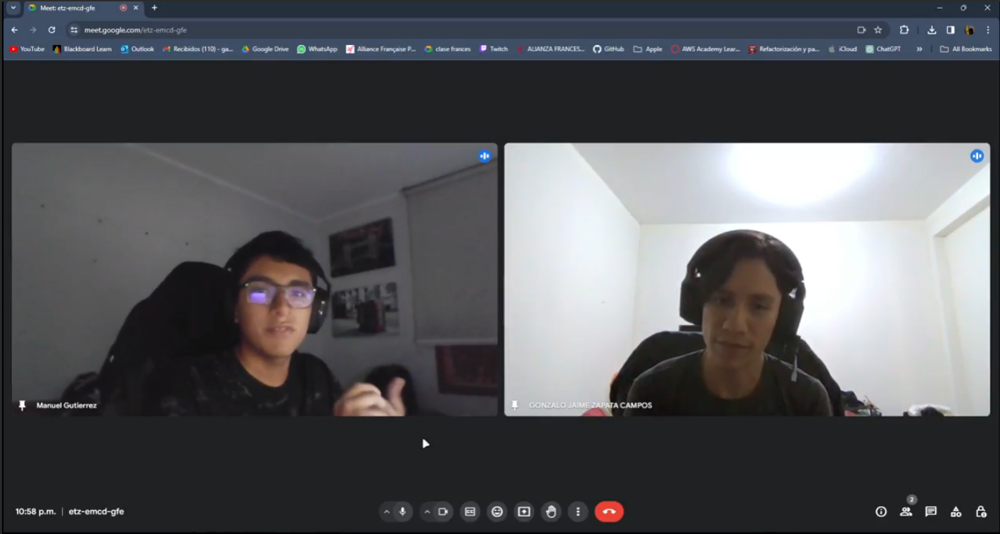

Resumen de la entrevista:

Gonzalo es un estudiante de 20 años que vive acutalmente en San Martin de Porres. Sus sistemas operativos de preferencia son Ios en moviles y Windows en ordenadores. El navegador que usa con mayor frecuencia es Google Chrome. Nos comenta que ha tenido problemas anteriormente al momento de sacar cita, como el dijo no habia una buena organizacion de citas por lo que para sacar una ha tenido que espera mucho tiempo. Ademas habla de algunas caracteristica que le gustaria tener ante de poder sacar una cita y tambien otra para los envios de los resultados de algun examen medico que hice, dependiendo de la gravedad de la situacion el pueda elegir entre que sea virtual o presencial.

### Entrevista 2:

Fecha entrevistada: 14/04/24

Entrevistador: Sebastian Flores Manrique

Entrevistado: Juan Mendevil Quispe

Datos del entrevistado:

- Edad: 26
- Distrito: Villa María del triunfo

Link de la Entrevista: <a href="https://upcedupe-my.sharepoint.com/:v:/g/personal/u201611430_upc_edu_pe/EbjLpEbXB19DpCYb3IeGsgIBKh-fjJKv9hqqiDE3P6u70A?e=AuM7GN&nav=eyJyZWZlcnJhbEluZm8iOnsicmVmZXJyYWxBcHAiOiJTdHJlYW1XZWJBcHAiLCJyZWZlcnJhbFZpZXciOiJTaGFyZURpYWxvZy1MaW5rIiwicmVmZXJyYWxBcHBQbGF0Zm9ybSI6IldlYiIsInJlZmVycmFsTW9kZSI6InZpZXcifX0%3D" Target="_blank">Link</a>

- Minuto de Inicio: 06:52
- Minuto de Fin: 11:38

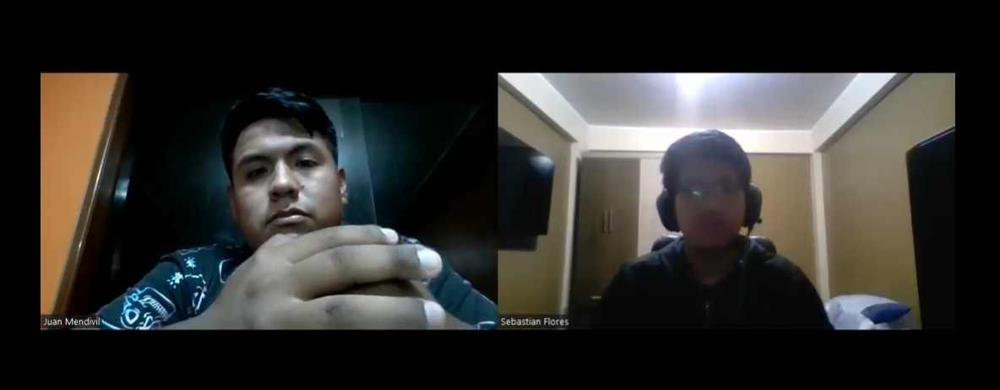

Resumen de la entrevista:

Juan Daniel Mendívil es un adulto de 27 años y trabajador independiente que vive actualmente en Villa María del Triunfo. Sus sistemas operativos de preferencia son Android en móviles y Windows en ordenadores. El navegador que usa con mayor frecuencia es Google Chrome. Busca atención médica por una fisura en su tobillo derecho. Su principal objetivo es una recuperación completa que le permita realizar todas sus actividades habituales. Al elegir a un especialista en traumatología, valora la experiencia y la buena reputación del doctor. Prefiere citas virtuales para evitar colas y desea acceso rápido a la cita y atención rápida durante la misma. En cuanto a la comunicación con el equipo médico, espera atención personalizada y enfocada en sus necesidades. Considera que la paciencia por parte del personal médico y la mejor comunicación del seguimiento del tratamiento son áreas de mejora en la experiencia de atención médica. Prefiere recibir los resultados de los exámenes médicos en línea y atención post-consulta por medios virtuales. Valora el acceso a la información sobre el tratamiento y la comunicación con el médico a través de una plataforma web, siempre que la plataforma sea segura y proteja su privacidad.

### Entrevista 3:

Fecha entrevistada: 14/04/2024

Entrevistador: Juan Eduardo Montes Figueroa

Entrevistado: Abril Gloria Montes Jiménez

Datos del entrevistado:

- Edad: 50
- Distrito: La Molina

Link de la Entrevista: <a href="https://upcedupe-my.sharepoint.com/:v:/g/personal/u201611430_upc_edu_pe/EbjLpEbXB19DpCYb3IeGsgIBKh-fjJKv9hqqiDE3P6u70A?e=AuM7GN&nav=eyJyZWZlcnJhbEluZm8iOnsicmVmZXJyYWxBcHAiOiJTdHJlYW1XZWJBcHAiLCJyZWZlcnJhbFZpZXciOiJTaGFyZURpYWxvZy1MaW5rIiwicmVmZXJyYWxBcHBQbGF0Zm9ybSI6IldlYiIsInJlZmVycmFsTW9kZSI6InZpZXcifX0%3D" Target="_blank">Link</a>

- Minuto de Inicio: 43:13
- Minuto de Fin: 47:24

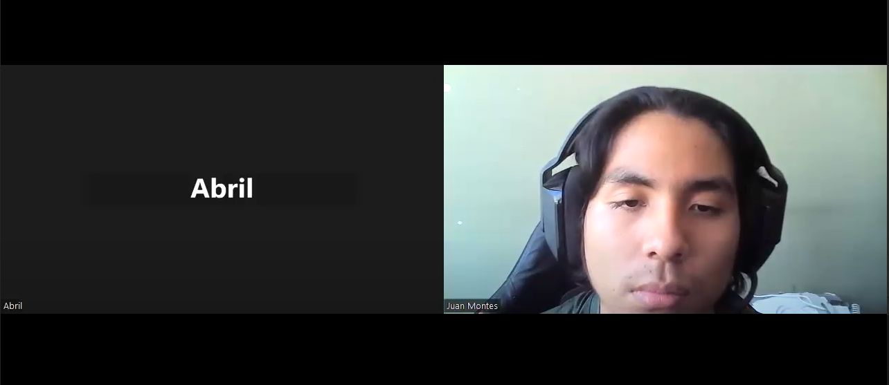

Resumen de la entrevista:

Abril es una adulta de 50 años que vive actualmente en La Molina. Sus sistemas operativos de preferencia son Android en moviles y Windows en ordenadores. El navegador que usa con mayor frecuencia es Google Chrome. Durante la entrevista con Abril, ejecutada mediante una videoconferencia en la plataforma Zoom con su celular, discutió su búsqueda de atención médica en traumatología debido a una lesión deportiva, destacando el desafío de encontrar un especialista con disponibilidad inmediata. Prioriza la experiencia y reputación del médico al elegir un especialista, y prefiere la conveniencia de programar citas médicas en línea. Expresó la importancia de tener información detallada antes de las consultas y espera una comunicación clara y coordinación entre los profesionales de la salud. Valora la facilidad de uso y la seguridad en una plataforma web para el seguimiento del tratamiento, pero muestra preocupación por la privacidad de sus datos médicos en línea y espera que se cumplan los estándares de seguridad.

### Segmento objetivo - Medico

### Entrevista 1:

Fecha entrevistada: 10/04/2024

Entrevistador: Jorge Altamirano

Entrevistado: Gaby Manrique

Datos del entrevistado:

- Edad: 50
- Distrito: La Molina

Link de la Entrevista: <a href="https://upcedupe-my.sharepoint.com/:v:/g/personal/u201611430_upc_edu_pe/EbjLpEbXB19DpCYb3IeGsgIBKh-fjJKv9hqqiDE3P6u70A?e=AuM7GN&nav=eyJyZWZlcnJhbEluZm8iOnsicmVmZXJyYWxBcHAiOiJTdHJlYW1XZWJBcHAiLCJyZWZlcnJhbFZpZXciOiJTaGFyZURpYWxvZy1MaW5rIiwicmVmZXJyYWxBcHBQbGF0Zm9ybSI6IldlYiIsInJlZmVycmFsTW9kZSI6InZpZXcifX0%3D" Target="_blank">Link</a>

- Minuto de Inicio: 11:39
- Minuto de Fin: 19:20

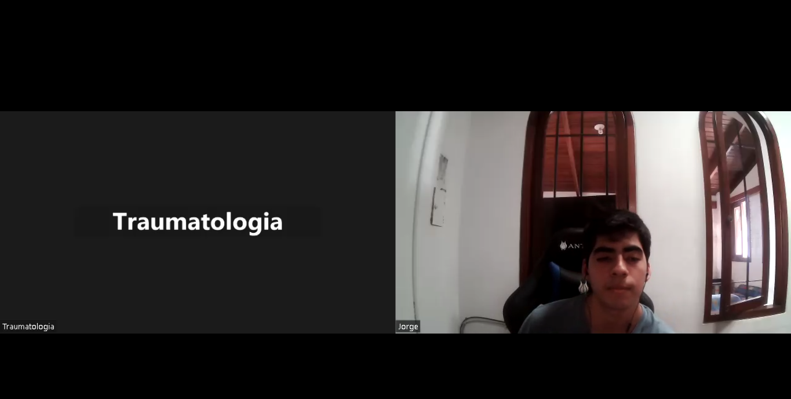

Resumen de la entrevista:

Gaby Manrique es una adulta de 50 años, que vive actualmente en La Molina. Sus sistemas operativos de preferencia son Android en móviles y Windows en ordenadores. El navegador que usa con mayor frecuencia es Microsoft Edge. Durante la entrevista con Gaby, llevada a cabo a través de una videoconferencia en la plataforma Zoom, exploramos los desafíos diarios que enfrenta en su práctica médica. La doctora destacó la necesidad de herramientas tecnológicas eficientes para gestionar sus citas y comunicarse con otros profesionales de la salud y laboratorios. Mencionó que prefiere recibir pedidos médicos y resultados de pruebas de manera electrónica, utilizando plataformas seguras y fáciles de usar. En cuanto a la tecnología, el médico utilizó su computadora de escritorio con el navegador Chrome durante la videoconferencia. Además, expresó preocupación por la seguridad y privacidad de los datos médicos, destacando la importancia de medidas sólidas de protección de la información en línea.

### Entrevista 2:

Fecha entrevistada: 09/04/2024

Entrevistador: Carlos Eduardo Guimaraes Escalante

Entrevistado: Gerardo Villaroel

Datos del entrevistado:

- Edad: 30
- Distrito: Trujillo

Link de la Entrevista: <a href="https://upcedupe-my.sharepoint.com/:v:/g/personal/u201611430_upc_edu_pe/EbjLpEbXB19DpCYb3IeGsgIBKh-fjJKv9hqqiDE3P6u70A?e=AuM7GN&nav=eyJyZWZlcnJhbEluZm8iOnsicmVmZXJyYWxBcHAiOiJTdHJlYW1XZWJBcHAiLCJyZWZlcnJhbFZpZXciOiJTaGFyZURpYWxvZy1MaW5rIiwicmVmZXJyYWxBcHBQbGF0Zm9ybSI6IldlYiIsInJlZmVycmFsTW9kZSI6InZpZXcifX0%3D" Target="_blank">Link</a>

- Minuto de Inicio: 23:38
- Minuto de Fin: 34:03

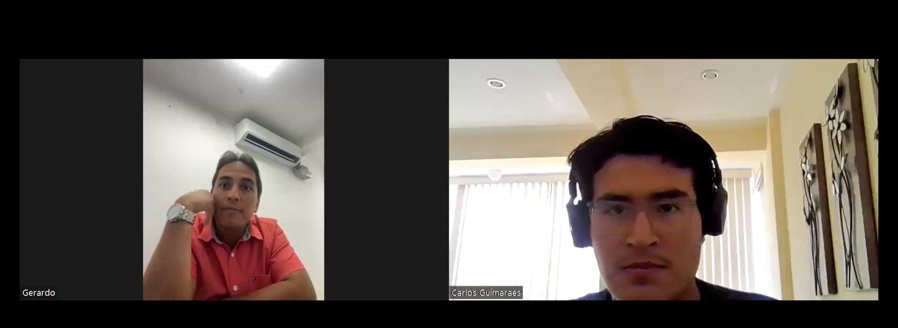

Resumen de la entrevista:

Gerardo Vilaroel es un adulto de 30 años, que vive actualmente en Trujillo. Sus sistemas operativos de preferencia son Android en móviles y Windows en ordenadores. El navegador que usa con mayor frecuencia es Google Chrome. Durante la entrevista, el Dr. Gerardo Villaroel nos explica los procesos que suele haber en el área de traumatología y como es que en el centro donde trabaja ya cuenta con un sistema tecnológico que les da mayor facilidad para comunicarse con sus pacientes. En este caso nos dice que los pacientes ingresan con sus credenciales a este portal médico, y de esa forma pueden visualizar el contenido multimedia que es de ellos, como radiografías por ejemplo. El Dr. Villaroel reafirma la importancia de la tecnología en su práctica médica, y como facilita su forma de trabajo. En su caso el demuestra ser una persona experta, amable y fiable. El prefiere marcas como GE HealthCare, Bowa Medical o Stryker y suele usar WhatsApp, Facebook, Instagram y Tik Tok como canal de interacción. Por último, el usa Opera GX como browser de preferencia y prefiere utilziar dispositivos IOS.

### Segmento objetivo - Laboratorio

### Entrevista 1:

Fecha entrevistada: 10/04/2024

Entrevistador: Jorge Altamirano

Entrevistado: Luis Protocarrero

Datos del entrevistado:

- Edad: 60
- Distrito: La Molina

Link de la Entrevista: <a href="https://upcedupe-my.sharepoint.com/:v:/g/personal/u201611430_upc_edu_pe/EbjLpEbXB19DpCYb3IeGsgIBKh-fjJKv9hqqiDE3P6u70A?e=AuM7GN&nav=eyJyZWZlcnJhbEluZm8iOnsicmVmZXJyYWxBcHAiOiJTdHJlYW1XZWJBcHAiLCJyZWZlcnJhbFZpZXciOiJTaGFyZURpYWxvZy1MaW5rIiwicmVmZXJyYWxBcHBQbGF0Zm9ybSI6IldlYiIsInJlZmVycmFsTW9kZSI6InZpZXcifX0%3D" Target="_blank">Link</a>

- Minuto de Inicio: 19:21
- Minuto de Fin: 23:37

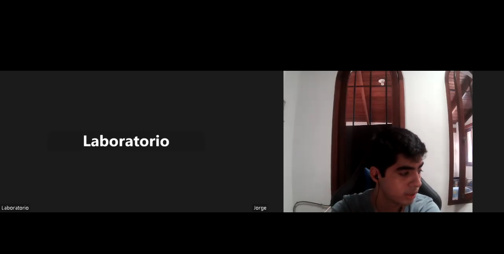

Resumen de la entrevista:

Luis Protocarrero es un adulto de 60 años, que vive actualmente en La Molina.Sus sistemas operativos de preferencia son Android en móviles y Windows en ordenadores. El navegador que usa con mayor frecuencia es Google Chrome. .Durante la entrevista Luis, realizada a través de una videoconferencia en la plataforma Zoom, exploramos los desafíos que enfrenta su laboratorio en la recepción y gestión de información de pacientes.Mencionó que utilizan una variedad de herramientas digitales para recibir y procesar pedidos médicos, incluyendo un sistema de gestión de laboratorio basado en la web. Destacó la importancia de la precisión y la integridad de los resultados de las pruebas, y expresó interés en mejorar la coordinación con médicos remitentes a través de plataformas de comunicación seguras. Durante la entrevista, Luis utilizó una laptop Lenovo con el navegador Chrome para acceder a la videoconferencia.

### Entrevista 2:

Fecha entrevistada: 13/04/2024

Entrevistador: Carlos Eduardo Guimaraes Escalante

Entrevistado: Giannina Escalante Gutierrez

Datos del entrevistado:

- Edad: 51
- Distrito: Trujillo

Link de la Entrevista: <a href="https://upcedupe-my.sharepoint.com/:v:/g/personal/u201611430_upc_edu_pe/EbjLpEbXB19DpCYb3IeGsgIBKh-fjJKv9hqqiDE3P6u70A?e=AuM7GN&nav=eyJyZWZlcnJhbEluZm8iOnsicmVmZXJyYWxBcHAiOiJTdHJlYW1XZWJBcHAiLCJyZWZlcnJhbFZpZXciOiJTaGFyZURpYWxvZy1MaW5rIiwicmVmZXJyYWxBcHBQbGF0Zm9ybSI6IldlYiIsInJlZmVycmFsTW9kZSI6InZpZXcifX0%3D" Target="_blank">Link</a>

- Minuto de Inicio: 34:04
- Minuto de Fin: 43:11

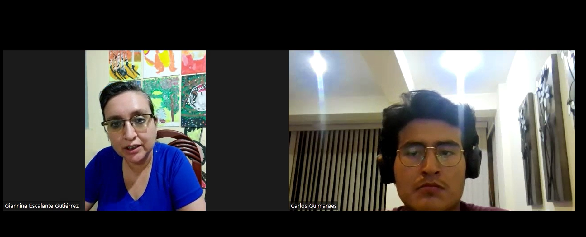

Resumen de la entrevista:

Gianna Escalante Gutierrez es una adulta de 51 años, que vive actualmente en Trujillo. Sus sistemas operativos de preferencia son Ios en moviles y Windows en ordenadores. El navegador que usa con mayor frecuencia es Mozila. Giannina nos comenta la importancia de que los resultado médicos llegue en las horas establecida, asi como lo importante que es que las indicaciones el doctor para realizar una prueba médica sea concisa. Según ella, los examenes se deben realizar una y otra vez para que el resultado de la prueba sea fiable. Asimismo, nos habla de lo importante que sería la tecnología para poder tener un contacto más directo con el médico, y de esta forma agilizar los procesos de laboratorio. En su caso ella es una persona muy racional y objetiva. Ella prefiere marcas como Sony, MEDISONIC, Samsung y suele usar WhatsApp o Facebook como canal de interacción. Por último, ella usa Google Chrome como browser de preferencia y utliza dispositivos Android.

### 2.2.3. Análisis de entrevistas

Analizando las entrevistas de Gonzalo y Abril, es posible identificar varias necesidades y preferencias comunes que podrían guiar la mejora y el desarrollo de un sistema de gestión de citas médicas.

#### Necesidades Expresadas:

- Búsqueda de Especialistas: Abril menciona la dificultad de encontrar especialistas disponibles, especialmente en traumatología. Esto sugiere la necesidad de un sistema que facilite la búsqueda de médicos por especialidad y disponibilidad.
- Priorización de la Experiencia Médica: Valora la experiencia y la reputación del especialista, indicando la importancia de que esta información sea accesible y clara en la plataforma.
- Seguridad y Privacidad: Tiene preocupaciones sobre la privacidad de sus datos médicos en plataformas en línea, lo que requiere garantizar altos estándares de seguridad y encriptación de datos.
- Coordinación entre Profesionales: Espera que haya buena comunicación y coordinación entre los distintos profesionales de salud que consulte.

## 2.3 Needfinding

### 2.3.1 User Personas

Los user persona que se muestran a continuación, fueron realizados a partir de la información recopilada de la sección de entrevistas. Estos nos ayudarán a describir de forma general nuestro segmento objetivo.

- Paciente:

  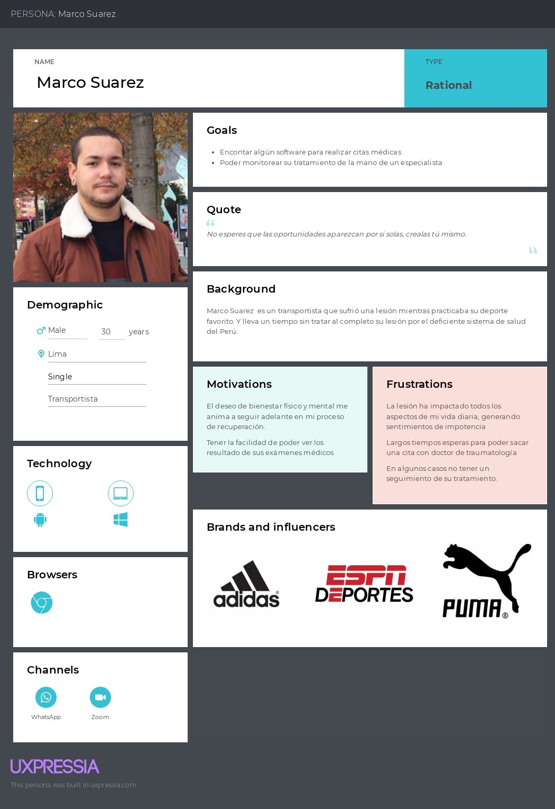

- Doctor:

  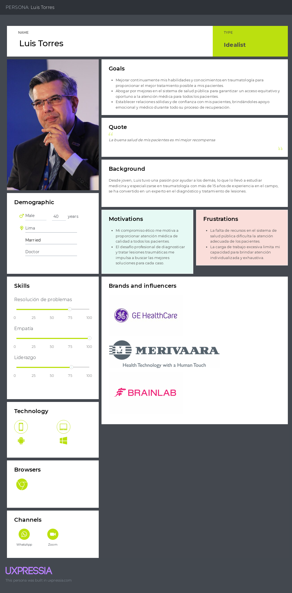

### 2.3.2 User Task Matrix

En esta sección se presenta el user task matrix de los segmentos objetivos, con el fin de indentificar la frecuencia de las actividades realizadas por los usuarios, y de esta manera se refleja la importancia de determinadas tareas.

<table>
    <thead>
        <tr>
            <th>Task</th>
            <th colspan="2">Pacientes</th>
            <th colspan="2">Profesionales médicos</th>
            <th colspan="2">Laboratorio</th>
        </tr>
        <tr>
            <th></th>
            <th>Frecuencia</th>
            <th>Importancia</th>
            <th>Frecuencia</th>
            <th>Importancia</th>
            <th>Frecuencia</th>
            <th>Importancia</th>
        </tr>
    </thead>
    <tbody>
        <tr>
            <td>Programar una cita</td>
            <td>Alta</td>
            <td>Alta</td>
            <td>Alta</td>
            <td>Alta</td>
            <td>-</td>
            <td>-</td>
        </tr>
        <tr>
            <td>Acceder a resultados de exámenes</td>
            <td>Media</td>
            <td>Alta</td>
            <td>Alta</td>
            <td>Alta</td>
            <td>Alta</td>
            <td>Alta</td>
        </tr>
        <tr>
            <td>Realizar seguimiento de tratamiento</td>
            <td>Alta</td>
            <td>Alta</td>
            <td>Alta</td>
            <td>Alta</td>
            <td>-</td>
            <td>-</td>
        </tr>
        <tr>
            <td>Agendar una cirugía</td>
            <td>Baja</td>
            <td>Alta</td>
            <td>Media</td>
            <td>Alta</td>
            <td>-</td>
            <td>-</td>
        </tr>
        <tr>
            <td>Participar en consultas virtuales</td>
            <td>Baja</td>
            <td>Alta</td>
            <td>Media</td>
            <td>Alta</td>
            <td>-</td>
            <td>-</td>
        </tr>
        <tr>
            <td>Recibir recordatorios automáticos de citas</td>
            <td>Alta</td>
            <td>Alta</td>
            <td>Alta</td>
            <td>Alta</td>
            <td>-</td>
            <td>-</td>
        </tr>
        <tr>
            <td>Acceder a historias clínicas</td>
            <td>-</td>
            <td>-</td>
            <td>Alta</td>
            <td>Alta</td>
            <td>-</td>
            <td>-</td>
        </tr>
        <tr>
            <td>Consultar información sobre medicamentos</td>
            <td>Media</td>
            <td>Alta</td>
            <td>Media</td>
            <td>Alta</td>
            <td>-</td>
            <td>-</td>
        </tr>
        <tr>
            <td>Comunicarse con el especialista</td>
            <td>Alta</td>
            <td>Alta</td>
            <td>Media</td>
            <td>Alta</td>
            <td>Alta</td>
            <td>Alta</td>
        </tr>
        <tr>
            <td>Proporcionar retroalimentación sobre la experiencia</td>
            <td>Baja</td>
            <td>Media</td>
            <td>-</td>
            <td>-</td>
            <td>-</td>
            <td>-</td>
        </tr>
        <tr>
            <td>Solicitar análisis clínicos</td>
            <td>Baja</td>
            <td>Alta</td>
            <td>-</td>
            <td>-</td>
            <td>Alta</td>
            <td>Alta</td>
        </tr>
        <tr>
            <td>Enviar resultado de análisis</td>
            <td>-</td>
            <td>-</td>
            <td>-</td>
            <td>-</td>
            <td>Alta</td>
            <td>Alta</td>
        </tr>
    </tbody>
</table>

### 2.3.3 User Journey Mapping

En esta sección se presentan los User Journey Mapping de los segmentos objetivos, que realizamos con el fin de dar a entender cómo se siente nuestro usuario al usar la aplicación, detallando cada paso que realiza y las emociones que experimenta.

#### Segmento 1(pacientes):

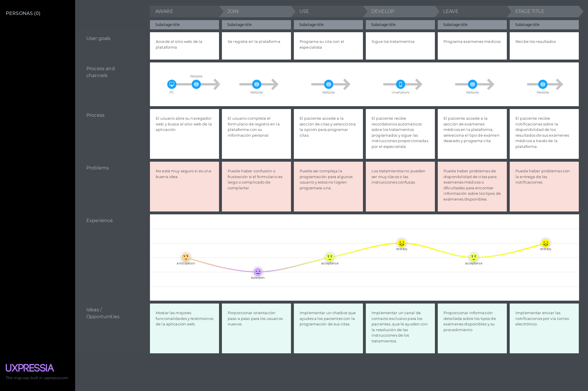

#### Segmento 2(doctor):

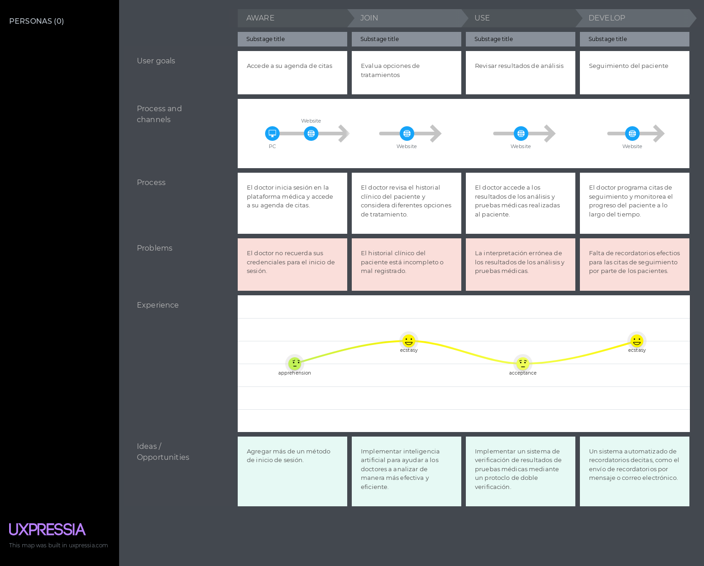

#### Segmento 3(laboratorio):

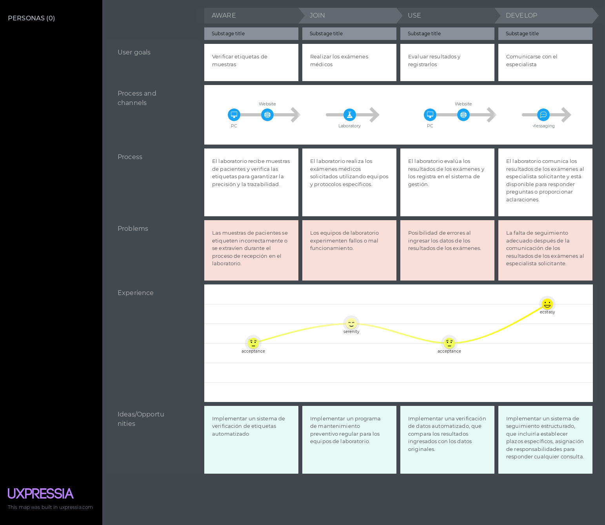

### 2.3.4 Empathy Mapping

En esta sección mostramos los empathy mapping de los segmentos objetivos realizados con la información recopilada de componentes anteriores.

### 2.3.5 As-is Scenario Mapping

En esta sección se realizaron las distintas etapas de preparación, tales como la lluvia de ideas individual, revisión e identificación de fases como columnas, para conseguir los As-is Scenario Mapping de los segmentos objetivos.

<b>Para el segmento 1 (Pacientes):</b>

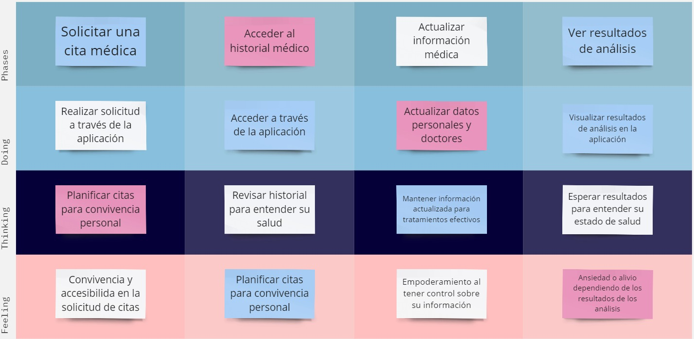

<b>Para el segmento 2 (Doctores):</b>

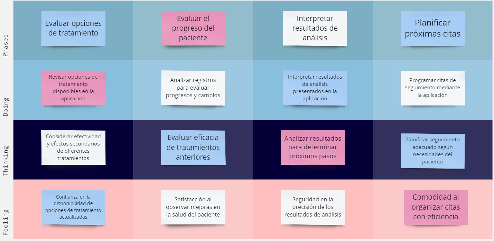

<b>Para el segmento 3 (Laboratorios):</b>

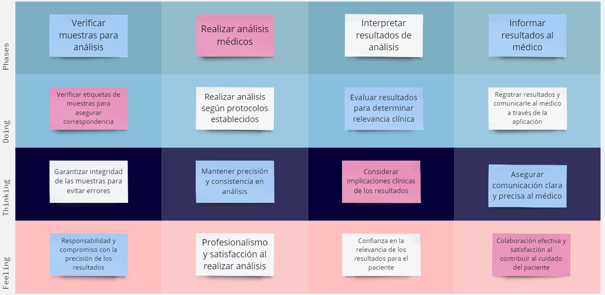

## 2.4 Ubiquitous Language

| Terms and definitions | Términos y definiciones                                                                                       |
| --------------------- | ------------------------------------------------------------------------------------------------------------- |
| Patient               | Un individuo que busca atención médica en el campo de la traumatología.                                       |
| Medical history       | El registro completo de la información médica y el historial de tratamientos de un paciente.                  |
| Medical appointment   | Una programación de tiempo específico para la atención médica entre un paciente y un médico.                  |
| Medical analysis      | Proceso de examinar muestras biológicas para obtener información sobre la salud de un paciente.               |
| Treatment             | Un plan de acción médico recomendado para abordar una condición específica del paciente.                      |
| Analysis results      | Los hallazgos y conclusiones obtenidos a partir de los análisis médicos realizados en muestras de pacientes.  |
| Notifications         | Mensajes automáticos enviados a pacientes y médicos para recordatorios de citas, resultados de análisis, etc. |
| Secure Communication  | La capacidad de intercambiar información sensible de manera segura entre pacientes y médicos.                 |
| Laboratory staff      | Profesionales responsables de realizar análisis médicos en las muestras de los pacientes.                     |
| Sample                | Material biológico proporcionado por un paciente para su análisis médico.                                     |

---

 

# Capítulo III: Requirements Specification

## 3.1 To-Be Scenario Mapping

En esta sección se presenta el mapeo de los escenarios, realizando una tabla con la situación a mejorar del segmento objetivo, analizando que pasos se realizarán y cómo se siente.

<b>Para el segmento 1 (Pacientes):</b>

<b>Para el segmento 2 (Doctores):</b>

<b>Para el segmento 3 (Laboratorios):</b>

## 3.2 User Stories

| Epic / Story ID |                                    Título                                    |                                                                                                                                                                    Descripción                                                                                                                                                                    |                                                                                                                                                                                                                                                                                                                                                                                                      Criterios de Aceptación                                                                                                                                                                                                                                                                                                                                                                                                       | Relacionado con (Epic ID) |
| :-------------: | :--------------------------------------------------------------------------: | :-----------------------------------------------------------------------------------------------------------------------------------------------------------------------------------------------------------------------------------------------------------------------------------------------------------------------------------------------: | :--------------------------------------------------------------------------------------------------------------------------------------------------------------------------------------------------------------------------------------------------------------------------------------------------------------------------------------------------------------------------------------------------------------------------------------------------------------------------------------------------------------------------------------------------------------------------------------------------------------------------------------------------------------------------------------------------------------------------------------------------------------------------------------------------------------------------------: | :-----------------------: | 
|       E01       |                     Gestión de Inventario de Laboratorio                     |                                            Como técnico de laboratorio, deseo una plataforma tecnológica que me permita gestionar eficientemente el inventario de suministros y equipos, para garantizar la disponibilidad de materiales necesarios y optimizar el flujo de trabajo en el laboratorio.                                            |                                                                                                                                                                                                                                                                                                                                                                                                                 -                                                                                                                                                                                                                                                                                                                                                                                                                  |             -             |
|       E02       |                           Gestión de citas médicas                           |                                                               Como paciente, deseo tener acceso a una plataforma tecnológica que facilite la gestión de mis citas médicas, para poder organizar mi agenda de manera eficiente y recibir una atención médica oportuna y de calidad.                                                                |                                                                                                                                                                                                                                                                                                                                                                                                                 -                                                                                                                                                                                                                                                                                                                                                                                                                  |             -             |
|       E03       |             Plataforma tecnológica para tratamientos ortopédicos             |                                                            Como médico traumatológico, quiero tener una plataforma tecnológica que me permita gestionar eficientemente los tratamientos de mis pacientes, para poder proporcionar una atención médica de alta calidad y personalizada.                                                            |                                                                                                                                                                                                                                                                                                                                                                                                                 -                                                                                                                                                                                                                                                                                                                                                                                                                  |             -             |
|       E04       |                    Acceso a historial médico del paciente                    |                                                                                      Como médico traumatológico,deseo poder acceder al historial médico completo de mis pacientes, para tomar decisiones informadas y brindarles la mejor atención posible.                                                                                       |                                                                                                                                                                                                                                                                                                                                                                                                                 -                                                                                                                                                                                                                                                                                                                                                                                                                  |             -             |
|       E05       |               Gestión de muestras y resultados de laboratorio                |                                                                                                  Como técnico de laboratorio, deseo contar con una aplicación web que me permita optimizar la gestión de muestras y resultados de los pacientes.                                                                                                  |                                                                                                                                                                                                                                                                                                                                                                                                                 -                                                                                                                                                                                                                                                                                                                                                                                                                  |             -             |
|       E06       |               Acceso a página informativa sobre la aplicación                |                                                                                                                   Como paciente quiero poder entrar una landing page donde esté la información esencial sobre la aplicación web                                                                                                                   |                                                                                                                                                                                                                                                                                                                                                                                                                 -                                                                                                                                                                                                                                                                                                                                                                                                                  |             -             |
|      US01       |                           Registro de Muestras                            |                                              Como técnico de laboratorio, quiero poder registrar nuevas muestras en el sistema, incluyendo detalles como el código de la muestra, tipo de muestra y fecha de recepción, para mantener un seguimiento preciso de todas las muestras recibidas.                                              |                                                                       
**Escenario 1: Registro Exitoso**

- Dado que el técnico de laboratorio está en la página de registro de muestras,

- Cuando el técnico ingresa una nueva muestra con todos los campos requeridos correctamente,

- Entonces el sistema registra la muestra y muestra un mensaje de confirmación.

**Escenario 2: Validación de Campos Obligatorios**

- Dado que el técnico de laboratorio está en la página de registro de muestras,

- Cuando el técnico intenta ingresar una nueva muestra sin completar todos los campos obligatorios,

- Entonces el sistema muestra un mensaje de error indicando los campos faltantes.
                                                                        |            E01            |
|      US02       |                          Asignación de Análisis                           |                         Como técnico de laboratorio, quiero poder asignar análisis específicos a las muestras registradas, incluyendo detalles como el tipo de análisis y el técnico responsable, para asegurar que cada muestra sea analizada adecuadamente.                         |                
**Escenario 1: Asignación Exitosa**

- Dado que el técnico de laboratorio está en la página de asignación de análisis,

- Cuando el técnico asigna un análisis a una muestra con todos los campos requeridos correctamente,

- Entonces el sistema registra la asignación y muestra un mensaje de confirmación.

**Escenario 2: Validación de Campos Obligatorios**

- Dado que el técnico de laboratorio está en la página de asignación de análisis,

- Cuando el técnico intenta asignar un análisis a una muestra sin completar todos los campos obligatorios,

- Entonces el sistema muestra un mensaje de error indicando los campos faltantes.
                 |            E01            |
|      US03       |                         Gestión de Pedidos Internos                          |                                                       Como técnico de laboratorio, desea poder realizar pedidos de reposición de suministros de manera fácil y rápida a través de la plataforma, para mantener los niveles de inventario óptimos y asegurar un flujo de trabajo eficiente.                                                        |                                
**Escenario 1: Creación de Pedido Exitosa**

- Dado que el técnico de laboratorio está en la página de gestión de pedidos internos,

- Cuando selecciona los suministros necesarios y confirma la creación del pedido,

- Entonces el sistema registra el pedido correctamente y muestra un mensaje de confirmación.

**Escenario 2: Pedido de Suministros Insuficientes**

- Dado que el técnico de laboratorio está en la página de gestión de pedidos internos,

- Cuando intenta realizar un pedido con suministros no disponibles en el inventario,

- Entonces el sistema muestra un mensaje de error indicando que algunos suministros no están disponibles y sugiere revisar el inventario antes de continuar.
                                 |            E01            |
|      US04       |                           Organización de Equipos                            |                                                Como técnico de laboratorio, quiere poder mantener un registro detallado de los equipos disponibles en el laboratorio, incluyendo información sobre su estado, mantenimiento programado y ubicación actual, para facilitar su uso y mantenimiento.                                                 |                                          
**Escenario 1: Registro Exitoso de Equipo**

- Dado que el técnico de laboratorio está en la página de organización de equipos,

- Cuando ingresa los detalles de un nuevo equipo correctamente,

- Entonces el sistema registra el equipo en la base de datos y muestra un mensaje de confirmación.

**Escenario 2: Actualización de Estado de Equipo**

- Dado que el técnico de laboratorio está en la página de organización de equipos,

- Cuando actualiza el estado de un equipo después de realizar el mantenimiento programado,

- Entonces el sistema actualiza la información del equipo en la base de datos y muestra un mensaje indicando que la actualización se ha realizado con éxito.
                                          |            E01            |
|      US05       |                             Integración de Datos                             |                                      Como técnico de laboratorio, necesita que la plataforma tenga la capacidad de integrar los datos del inventario con otros sistemas internos del laboratorio, para garantizar una gestión coherente y eficiente del inventario y evitar discrepancias en los registros.                                       | 
**Escenario 1: Actualización Exitosa del Inventario**

- Dado que el técnico de laboratorio está en la página de integración de datos,

- Cuando se realiza una actualización en el inventario desde otro sistema interno del laboratorio,

- Entonces el sistema integra los nuevos datos con el inventario existente y muestra un mensaje de confirmación.

**Escenario 2: Sincronización Automatizada de Información**

- Dado que el técnico de laboratorio está en la página de integración de datos,

- Cuando se activa la sincronización automática entre la aplicación web del laboratorio y otros sistemas internos,

- Entonces el sistema verifica periódicamente la información en ambos sistemas y asegura que estén alineados, garantizando la consistencia de los datos.
 |            E01            |
|      US06       |                     Gestión de Mantenimiento de Equipos                      |                                                              Como técnico de laboratorio, necesito una funcionalidad en la plataforma que me permita gestionar el mantenimiento de los equipos del laboratorio, para garantizar su correcto funcionamiento y prolongar su vida útil.                                                              |                                        
**Escenario 1: Programación de Mantenimiento**

- Dado que el encargado de laboratorio accede a la página de gestión de mantenimiento de equipos,
- Cuando selecciona un equipo específico que requiere mantenimiento preventivo,
 

- Entonces puede programar una fecha y hora para la realización del mantenimiento.

 
**Escenario 2: Registro de Mantenimiento Realizado**

- Dado que se ha completado el mantenimiento programado de un equipo,

- Cuando el técnico responsable del mantenimiento ingresa los detalles del trabajo realizado,

- Entonces el sistema registra la información del mantenimiento en la base de datos y actualiza el historial del equipo con los nuevos datos.

                                         |            E01            |
|      US07       |                            Registro de Nueva Cita                            |                                                                                                 Como paciente, quiero programar una nueva cita médica a través de la plataforma en línea de MedSystem para evitar tener que llamar por teléfono.                                                                                                  |                                               
**Escenario 1: Registro de Cita para Pacientes Registrados**

- Dado que el usuario es un paciente registrado en MedSystem,

- Cuando selecciona la opción de programar una nueva cita médica desde la plataforma,

- Entonces es redirigido a un formulario donde puede ingresar los detalles de la cita, como la fecha, hora y motivo de la consulta.

**Escenario 2: Registro de Cita para Nuevos Pacientes**

- Dado que el usuario es un nuevo paciente en MedSystem,

- Cuando accede a la plataforma por primera vez y elige programar una cita médica,

- Entonces se le solicita completar un formulario de registro con su información personal antes de poder programar la cita.
                                                |            E02            |
|      US08       |                    Selección de Especialista y Ubicación                     |                                                                                      Como paciente, quiero poder seleccionar al especialista y la ubicación preferida para mi cita médica en MedSystem, para poder planificar de acuerdo a mis necesidades.                                                                                       |             
**Escenario 1: Selección de Especialista Disponible**

- Dado que el usuario está programando una cita médica en MedSystem,

- Cuando elige la opción de seleccionar un especialista desde la plataforma,

- Entonces se le presenta una lista de especialistas disponibles junto con su especialidad y ubicación, lo que le permite elegir el más adecuado para su consulta.

**Escenario 2: Selección de Ubicación para la Cita Médica**

- Dado que el usuario tiene una preferencia de ubicación para su cita médica,

- Cuando selecciona la opción de elegir la ubicación en MedSystem,

- Entonces se le muestra un mapa interactivo con los diferentes centros médicos disponibles en su área, lo que le permite seleccionar el más conveniente para él.
             |            E02            |
|      US09       |                          Disponibilidad de Horarios                          |                                                                                            Como paciente, quiero ver la disponibilidad de horarios de los especialistas en MedSystem para elegir la fecha y hora más conveniente para mi cita médica.                                                                                             |     
**Escenario 1: Verificación de Disponibilidad de Horarios**

- Dado que el usuario está buscando una cita médica en MedSystem,

- Cuando selecciona la opción de verificar la disponibilidad de horarios desde la plataforma,

- Entonces se le muestra un calendario interactivo con los días y horarios disponibles de los especialistas, lo que le permite seleccionar el más adecuado para él.

**Escenario 2: Destaque de Horarios Disponibles para Citas Urgentes**

- Dado que el usuario necesita una cita médica urgente,

- Cuando accede a la plataforma de MedSystem y selecciona la opción de ver la disponibilidad de horarios,

- Entonces se resaltan en el calendario los próximos horarios disponibles, lo que le permite programar una cita lo antes posible.
     |            E02            |
|      US10       |                            Recordatorios de Cita                             |                                                                                 Como paciente, quiero recibir recordatorios automáticos de mi cita médica a través de notificaciones por correo electrónico o mensajes de texto en MedSystem, para no olvidarla.                                                                                  |                                                                
**Escenario 1: Recordatorio por Correo Electrónico**

- Dado que el usuario ha programado una cita médica en MedSystem,

- Cuando se acerca la fecha y hora de la cita,

- Entonces recibe automáticamente un recordatorio por correo electrónico con los detalles de la cita y un enlace para confirmar su asistencia.

**Escenario 2: Recordatorio por Mensaje de Texto**

- Dado que el usuario tiene múltiples citas médicas programadas en MedSystem,

- Cuando se aproxima la fecha de una de sus citas,

- Entonces recibe un recordatorio por mensaje de texto en su teléfono móvil, lo que le permite estar al tanto de todas sus citas médicas.
                                                                 |            E02            |
|      US11       |                             Cancelación de Citas                             |                                                                                                           Como paciente, quiero tener la opción de cancelar mi cita médica en MedSystem en caso de imprevistos o cambios en mi agenda.                                                                                                            |                                  
**Escenario 1: Cancelación de Cita por Conflicto de Programación**

- Dado que el usuario tiene un conflicto de programación y necesita cancelar una cita médica en MedSystem,

-Cuando accede a la plataforma y selecciona la opción de cancelar la cita,

- Entonces se le solicita confirmar la cancelación y el horario se libera para que otro paciente pueda programar una cita en ese mismo horario.

**Escenario 2: Confirmación de Cancelación de Cita**

- Dado que el usuario ha cancelado con éxito su cita médica en MedSystem,

- Cuando confirma la cancelación,

- Entonces recibe una confirmación en pantalla de que la cita ha sido cancelada con éxito, brindándole tranquilidad sobre su acción.
                                   |            E02            |
|      US12       |                           Re-agendamiento de Citas                           |                                                                                                           Como paciente, quiero tener la opción de reagendar mi cita médica en MedSystem en caso de imprevistos o cambios en mi agenda.                                                                                                           |                                                        
**Escenario 1: Reagendamiento de Cita Médica**

- Dado que el usuario necesita reagendar su cita médica en MedSystem,

- Cuando accede a la plataforma y selecciona la opción de reagendar la cita,

- Entonces se le presenta un calendario con los horarios disponibles para que pueda seleccionar una nueva fecha y hora para su cita.

**Escenario 2: Confirmación de Reagendamiento de Cita**

- Dado que el usuario ha reagendado con éxito su cita médica en MedSystem,

- Cuando confirma el nuevo horario de la cita,

- Entonces recibe una confirmación en pantalla de que la cita ha sido reagendada con éxito, brindándole tranquilidad sobre su nueva cita.
                                                         |            E02            |
|      US13       |                             Confirmación de Cita                             |                                                                                 Como paciente, quiero recibir una confirmación instantánea de mi cita médica después de programarla en MedSystem, para tener la certeza de que ha sido registrada correctamente.                                                                                  |                                                    
**Escenario 1: Confirmación Instantánea**

- Dado que el usuario ha programado una cita médica en MedSystem,

- Cuando completa el proceso de programación de la cita y selecciona la opción de confirmar,

- Entonces recibe una confirmación instantánea en pantalla junto con un número de referencia de la cita.

**Escenario 2: Confirmación por Correo Electrónico**

- Dado que el usuario ha programado una cita médica en MedSystem,

- Cuando pasa por el proceso de programación de la cita y confirma su asistencia,

- Entonces recibe un correo electrónico de confirmación con los detalles de la cita, lo que le brinda tranquilidad y seguridad sobre su reserva.
                                                    |            E02            |
|      US14       |                Acceso Eficiente al Historial Médico Completo                 |                  Como médico traumatológico, quiero poder acceder rápidamente al historial médico completo de mis pacientes, incluyendo su historial de tratamientos pasados y resultados de análisis, para poder evaluar su progreso de manera eficiente y tomar decisiones informadas sobre los próximos pasos del tratamiento                  |                                                                 
**Escenario 1:**

- Dado que estoy en la página principal de MedSystem,

- Cuando hago clic en el nombre de un paciente en la lista de pacientes,

- Entonces se carga la página del historial médico del paciente en menos de 3 segundos, mostrando toda la información relevante de manera clara y organizada.

**Escenario 2:**

- Dado que estoy revisando el historial médico de un paciente,

- Cuando hago clic en la sección "Tratamientos Pasados" del historial médico,

- Entonces se muestran todos los tratamientos anteriores del paciente, con detalles como la fecha de inicio, la fecha de finalización, la dosis y las notas médicas.
                                                                  |            E03            |
|      US15       |                    Notificaciones de Citas de Seguimiento                    |                                               Como médico traumatológico, quiero recibir notificaciones automáticas sobre citas de seguimiento programadas con mis pacientes, para poder planificar mi agenda con anticipación y garantizar que ningún paciente se quede sin seguimiento adecuado.                                                |                                                                                                                                           
**Escenario 1:**

- Dado que tengo una cita de seguimiento programada para un paciente,

- Cuando falta menos de 24 horas para la cita,

- Entonces recibo automáticamente una notificación por correo electrónico con los detalles de la cita.

**Escenario 2:**

- Dado que recibo una notificación de una cita de seguimiento,

- Cuando hago clic en la notificación,

- Entonces se abre la página de detalles de la cita en MedSystem, donde puedo confirmar, reprogramar o cancelar la cita.
                                                                                                                                            |            E03            |
|      US16       |                    Actualización de Planes de Tratamiento                    |                          Como médico traumatológico, quiero tener la capacidad de ajustar y actualizar los planes de tratamiento de mis pacientes directamente desde la plataforma MedSystem, para poder adaptar los tratamientos a medida que evoluciona la condición del paciente o surgen nuevas necesidades médicas.                          |                                                                                                   
**Escenario 1:**

- Dado que estoy revisando el historial médico de un paciente,

- Cuando hago clic en la sección "Plan de Tratamiento" del historial médico,

- Entonces se muestra una lista de todos los tratamientos actuales del paciente, con opciones para agregar, editar o eliminar tratamientos.

**Escenario 2:**

- Dado que he realizado cambios en el plan de tratamiento de un paciente,

- Cuando guardo los cambios,

- Entonces se actualiza automáticamente el historial médico del paciente y se registra una entrada de auditoría para los cambios realizados.
                                                                                                   |            E03            | 
|      US17       |                 Alertas de Cambios en Resultados de Análisis                 |                                 Como médico traumatológico, quiero recibir alertas automáticas sobre cambios significativos en los resultados de los análisis médicos de mis pacientes, para poder responder rápidamente a cualquier nueva información relevante y ajustar los tratamientos según sea necesario.                                  |                                                                                                                            
**Escenario 1:**

- Dado que recibo nuevos resultados de análisis para un paciente,

- Cuando se detecta un cambio significativo en los resultados,

- Entonces recibo automáticamente una alerta por correo electrónico y se muestra una notificación en MedSystem.

**Escenario 2:**

- Dado que recibo una alerta sobre un cambio en los resultados de análisis,

- Cuando hago clic en la alerta,

- Entonces se muestra una descripción detallada del cambio y se proporciona orientación sobre la acción recomendada por mí.
                                                                                                                            |            E03            |
|      US18       |                    Comunicación Segura con los Pacientes                     |                                    Como médico traumatológico, quiero poder comunicarme de manera segura con mis pacientes a través de la plataforma MedSystem, para poder proporcionar orientación, responder preguntas y mantener una línea abierta de comunicación durante todo el proceso de tratamiento.                                     |                                                                                                                                                        
**Escenario 1:**

- Dado que estoy en la página de detalles de un paciente en MedSystem,

- Cuando hago clic en el botón de "Enviar Mensaje",

- Entonces se abre una ventana de mensajería segura donde puedo redactar y enviar un mensaje al paciente.

**Escenario 2:**

- Dado que recibo un mensaje de un paciente,

- Cuando accedo a la bandeja de entrada de mensajes en MedSystem,

- Entonces se muestra el mensaje recibido de manera segura y puedo responder.
                                                                                                                                                        |            E03            |
|      US19       |              Análisis y Evaluación de Eficacia del Tratamiento               |                         Como médico traumatológico, quiero tener acceso a informes y análisis de datos sobre el progreso y la efectividad de los tratamientos de mis pacientes a lo largo del tiempo, para poder evaluar la eficacia de diferentes enfoques de tratamiento y mejorar continuamente mis prácticas médicas.                         |   
**Escenario 1:**

- Dado que quiero generar un informe sobre la eficacia del tratamiento para un grupo de pacientes,

- Cuando selecciono los parámetros de filtro deseados, como el rango de fechas y las condiciones de tratamiento,

- Entonces se genera automáticamente un informe detallado que muestra métricas clave de eficacia del tratamiento para el grupo seleccionado de pacientes.

**Escenario 2:**

- Dado que estoy revisando un informe sobre la eficacia del tratamiento,

- Cuando hago clic en una métrica específica, como la tasa de éxito del tratamiento,

- Entonces se muestra un desglose detallado de los pacientes incluidos en la métrica seleccionada, así como información adicional sobre los tratamientos utilizados y los resultados obtenidos.
   |            E03            |
|      US20       |                Acceso rápido al historial médico del paciente                |                                                          Como doctor, quiero acceder rápidamente al historial médico completo de mis pacientes para revisar su historial de enfermedades, tratamientos pasados, alergias y otros datos relevantes antes de una consulta o procedimiento.                                                          |                                                                                                                           
**Escenario 1:**

- Dado que el doctor inicia una consulta

- Cuando busca y selecciona el nombre completo o número de identificación de un paciente

- Entonces el sistema muestra el historial médico completo del paciente en menos de 30 segundos.

**Escenario 2:**

- Dado que el historial médico del paciente se muestra

- Cuando el doctor selecciona una categoría específica, como diagnósticos previos o tratamientos pasados

- Entonces el sistema muestra los detalles correspondientes de manera clara y ordenada.
                                                                                                                            |            E04            |
|      US21       |                 Visualización detallada del historial médico                 |                                  Como doctor, quiero poder visualizar de manera detallada el historial médico de mis pacientes, incluyendo información como diagnósticos previos, resultados de exámenes, medicaciones actuales y pasadas, procedimientos realizados, y notas de otros médicos o especialistas.                                   |                                                                                                                                           
**Escenario 1:**

- Dado que el doctor revisa el historial médico de un paciente

- Cuando selecciona la sección de resultados de exámenes

- Entonces el sistema muestra una lista ordenada de exámenes recientes.

**Escenario 2:**

- Dado que el doctor visualiza una entrada del historial médico

- Cuando expande la entrada, entonces el sistema muestra detalles adicionales

- Entonces el sistema muestra detalles adicionales, como notas de otros médicos o resultados de laboratorio.
                                                                                                                                            |            E04            |
|      US22       |              Actualización en tiempo real del historial médico               |                                                          Como doctor, quiero que cualquier actualización realizada en el historial médico de un paciente se refleje inmediatamente en el sistema, para garantizar que siempre esté trabajando con la información más reciente y precisa.                                                          |                                                                                                                                               
**Escenario 1:**

- Dado que un doctor actualiza el historial médico de un paciente

- Cuando otro doctor accede al historial médico del mismo paciente

- Entonces el sistema refleja instantáneamente los cambios realizados por el primer doctor.

**Escenario 2:**

- Dado que se realiza una actualización en el historial médico

- Cuando el sistema procesa la actualización

- Entonces envía notificaciones automáticas a los médicos relevantes sobre la actualización reciente.
                                                                                                                                                |            E04            |
|      US23       |              Registro de nuevas entradas en el historial médico              |                                  Como doctor, quiero poder registrar nuevas entradas en el historial médico de mis pacientes, como nuevos diagnósticos, tratamientos recetados, resultados de exámenes o notas de la consulta actual, para mantener un registro completo y actualizado de su historial de salud.                                  |                                                                                                                                                              
**Escenario 1:**

- Dado que el doctor completa el formulario de registro de entradas en el historial médico

- Cuando guarda la nueva entrada

- Entonces el sistema confirma la acción y actualiza la lista de entradas del paciente.

**Escenario 2:**

- Dado que se registra una nueva entrada en el historial médico

- Cuando el doctor guarda la entrada

- Entonces el sistema muestra la nueva entrada en la lista de historial médico del paciente.
                                                                                                                                                              |            E04            |
|      US24       |                 Seguridad y privacidad del historial médico                  |                             Como doctor, necesito que el acceso al historial médico de mis pacientes esté protegido por medidas de seguridad robustas, y que se cumplan estrictamente las regulaciones de privacidad de datos para garantizar la confidencialidad y la integridad de la información médica sensible.                              |                                                                                                                                                              
**Escenario 1:**

- Dado que el doctor intenta acceder al historial médico desde una ubicación o dispositivo nuevo

- Cuando introduce sus credenciales

- Entonces el sistema solicita autenticación de doble factor.

**Escenario 2:**

- Dado que se establece una conexión entre el sistema y un dispositivo de acceso al historial médico

- Cuando se transmiten datos

- Entonces la comunicación se cifra utilizando protocolos de seguridad robustos.
                                                                                                                                                              |            E04            |
|      US25       |            Registro de eventos importantes en el historial médico            | Como doctor, quiero poder registrar eventos importantes en el historial médico de mis pacientes, como hospitalizaciones, cirugías importantes, cambios significativos en el estado de salud o eventos relevantes en la historia médica familiar, para tener una visión completa y contextualizada de la salud del paciente a lo largo del tiempo. |                                                                                                                                                
**Escenario 1:**

- Dado que el doctor registra un evento importante en el historial médico de un paciente

- Cuando completa el formulario de registro

- Entonces el sistema confirma la acción y actualiza el historial médico del paciente.

**Escenario 2:**

- Dado que se registra un evento importante en el historial médico

- Cuando se guarda la entrada

- Entonces el sistema muestra el evento registrado en la sección correspondiente del historial médico del paciente.
                                                                                                                                                 |            E04            |
|      US26       |   Interfaz personalizable para mejorar eficiencia en los análisis médicos    |                                                    Como técnico de laboratorio, necesito una interfaz intuitiva y personalizable en el sistema de análisis para adaptarla a las necesidades específicas de cada tipo de prueba y mejorar la eficiencia en la ejecución de los análisis médicos                                                    |                      
**Escenario 1:Personalización de la interfaz**

- Dado, que un técnico de laboratorio necesita adaptar la interfaz para un tipo específico de análisis.

- Cuando, accede a la función de personalización en el sistema de análisis.

- Entonces, puede mover, agregar o eliminar herramientas y paneles según sea necesario para optimizar el flujo de trabajo.

**Escenario 2:Guardado y aplicado de la personalización**

- Dado,que un técnico de laboratorio ha personalizado la interfaz para un tipo de prueba.

- Cuando, guarda los cambios realizados en la interfaz.

- Entonces, la configuración personalizada se guarda correctamente y se aplica automáticamente en futuras sesiones de análisis para el mismo tipo de prueba.
                       |            E05            |
|      US27       |  Acceso a los protocolos actualizados en la aplicación web del laboratorio   |                          Como técnico de laboratorio, quiero una funcionalidad en la aplicación web que me permita acceder y revisar los protocolos actualizados de análisis y procedimientos, para asegurar que estoy siguiendo las últimas directrices y garantizar la calidad en la ejecución de las pruebas médicas.                          |                                                  
**Escenario 1:Acceso a los protocolos actualizados**

- Dado, que un técnico de laboratorio necesita revisar los protocolos actualizados.

- Cuando, accede a la sección de protocolos en la aplicación web.

- Entonces, encuentra una lista clara y organizada de los protocolos actualizados, con la posibilidad de ver detalles adicionales si es necesario.

**Escenario 2: Revisión y confirmación de los protocolos**

- Dado, que un técnico de laboratorio revisa un protocolo actualizado.

- Cuando, lee y comprende los detalles del protocolo.

- Entonces, confirma que está siguiendo las últimas directrices y procedimientos al ejecutar el análisis correspondiente.
                                                  |            E05            |
|      US28       |               Sistema de comunicación y registro de resultados               |                                                     Como técnico de laboratorio, quiero un sistema que registre automáticamente los resultados de los análisis y los comunique al médico a través de la aplicación para agilizar la entrega de información y mejorar la atención al paciente.                                                     |                                                                           
**Escenario 1:Registro automático de resultados**

- Dado, que un técnico de laboratorio completa un análisis.

- Cuando, finaliza el proceso, los resultados se registran automáticamente en el sistema.

- Entonces, el sistema confirma el registro exitoso de los resultados.

**Escenario 2:Comunicación de resultados al médico**

- Dado, que un técnico de laboratorio finaliza el registro de resultados.

- Cuando, utiliza la funcionalidad de comunicación para enviar los resultados al médico a cargo.

- Entonces, el sistema envía los resultados de manera rápida y eficiente al médico a través de la aplicación.
                                                                            |            E05            |
|      US29       |     Protocolo de integridad para las muestras en el proceso de análisis      |                                         Como técnico de laboratorio, quiero un protocolo actualizado que asegure la integridad de las muestras durante todo el proceso, desde la recolección hasta el análisis, minimizando así la posibilidad de resultados incorrectos debido a muestras comprometidas.                                         |    
**Escenario 1:Aplicación del protocolo de integridad**

- Dado, que un técnico de laboratorio comienza el proceso de análisis de muestras.

- Cuando, sigue el protocolo de integridad establecido para garantizar la calidad de las muestras.

- Entonces, se llevan a cabo las medidas necesarias para asegurar que las muestras se mantengan íntegras durante todo el proceso.

**Escenario 2:Identificación de muestras comprometidas**

- Dado, que un técnico de laboratorio está realizando un análisis.

- Cuando, se detecta una muestra comprometida según el protocolo de integridad.

- Entonces, se toman acciones específicas, como la repetición del análisis o la notificación al supervisor, para evitar resultados incorrectos debido a muestras comprometidas.
     |            E05            |
|      US30       | Sistema de Registro de Resultados con Consideraciones Clínicas Automatizadas |                                   Como técnico de laboratorio, quiero un sistema de registro de resultados que considere automáticamente las implicaciones clínicas de los mismos, proporcionando información contextual al médico y facilitando la toma de decisiones informadas sobre el cuidado del paciente                                   |                                                                                                                                                                                            
**Escenario 1:Registro de resultados con consideraciones clínicas automatizadas**

- Dado, que un técnico de laboratorio completa el registro de resultados de un análisis.

- Cuando,el sistema automáticamente evalúa las implicaciones clínicas de los resultados. 

- Entonces, proporciona información contextual relevante al médico para apoyar la toma de decisiones informadas sobre el cuidado del paciente.
                                                                                                                                                                                            |            E05            |
|      US31       |                 Selección de Idioma para la Página de Inicio                 |                                                                                                                    Como usuario, Quiero poder seleccionar el idioma (español o inglés) para la página de inicio de MedSystem,                                                                                                                     |                                                                         
**Escenario 1: Selección del Idioma Español**

- Dado que el usuario desea ver la página de inicio en español.

- CCuando elige la opción de cambiar el idioma a español en MedSystem.

- Entonces la página de inicio se muestra en español, permitiéndole navegar y entender la información en su idioma preferido.
 
**Escenario 2: Selección del Idioma Inglés**

- Dado que el usuario desea ver la página de inicio en inglés.

- Cuando elige la opción de cambiar el idioma a inglés en MedSystem.

- Entonces la página de inicio se muestra en inglés, permitiéndole navegar y entender la información en su idioma preferido.
                                                                         |            E05            |
|      US32       |                               Sección About Us                               |                                                                                                         Como usuario, quiero encontrar una sección "About Us" en la landing page para conocer la misión, visión y valores de la empresa.                                                                                                          |                                                                                                                                 
**Escenario 1: Usuario accede a la sección "About Us"**

- Dado,que un usuario visita la landing page.

- Cuando, busca la sección "About Us".

- Entonces, encuentra información detallada sobre la historia, misión, visión y valores de la empresa.

**Escenario 2: Información actualizada en "About Us"**

- Dado,que un usuario visita la landing page.

- Cuando,revisa la sección "About Us".

- Entonces, nota que la información está actualizada con los últimos logros y noticias relevantes de la empresa.
                                                                                                                                  |            E06            |
|      US33       |                          Sección sobre el Producto                           |                                                                                                        Como usuario, quiero encontrar una sección dedicada que describa detalladamente el producto o servicio ofrecido por la aplicación.                                                                                                         |                                                                                       
**Escenario 1: Usuario accede a la sección "Sobre el Producto"**

- Dado,que un usuario visita la landing page.

- Cuando, busca la sección "Sobre el Producto".

- Entonces, encuentra una descripción detallada que explica cómo funciona el producto, sus beneficios y ventajas.

**Escenario 2: Destacar Ventajas Competitivas en la Sección "Sobre el Producto"**

- Dado, que un usuario visita la landing page.

- Cuando, revisa la sección "Sobre el Producto".

- Entonces, encuentra información que destaca las ventajas competitivas del producto en comparación con otros productos similares.
                                                                                       |            E06            |
|      US34       |                       Funciones que ofrece al paciente                       |                                                                                                       Como paciente, quiero encontrar una sección que detalle las funciones clave que la aplicación ofrece para satisfacer mis necesidades.                                                                                                       |                                                                                           
**Escenario 1: Usuario accede a la sección de Funciones**

- Dado,que un usuario visita la landing page.

- Cuando, busca la sección de Funciones.

- Entonces, encuentra una lista detallada de las funciones clave que la aplicación ofrece, con explicaciones claras de cada una.

**Escenario 2: Demostración de Funcionalidades en la Sección de Funciones**

- Dado, que un usuario visita la landing page.

- Cuando, revisa la sección de Funciones.

- Entonces, encuentra demostraciones interactivas o videos que muestran cómo utilizar las diferentes funcionalidades de la aplicación.
                                                                                           |            E06            |
|      US35       |                             Sección de contactos                             |                                                                                                              Como usuario, quiero encontrar una sección de contactos para poder comunicarse fácilmente con el equipo de la empresa.                                                                                                               |                                                                                                                      
**Escenario 1:Usuario accede a la sección de Contacto**

- Dado,que un usuario visita la landing page.

- Cuando, busca la sección de Contacto.

- Entonces, encuentra información completa de contacto, incluyendo correo electrónico, número de teléfono

**Escenario 2:Respuesta Rápida a Consultas a través del Formulario de Contacto**

- Dado, que un usuario utiliza el formulario de contacto en la landing page.

- Cuando, envía una consulta o pregunta.

- Entonces, recibe una respuesta rápida y útil del equipo de la empresa.
                                                                                                                      |            E06            |
|      US36       |                           Sección sobre el equipo                            |                                                                                                                Como usuario, quiero encontrar una sección dedicada que presente información sobre el equipo detrás de la empresa.                                                                                                                 |                                                                                                              
**Escenario 1:Usuario accede a la sección "Equipo"**

- Dado, que un usuario visita la landing page.

- Cuando, busca la sección "Equipo".

- Entonces, encuentra información detallada sobre los miembros del equipo, incluyendo sus roles, responsabilidades y una breve biografía.

**Escenario 2:Información actualizada en la sección "Equipo"**

- Dado, que un usuario visita la landing page.

- Cuando, revisa la sección "Equipo".

- Entonces., nota que la información está actualizada con los últimos miembros del equipo y cambios relevantes.
                                                                                                               |            E06            |
|      US37       |                             Barra de navegación                              |                                                                                                     Como usuario, quiero una barra de navegación bien organizada en la landing page para poder acceder fácilmente a las diferentes secciones.                                                                                                     |                                                                            
**Escenario 1:Usuario utiliza la barra de navegación**

- Dado, que un usuario visita la landing page.

- Cuando, utiliza la barra de navegación para acceder a diferentes secciones.

- Entonces, encuentra que los enlaces funcionan correctamente y lo llevan a las páginas correspondientes.

**Escenario 2: Navegación intuitiva en la barra de navegación**

- Dado, que un usuario visita la landing page.

- Cuando, utiliza la barra de navegación para moverse por la página.

- Entonces, encuentra que la disposición de los enlaces es intuitiva y facilita la navegación por las diferentes secciones de la página.
                                                                             |            E06            |

### Technical Stories

| Epic / Story ID |                       Título                        |                                                                                                                               Descripción                                                                                                                                |                                                                                                                                                                                                                                                                                                                                                                                                                                  Criterios de Aceptación                                                                                                                                                                                                                                                                                                                                                                                                                                    | Relacionado con (Epic ID) |
| :-------------: | :-------------------------------------------------: | :----------------------------------------------------------------------------------------------------------------------------------------------------------------------------------------------------------------------------------------------------------------------: |:-------------------------------------------------------------------------------------------------------------------------------------------------------------------------------------------------------------------------------------------------------------------------------------------------------------------------------------------------------------------------------------------------------------------------------------------------------------------------------------------------------------------------------------------------------------------------------------------------------------------------------------------------------------------------------------------------------------------------------------------------------------------------------------------------------------------------------------------------------------------------------------------:| :-----------------------: |
|      US01       |        Consulta de las citas de los medicos         |                                                                        Como desarrollador quiero obtener las citas programadas para cada doctor para que se puedan mostrar y modificar las notas                                                                         |                                                                   
**Escenario 1: Obtener las citas por el id del doctor**

- Given que el endpoint "doctor/:id/appointments" esta disponible

- When se envia una solicitud GET con el id del doctor

- Then se recibe una respuesta con el estado 200

- And una lista con las informacion de cada appointments de ese doctor estara incluida en el cuerpo de la respuesta

**Escenario 2: Obtener citas con id de doctor no valido**

- Given que el endpoint "doctor/:id/appointments" esta disponible

- When se envia una solicitud GET con el id del doctor

- Then se recibe una respuesta con el estado 404

- And se muestra un error en el cuerpo de la respuesta indicando que el doctor no esta registrado
                                                                    |            E01            |
|      US02       |      Consulta de tratamientos de los pacientes      |                                                                                                Como desarrollador, obtener los tratatiemientos asignados a cada paciente.                                                                                                |                                                      p>**Escenario 1: Obtener los tratamientos por el id del paciente**

- Given que el endpoint "patient/:id/treatments" esta disponible

- When se envia una solicitud GET con el id del paciente

- Then se recibe una respuesta con el estado 200

- And en el cuerpo de la respuesta se muestra un lista con los tratamientos asignados a ese paciente

**Escenario 2: Obtener los tratamientos con id de paciente no valido**

- Given que el endpoint "patient/:id/treatments" esta disponible

- When se envia una solicitud GET con el id del paciente

- Then se recibe una respuesta con el estado 404

- And se muestra un error en el cuerpo de la respuesta indicando que el paciente no esta registrado en la plataforma
                                                      |            E01            |
|      US03       |         Mejora del Rendimiento del Sistema          |                                   Como desarrollador, quiero optimizar el rendimiento del sistema en MedSystem para garantizar tiempos de carga rápidos, respuesta rápida a las consultas y una experiencia fluida para los usuarios.                                    |                                                                                                                                                                                                       
**Escenario 1: Tiempos de Carga Rápidos y Respuesta Eficiente a Consultas**

- Dado que un usuario accede a MedSystem desde cualquier dispositivo y ubicación,

- Cuando carga la página de inicio o realiza consultas en el sistema,

- Entonces el tiempo de carga de la página debe ser inferior a 3 segundos y el sistema debe responder a las consultas de manera eficiente, mostrando resultados en menos de 1 segundo en la mayoría de los casos.
                                                                                                                                                                                                        |            E01            |
|      US04       |           Gestión de Permisos y Seguridad           | Como desarrollador, quiero implementar un sistema de gestión de permisos y seguridad en MedSystem con roles para asegurar que solo el personal tenga acceso a la información de los pacientes y del sistema, protegiendo así la privacidad y la integridad de los datos. |                                                                                                                                                                                                                                              
**Escenario 1: Acceso Seguro y Controlado**
- Dado que un empleado de salud intenta acceder a la plataforma MedSystem, 

- Cuando intenta ingresar a la sección de historias clínicas electrónicas,

- Entonces el sistema debe verificar su rol de DOCTOR o ADMIN, y solo permitir acceso si está autorizado, mostrando un mensaje de error o redireccionando si no lo está.
                                                                                                                                                                                                                                               |            E01            |
|      US05       | Implementación de un Sistema de Respaldo Automático |      Como desarrollador, quiero implementar un sistema de respaldo automático en MedSystem, para asegurar que todos los datos de los pacientes y operaciones del sistema se conserven de manera segura y puedan ser restaurados rápidamente en caso de falgun fallo      |                                                                                                                                                                                                                                      
**Escenario 1: Ejecución de Respaldo de Datos Automático**

- Dado que el sistema MedSystem está en operación,

- Cuando se completan las horas de operación del día,

- Entonces el sistema debe ejecutar automáticamente un proceso de respaldo de todos los datos críticos, asegurando que se guarden en un entorno seguro y accesible solo para administradores y personal autorizado.
                                                                                                                                                                                                                                       |            E01            |
|      US06       |            Consulta de exámenes médicos             |                                                                Como desarrollador, quiero obtener los exámenes médicos a través de la API, para poder mostrar o procesar la información de los exámenes.                                                                 | 
**Escenario1:Obtener el exámen médico de una paciente con id específico**
-Dado que el endpoint "/api/v1/request-result/patient/{patientId}" está disponible,
 
-Cuando se envía una solicitud GET con un patientId válido,
 
-Luego se recibe una respuesta con el estado 200,

-Y una lista de exámenes médicos para ese paciente está incluida en el cuerpo de la respuesta.
 

**Escenario2:Obtener el exámen médico de una paciente con id específico no existente**

-Dado que el endpoint "/api/v1/request-result/patient/{patientId}" está disponible,

-Cuando se envía una solicitud GET con un patientId,

-Y no se encuentra ningún paciente con aquel Id
-Luego se recibe una respuesta con el estado 404

-Luego un mensaje de error está incluido en el cuerpo de la respuesta indicando "Paciente no encontrado".

 |            E01            |

## 3.3 Impact Mapping

En esta sección se muestra un gráfico que incluye los business goals del negocio así como tiene un impacto en nuestras user personas.

#### Segmento 1(Paciente):

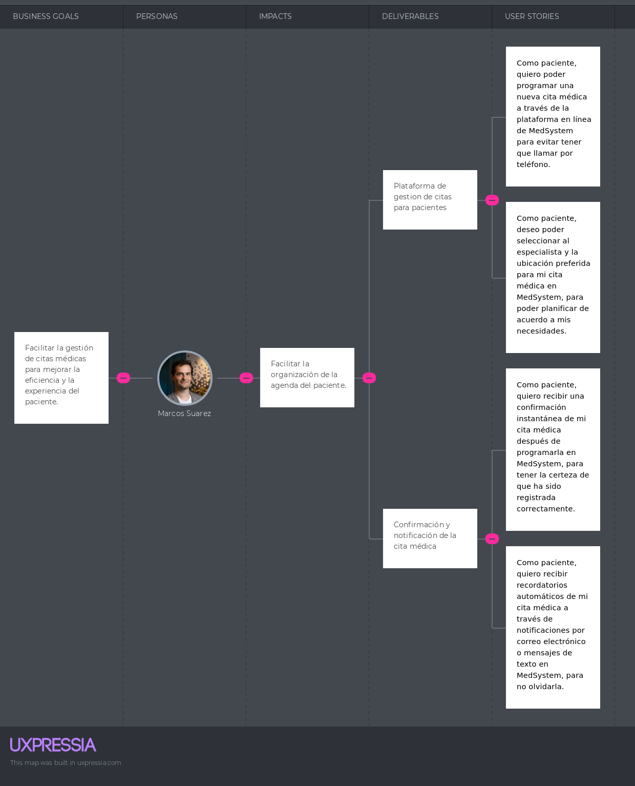

#### Segmento 2(Doctor):

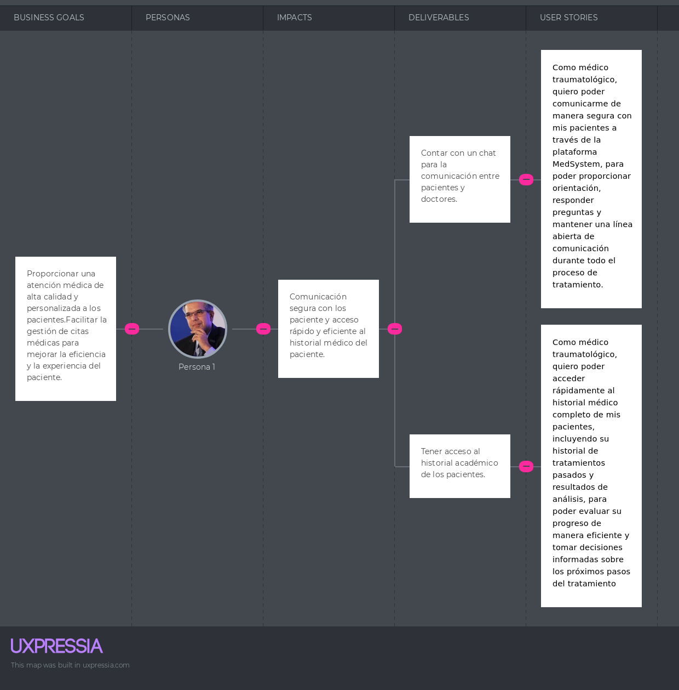

## 3.4 Product Backlog

Para elaborar nuestro Product Backlog hemos utilizado la secuencia de Fibonacci (1,2,3,5,8). Aplicamos esto con el objetivo de evaluar la complejidad de las tareas.

<b>Historia de usuario base:</b>

Como técnico de laboratorio, quiero un sistema que registre automáticamente los resultados de los análisis y los comunique al médico a través de la aplicación para agilizar la entrega de información y mejorar la atención al paciente. (Posee 5 puntos de historia)

Link del Pivotal Tracker: https://www.pivotaltracker.com/projects/2701194

<table border="1">
  <tr>
    <th>#Orden</th>
    <th>User Story ID</th>
    <th>Título</th>
    <th>Descripción</th>
    <th>Story Points (1/2/3/5/8)</th>
  </tr>
    <tr>
    <td>1</td>
    <td>US36</td>
    <td>Barra de navegación</td>
    <td>Como usuario, quiero una barra de navegación bien organizada en la landing page para poder acceder fácilmente a las diferentes secciones.</td>
    <td>1</td>
  </tr>
  <tr>
    <td>2</td>
    <td>US32</td>
    <td>Sección sobre el Producto</td>
    <td>Como usuario, deseo encontrar una sección dedicada que describa detalladamente el producto o servicio ofrecido por la aplicación.</td>
    <td>2</td>
  </tr>
  <tr>
    <td>3</td>
    <td>US31</td>
    <td>Sección About Us</td>
    <td>Como usuario, quiero encontrar una sección "About Us" en la landing page para conocer la misión, visión y valores de la empresa.</td>
    <td>2</td>
  </tr>
    <tr>
    <td>4</td>
    <td>US34</td>
    <td>Sección de contactos</td>
    <td>Como usuario, quiero encontrar una sección de contactos para poder comunicarse fácilmente con el equipo de la empresa.</td>
    <td>2</td>
  </tr>
  <tr>
    <td>5</td>
    <td>US33</td>
    <td>Funciones que ofrece al cliente</td>
    <td>Como paciente, quiero encontrar una sección que detalle las funciones clave que la aplicación ofrece para satisfacer mis necesidades.</td>
    <td>3</td>
  </tr>
  <tr>
    <td>6</td>
    <td>US35</td>
    <td>Sección sobre el equipo</td>
    <td>Como usuario, quiero encontrar una sección dedicada que presente información sobre el equipo detrás de la empresa.</td>
    <td>2</td>
  </tr>
  <tr>
    <td>7</td>
    <td>US07</td>
    <td>Registro de Nueva Cita</td>
    <td>Como paciente, quiero poder programar una nueva cita médica a través de la plataforma en línea de MedSystem para evitar tener que llamar por teléfono.</td>
    <td>3</td>
  </tr>
  <tr>
    <td>8</td>
    <td>US08</td>
    <td>Selección de Especialista y Ubicación</td>
    <td>Como paciente, deseo poder seleccionar al especialista y la ubicación preferida para mi cita médica en MedSystem, para poder planificar de acuerdo a mis necesidades.</td>
    <td>3</td>
  </tr>
  <tr>
    <td>9</td>
    <td>US09</td>
    <td>Disponibilidad de Horarios</td>
    <td>Como paciente, necesito ver la disponibilidad de horarios de los especialistas en MedSystem para elegir la fecha y hora más conveniente para mi cita médica.</td>
    <td>2</td>
  </tr>
  <tr>
    <td>10</td>
    <td>US012</td>
    <td>Confirmación de Cita</td>
    <td>Como paciente, quiero recibir una confirmación instantánea de mi cita médica después de programarla en MedSystem, para tener la certeza de que ha sido registrada correctamente.</td>
    <td>1</td>
  </tr>
  <tr>
    <td>11</td>
    <td>US10</td>
    <td>Recordatorios de Cita</td>
    <td>Como paciente, quiero recibir recordatorios automáticos de mi cita médica a través de notificaciones por correo electrónico o mensajes de texto en MedSystem, para no olvidarla.</td>
    <td>1</td>
  </tr>
  <tr>
    <td>12</td>
    <td>US11</td>
    <td>Cancelación y Re-agendamiento de Citas</td>
    <td>Como paciente, deseo tener la opción de cancelar o reagendar mi cita médica en MedSystem en caso de imprevistos o cambios en mi agenda.</td>
    <td>2</td>
  </tr>
  <tr>
    <td>13</td>
    <td>US17</td>
    <td>Comunicación Segura con los Pacientes</td>
    <td>Como médico traumatológico, quiero poder comunicarme de manera segura con mis pacientes a través de la plataforma MedSystem, para poder proporcionar orientación, responder preguntas y mantener una línea abierta de comunicación durante todo el proceso de tratamiento.</td>
    <td>3</td>
  </tr>
  <tr>
    <td>14</td>
    <td>US16</td>
    <td>Alertas de Cambios en Resultados de Análisis</td>
    <td>Como médico traumatológico, quiero recibir alertas automáticas sobre cambios significativos en los resultados de los análisis médicos de mis pacientes, para poder responder rápidamente a cualquier nueva información relevante y ajustar los tratamientos según sea necesario.</td>
    <td>3</td>
  </tr>
  <tr>
    <td>15</td>
    <td>US13</td>
    <td>Acceso Eficiente al Historial Médico Completo</td>
    <td>Como médico traumatológico, quiero poder acceder rápidamente al historial médico completo de mis pacientes, incluyendo su historial de tratamientos pasados y resultados de análisis, para poder evaluar su progreso de manera eficiente y tomar decisiones informadas sobre los próximos pasos del tratamiento</td>
    <td>3</td>
  </tr>
  <tr>
    <td>16</td>
    <td>US14</td>
    <td>Notificaciones de Citas de Seguimiento</td>
    <td>Como médico traumatológico, quiero recibir notificaciones automáticas sobre citas de seguimiento programadas con mis pacientes, para poder planificar mi agenda con anticipación y garantizar que ningún paciente se quede sin seguimiento adecuado.</td>
    <td>1</td>
  </tr>
  <tr>
    <td>17</td>
    <td>US15</td>
    <td>Actualización de Planes de Tratamiento</td>
    <td>Como médico traumatológico, quiero tener la capacidad de ajustar y actualizar los planes de tratamiento de mis pacientes directamente desde la plataforma MedSystem, para poder adaptar los tratamientos a medida que evoluciona la condición del paciente o surgen nuevas necesidades médicas.</td>
    <td>3</td>
  </tr>
  <tr>
    <td>18</td>
    <td>US18</td>
    <td>Análisis y Evaluación de Eficacia del Tratamiento</td>
    <td>Como médico traumatológico, quiero tener acceso a informes y análisis de datos sobre el progreso y la efectividad de los tratamientos de mis pacientes a lo largo del tiempo, para poder evaluar la eficacia de diferentes enfoques de tratamiento y mejorar continuamente mis prácticas médicas.</td>
    <td>3</td>
  </tr>
  <tr>
    <td>19</td>
    <td>US24</td>
    <td>Registro de eventos importantes en el historial médico</td>
    <td>Como doctor, necesito registrar eventos importantes en el historial médico de mis pacientes, como hospitalizaciones, cirugías importantes, cambios significativos en el estado de salud o eventos relevantes en la historia médica familiar, para tener una visión completa y contextualizada de la salud del paciente a lo largo del tiempo.</td>
    <td>3</td>
  </tr>
  <tr>
    <td>20</td>
    <td>US19</td>
    <td>Acceso rápido al historial médico del paciente</td>
    <td>Como doctor, necesito poder acceder rápidamente al historial médico completo de mis pacientes para revisar su historial de enfermedades, tratamientos pasados, alergias y otros datos relevantes antes de una consulta o procedimiento.</td>
    <td>3</td>
  </tr>
  <tr>
    <td>21</td>
    <td>US20</td>
    <td>Visualización detallada del historial médico</td>
    <td>Como doctor, necesito poder visualizar de manera detallada el historial médico de mis pacientes, incluyendo información como diagnósticos previos, resultados de exámenes, medicaciones actuales y pasadas, procedimientos realizados, y notas de otros médicos o especialistas.</td>
    <td>3</td>
  </tr>
  <tr>
    <td>22</td>
    <td>US22</td>
    <td>Registro de nuevas entradas en el historial médico</td>
    <td>Como doctor, necesito poder registrar nuevas entradas en el historial médico de mis pacientes, como nuevos diagnósticos, tratamientos recetados, resultados de exámenes o notas de la consulta actual, para mantener un registro completo y actualizado de su historial de salud.</td>
    <td>3</td>
  </tr>
  <tr>
    <td>23</td>
    <td>US21</td>
    <td>Actualización en tiempo real del historial médico</td>
    <td>Como doctor, necesito que cualquier actualización realizada en el historial médico de un paciente se refleje inmediatamente en el sistema, para garantizar que siempre esté trabajando con la información más reciente y precisa.</td>
    <td>2</td>
  </tr>
  <tr>
    <td>24</td>
    <td>US23</td>
    <td>Seguridad y privacidad del historial médico</td>
    <td>Como doctor, necesito que el acceso al historial médico de mis pacientes esté protegido por medidas de seguridad robustas, y que se cumplan estrictamente las regulaciones de privacidad de datos para garantizar la confidencialidad y la integridad de la información médica sensible.</td>
    <td>2</td>
  </tr>
  <tr>
    <td>25</td>
    <td>US30</td>
    <td>Alertas para detectar problemas en los resultados de las muestras</td>
    <td>Como técnico de laboratorio, deseo una función de alertas automáticas que me notifique sobre posibles discrepancias entre resultados de análisis de muestras de un mismo paciente, permitiéndome tomar medidas preventivas y garantizar la precisión de los resultados.</td>
    <td>3</td>
  </tr>
  <tr>
    <td>26</td>
    <td>US27</td>
    <td>Sistema de comunicación y registro de resultados</td>
    <td>Como técnico de laboratorio, quiero un sistema que registre automáticamente los resultados de los análisis y los comunique al médico a través de la aplicación para agilizar la entrega de información y mejorar la atención al paciente.</td>
    <td>5</td>
  </tr>
  <tr>
    <td>27</td>
    <td>US26</td>
    <td>Acceso a los protocolos actualizados en la aplicación web del laboratorio</td>
    <td>Como técnico de laboratorio, quiero una funcionalidad en la aplicación web que me permita acceder y revisar los protocolos actualizados de análisis y procedimientos, para asegurar que estoy siguiendo las últimas directrices y garantizar la calidad en la ejecución de las pruebas médicas.</td>
    <td>2</td>
  </tr>
  <tr>
    <td>28</td>
    <td>US28</td>
    <td>Protocolo de integridad para las muestras en el proceso de análisis</td>
    <td>Como técnico de laboratorio, quiero un protocolo actualizado que asegure la integridad de las muestras durante todo el proceso, desde la recolección hasta el análisis, minimizando así la posibilidad de resultados incorrectos debido a muestras comprometidas.</td>
    <td>3</td>
  </tr>
  <tr>
    <td>29</td>
    <td>US25</td>
    <td>Interfaz personalizable para mejorar eficiencia en los análisis medicos</td>
    <td>Como técnico de laboratorio, necesito una interfaz intuitiva y personalizable en el sistema de análisis para adaptarla a las necesidades específicas de cada tipo de prueba y mejorar la eficiencia en la ejecución de los análisis médicos</td>
    <td>3</td>
  </tr>
  <tr>
    <td>30</td>
    <td>US29</td>
    <td>Sistema de registro de resultados con consideraciones clínicas automatizadas</td>
    <td>Como técnico de laboratorio, quiero un sistema de registro de resultados que considere automáticamente las implicaciones clínicas de los mismos, proporcionando información contextual al médico y facilitando la toma de decisiones informadas sobre el cuidado del paciente</td>
    <td>2</td>
  </tr>
    <tr>
    <td>31</td>
    <td>US01</td>
    <td>Registro de Suministros</td>
    <td>Como técnico de laboratorio, quiere poder registrar nuevos suministros en el sistema, incluyendo detalles como nombre del producto, cantidad, fecha de vencimiento y ubicación en el laboratorio, para mantener un inventario actualizado y organizado.</td>
    <td>5</td>
  </tr>
  <tr>
    <td>32</td>
    <td>US02</td>
    <td>Seguimiento de Inventario</td>
    <td> Como técnico de laboratorio, necesita poder monitorear en tiempo real el nivel de existencias de cada suministro, recibir notificaciones cuando los niveles sean bajos y generar informes de inventario periódicos, para garantizar la disponibilidad de materiales necesarios en el laboratorio.</td>
    <td>3</td>
  </tr>
  <tr>
    <td>33</td>
    <td>US03</td>
    <td>Gestión de Pedidos Internos</td>
    <td>Como técnico de laboratorio, desea poder realizar pedidos de reposición de suministros de manera fácil y rápida a través de la plataforma, para mantener los niveles de inventario óptimos y asegurar un flujo de trabajo eficiente.</td>
    <td>3</td>
  </tr>
  <tr>
    <td>34</td>
    <td>US04</td>
    <td>Organización de Equipos</td>
    <td>Como técnico de laboratorio, quiere poder mantener un registro detallado de los equipos disponibles en el laboratorio, incluyendo información sobre su estado, mantenimiento programado y ubicación actual, para facilitar su uso y mantenimiento.</td>
    <td>2</td>
  </tr>
  <tr>
    <td>35</td>
    <td>US05</td>
    <td>Integración de Datos</td>
    <td>Integración de Datos: Como técnico de laboratorio, necesita que la plataforma tenga la capacidad de integrar los datos del inventario con otros sistemas internos del laboratorio, para garantizar una gestión coherente y eficiente del inventario y evitar discrepancias en los registros.</td>
    <td>3</td>
  </tr>
  <tr>
    <td>36</td>
    <td>US06</td>
    <td>Gestión de Mantenimiento de Equipos</td>
    <td>Como técnico de laboratorio, necesito una funcionalidad en la plataforma que me permita gestionar el mantenimiento de los equipos del laboratorio, para garantizar su correcto funcionamiento y prolongar su vida útil.</td>
    <td>3</td>
  </tr>
</table>

---

 

# Capítulo IV: Product Design

## 4.1. Style Guidelines

Para optimizar la experiencia de todos los usuarios, dentro de nuestro landing Page proponemos un diseño de interfaz atractivo, y responsivo que se adapte a distintas dimensiones para los distintos dispositivos. Asimismo, hemos elegido colores llamativos, imágenes de buena calidad y se implementa un navbar intuitivo para que el usuario pueda desplazarse por la página de manera cómoda y fluida. Con todo esto, buscamos proporcionar una experiencia amigable y práctica para todos los usuarios.

### 4.1.1. General Style Guidelines

<h4><strong>Branding:</strong> </h4>

Nuestro logro hace alusión al tema que se está trabajando en este proyecto, el cual busca ayudar a los traumatólogos con un sistema médico, es por esto que en nuestro logo se ve una cruz que hace referencia a la salud de una persona. De este modo, se crea una representación visual efectiva y reconocible ante cualquier usuario que lo vea. 

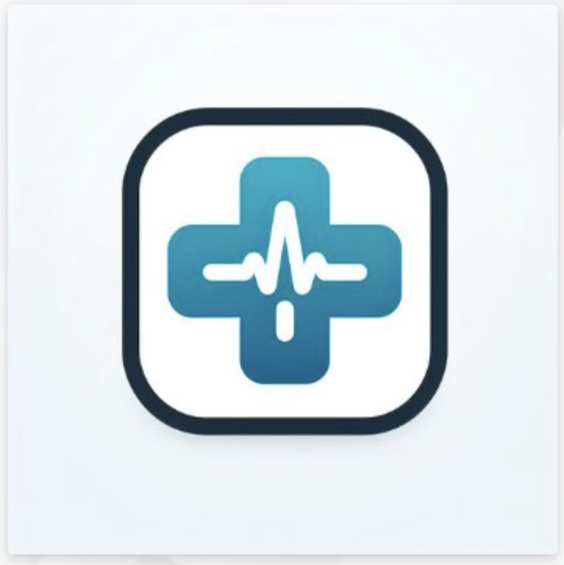

<h4><strong>Typography:</strong> </h4>

En cuanto a la elección de la tipografía, se eligió la fuente “Poppins”, puesto que no solo se quería que la fuente sea solo un estilo que intentara captar la atención del usuario, sino también era fundamental que sea legible y estéticamente agradable para el usuario. Con esta fuente, se logra lo deseado y se consigue brindar la información de manera clara dentro de la página. Además, para algunos subtitulos se utiliza la fuente "Oswald", para brindar variedad; y en caso de errores se utiliza fuentes "sans-serif" en caso de que alguna de las fuentes anteriores no funcionen.

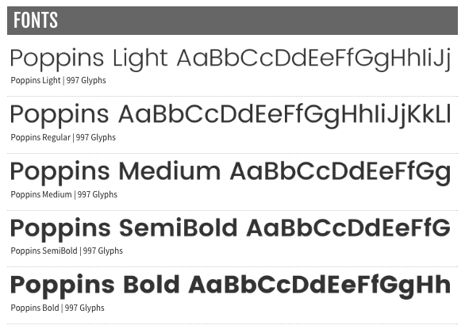 

<h4><strong>Paleta de colores:</strong> </h4>

La paleta de colores se baso en algunos colores llamativos parecidos al color azul, que tuvo ciertas variaciones en la página, como el difuminado en la imagen representativa o el degradado que tuvo en el footer.

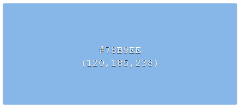 
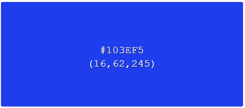 
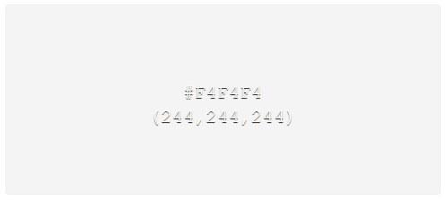

<h4><strong>Colores neutros:</strong> </h4>

El único color neutro que se eligió fue el blanco

### 4.1.2. Web Style Guidelines

En MedSystem, se ha elegido cuidadosamente los elementos de estilo web para que el usuario tenga una experiencia que refleje la esencia de la plataforma y atienda a las necesidades de los segmentos objetivo de pacientes, doctores y laboratorios. Los colores base elegidos son variaciones al azul, para que haya más sintonía con la página y se vea agradable a la vista. Para el estilo de letra elegido, se optó por una tipografía legible y formal, ya que se desea que el usuario logre entender la información de manera clara y efectiva, es por esto que también se emplean distintos tamaños de fuente, con el fin de dar accesibilidad a todo los usuarios, y puedan interactuar con la plataforma sin ningún problema. 

<h4><strong>Colores base:</strong> </h4>
 
 

<h4><strong>Colores neutros:</strong> </h4>

<h4><strong>Estilo de letras:</strong> </h4>
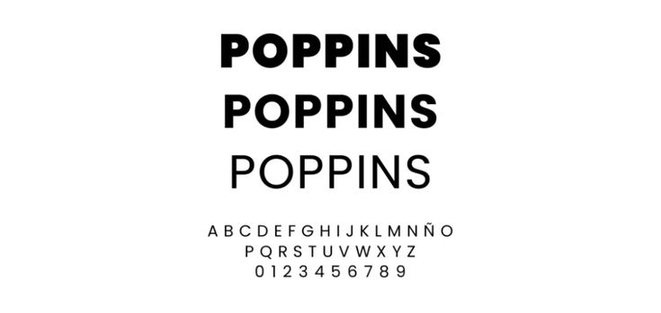 
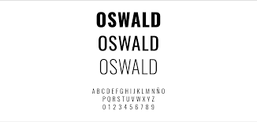

<h4><strong>Botones:</strong> </h4>
 
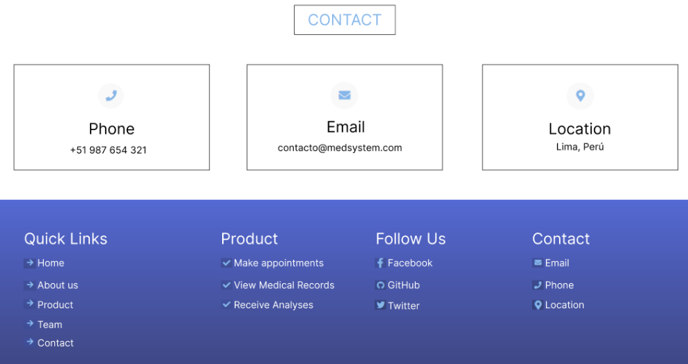

## 4.2. Information Architecture

### 4.2.1. Organization Systems

El principal objetivo de este punto es ofrecer una guía y apoyo para estructurar la información de la página web. Esto asegurará que, al llevar a cabo la implementación del sistema, sea accesible y sencillo de utilizar para los usuarios. En este nuevo proyecto, se ha decidido emplear la organización jerárquica para las diversas secciones del Landing Page. Esta elección se fundamenta en la variedad de grupos de usuarios y las diferencias según el tipo de usuario que la utilice. Además, para la clasificación del contenido, se opta por un orden numérico para las fucnionalidades que mencionamos en la aplicación.

### 4.2.2. Labeling Systems

En este caso, las etiquetas de información se representarán en el idioma inglés, y estas serán claras y concisas para que el usuario entienda por completo la funcionalidad. Las etiquetas más importantes de nuestra aplicación son: 

<strong>Appointments:</strong> Aquí se muestran las opciones para agendar citas, las que se desean programar, y las que ya tienen una fecha programada de asistencia, junto con todos los datos del paciente, el doctor a cargo de la consulta y la fecha y hora de esta.

<strong>Chat:</strong> En este apartado se muestran todos los chats de los pacientes con los que el doctor ha tenido contacto, y en el caso del paciente, se le muestra los doctores con los que ha tenido consulta. Por este medio se pueden aclarar dudas y su uso es solo para fines médicos. 

<strong>Treatments for patient:</strong> En este apartado el usuario podrá visualizar el tratamiento que debe realizar de acuerdo a las indicaciones del médico, el cual también podra ir editando en este apartado e ir viendo como evoluciona el paciente.

<strong>Request history:</strong> En este apartado el médico va poder ver diagnósticos anteriores del paciente, que tratamientos ha llevado y datos médicos específicos del paciente; con el fin de saber cual sería el mejor tratamiento para llevarse a cabo. Asimismo, podrá actualizar el historial clínico del paciente, una vez haya terminado cierto tratamiento. 

<strong>Request results:</strong> En este apartado el médico podrá pedir los resultados de un paciente a un laboratorio, brindando los datos del examen tomado y del paciente. De esta forma, el doctor obtiene los resultados y sabe que tratamiento llevar a cabo.

### 4.2.3. SEO Tags and Meta Tag

A continuación, mostraremos las etiquetas que representarán el contenido presentado tanto en nuestra aplicación web como en nuestra página de inicio. Estas etiquetas facilitarán la identificación y localización de nuestra aplicación MedSystem.

Landing Page:

Title: MedSystem

Description: MedSystem - Los Luminosos Oficial Landing Page

Keywords: Appointments, treatments, doctors, patients, laboratories.

Authors: Los Luminosos Team

Web application:

Title: MedSystem

Description: MedSystem - Los Luminosos Oficial Web Site

Keywords: Appointments, Clinic History, Treatment Tracking, medical tests, test results, registration, diagnosis.

Authors: Los Luminosos team

### 4.2.4. Searching Systems

El sistema de búsqueda es un elemento fundamental en nuestra aplicación, puesto que se va usar bastante al momento ded pedir las historias clinicas del paciente, al momento de pedir los resultados, y al momento de buscar a un paciente en el apartado de chats. Considerando que el sistema maneja una gran cantidad de datos, y a medida que estos van incrementando, se ha pensado en un sistema de busqueda ágil que funcione con la base de datos de manera fluída, y de esta forma los usuarios no tengan alguna insatisfacción al momento de usar el sistema.

### 4.2.5. Navigation Systems

El método de navegación entre las diversas secciones de la landing page estará facilitado por una barra superior. Esta barra estará compuesta por los títulos representativos de cada sección, permitiendo que los usuarios puedan acceder directamente a la información deseada simplemente haciendo clic en el título correspondiente. En el caso de la aplicación web, la navegación se irá dando a través de una barra lateral, la cual contendrá los títulos de cada función que se ofrece. Esta estructura de navegación se ha diseñado para integrarse de manera armoniosa con la interfaz visual de la Landing Page y la aplicación web, proporcionando una experiencia agradable y fluida para los usuarios.

## 4.3. Landing Page UI Design

### 4.3.1. Landing Page Wireframe

<td>

  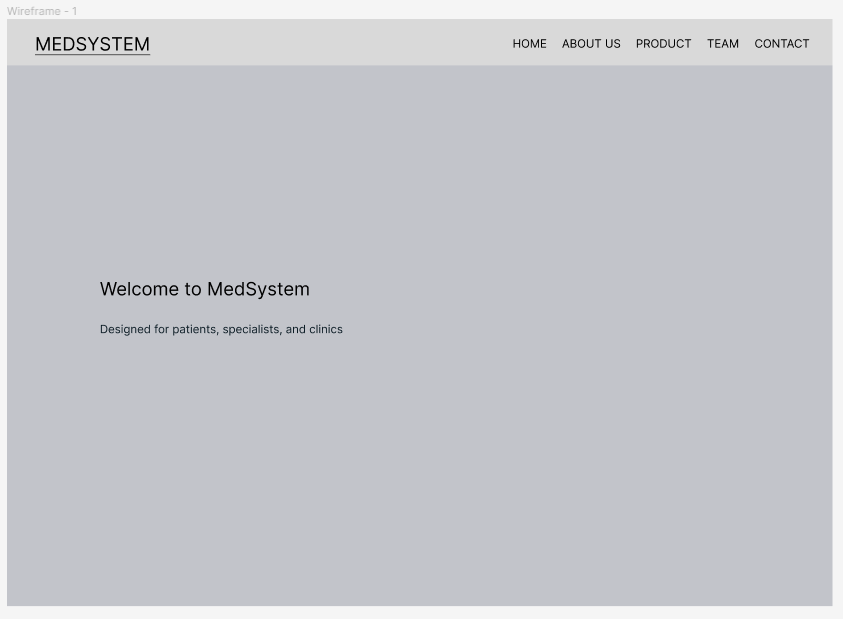
</td>
<td>

  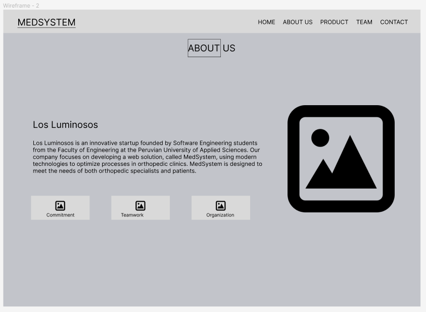
</td>
<td>

  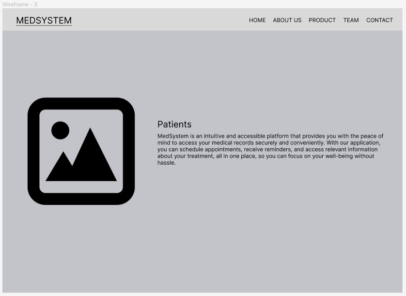
</td>
<td>

  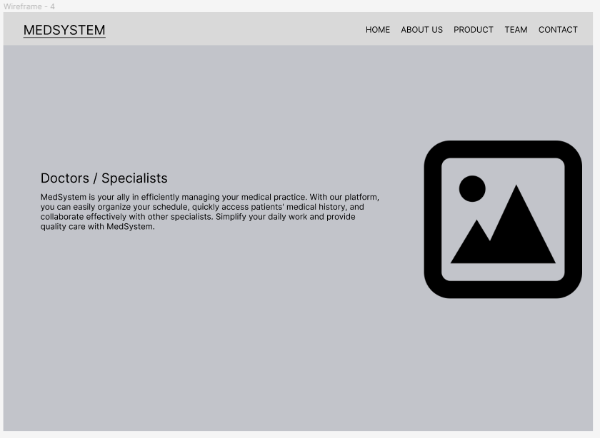
</td>  
<td>

  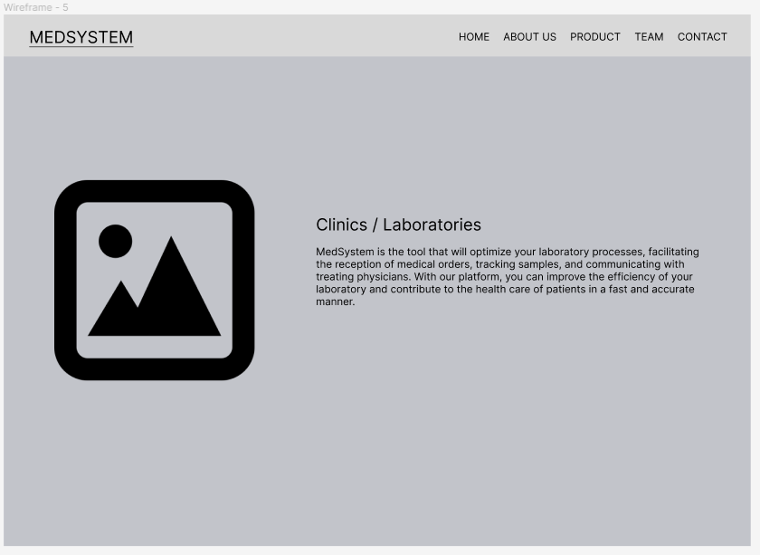
</td>
<td>

  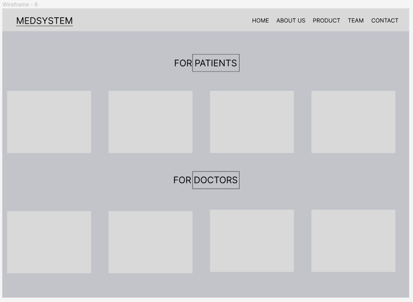
</td>
<td>

  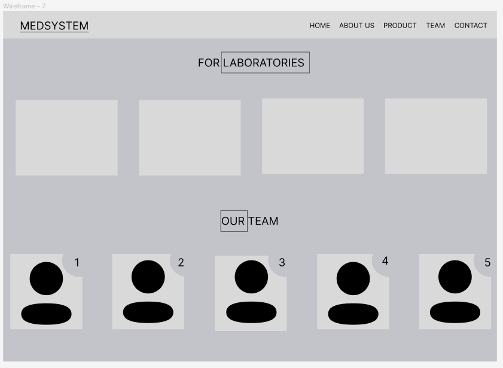
</td>
<td>

  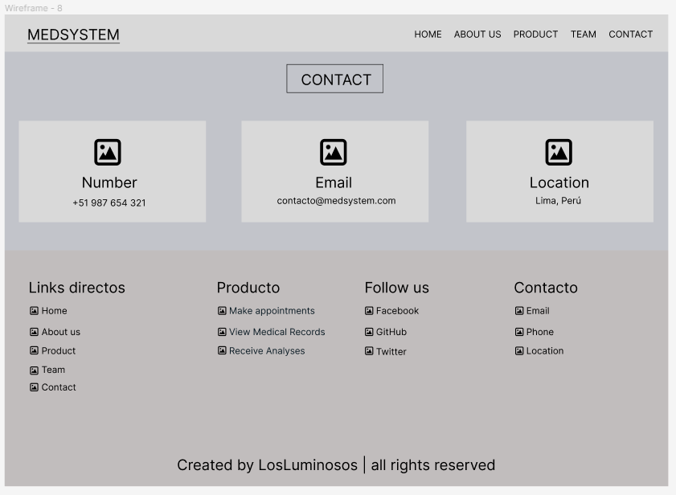
</td>

Figma:https://www.figma.com/file/xe8QMJ0qrwJtStkiB7l8zH/MEDSYSTEM?type=design&node-id=0%3A1&mode=design&t=ZtX8VrqTo4qt5UtH-1

### 4.3.2. Landing Page Mock-up

<td>

  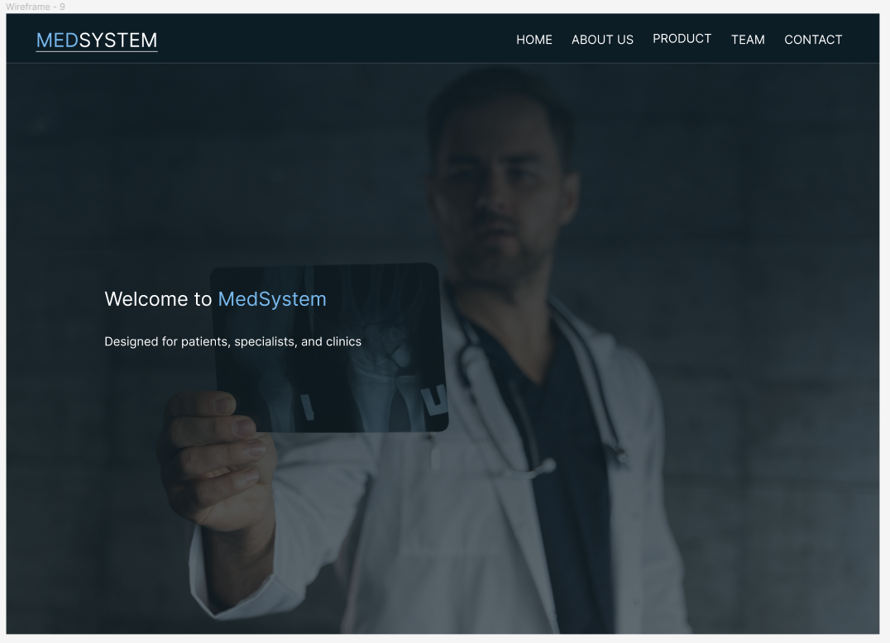
</td>
<td>

  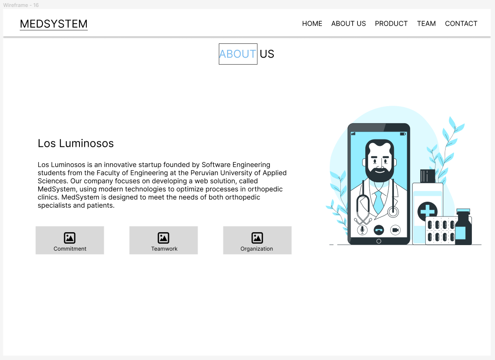
</td>
<td>

  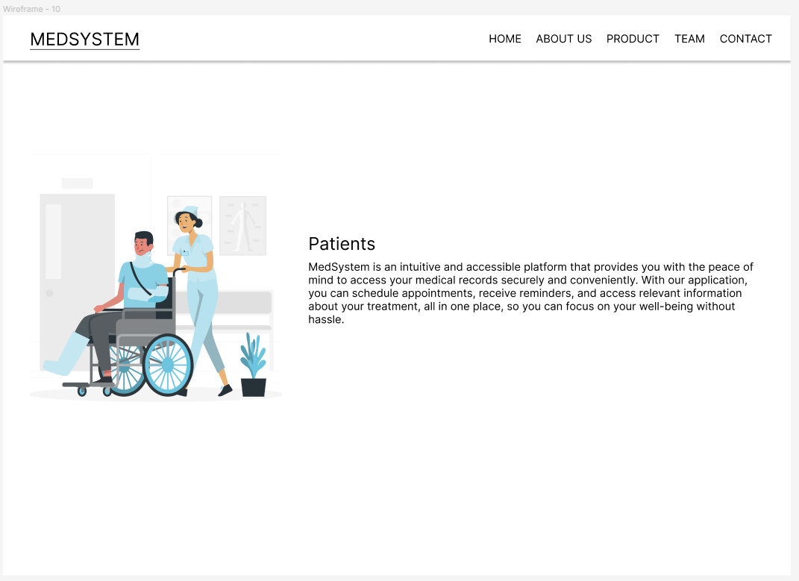
</td>
<td>

  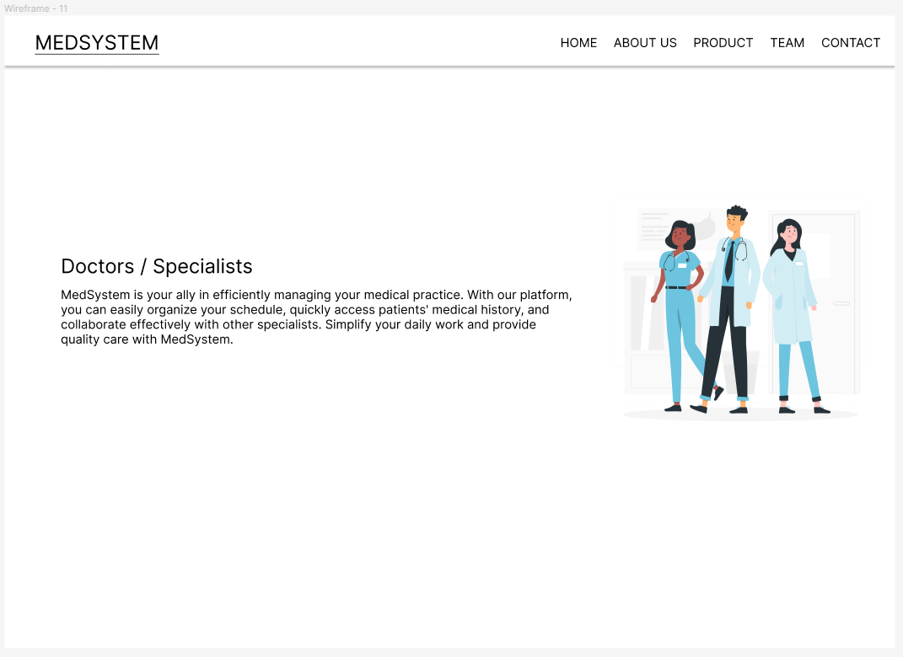
</td>
<td>

  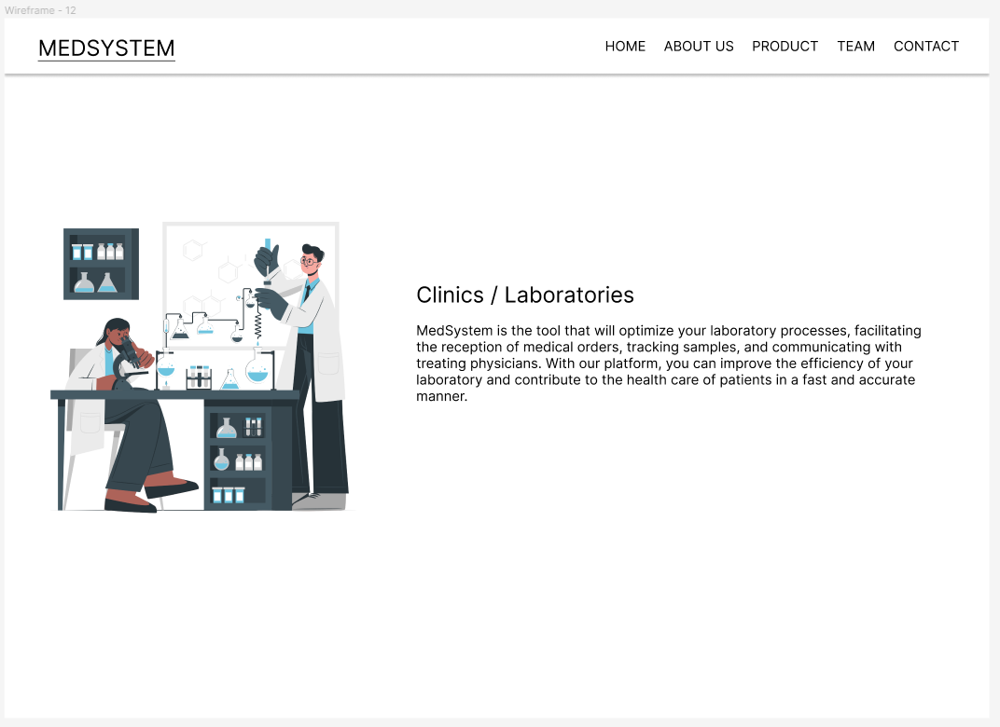
</td>
<td>

  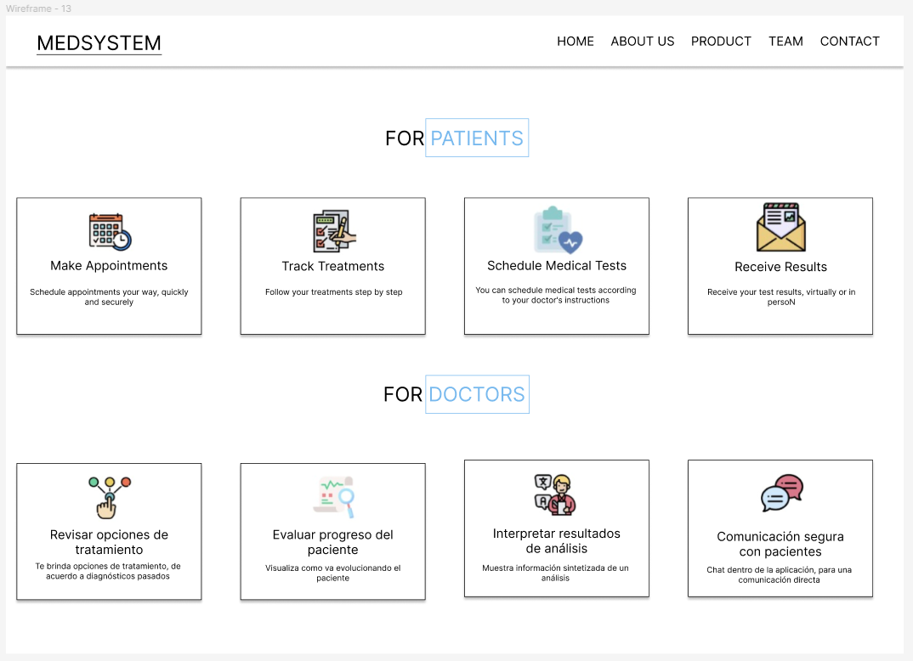
</td>
<td>

  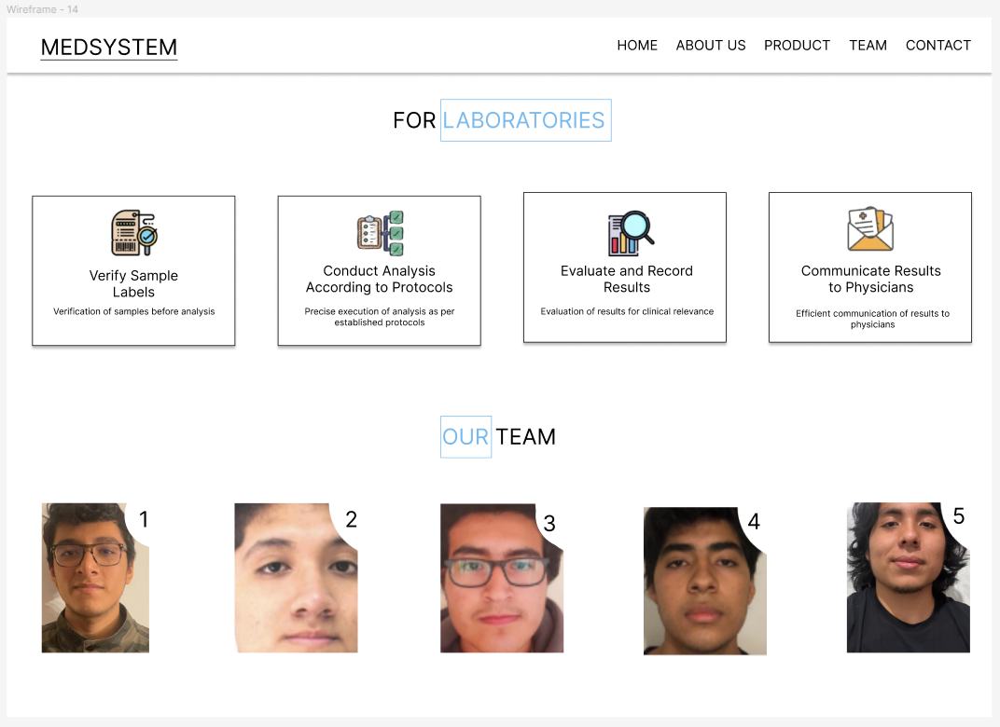
</td>
<td>

  
</td>

Figma:https://www.figma.com/file/xe8QMJ0qrwJtStkiB7l8zH/MEDSYSTEM?type=design&node-id=0%3A1&mode=design&t=ZtX8VrqTo4qt5UtH-1

### 4.4.1. Web Applications Wireframes

Login patient

<td>

  
</td> 
Login doctor
<td>

  
</td>
Login consultancy
<td>

  
</td>
Register patient
<td>

  
</td>
Register doctor
<td>

  
</td>
Register consultancy
<td>

  
</td>
Doctor appointment
<td>

  
</td>
Doctor appointment 2
<td>

  
</td>
  Doctor chat
<td>

  
</td>
Doctor treatments for pacient
<td>

  
</td>
Doctor request history
<td>

  
</td>
Doctor request results
<td>

  
</td>

Figma: https://www.figma.com/file/IWM02vY7KVWCXNZMMkQDp7/APPWEB---WIREFRAMES?type=design&node-id=38%3A210&mode=design&t=LeRDoXApO30XZxTA-1

### 4.4.2. Web Applications Wireflow Diagrams

User goal 1: Como desarrollador, quiero desarrollar un sistema de gestión de citas para MedSystem, para que los docotres y pacientes puedan programar y gestionar sus citas de manera eficiente.

<td>

  
</td>
<td>

  
</td>

User goal 2: Como médico traumatológico, quiero poder comunicarme de manera segura con mis pacientes a través de la plataforma MedSystem, para poder proporcionar orientación, responder preguntas y mantener una línea abierta de comunicación durante todo el proceso de tratamiento.

<td>

  
</td>

User goal 3: Como médico traumatológico, quiero tener acceso a informes y análisis de datos sobre el progreso y la efectividad de los tratamientos de mis pacientes a lo largo del tiempo, para poder evaluar la eficacia de diferentes enfoques de tratamiento y mejorar continuamente mis prácticas médicas.

<td>

  
</td>

User goal 4: Como desarrollador, quiero incorporar una función de seguimiento de historias clínicas en MedSystem, para que los doctores puedan acceder fácilmente al historial médico de cada paciente, y puedan realizar un seguimiento preciso de su tratamiento.

<td>

  
</td>

User goal 5: Como técnico de laboratorio, quiero un sistema que registre automáticamente los resultados de los análisis y los comunique al médico a través de la aplicación para agilizar la entrega de información y mejorar la atención al paciente.

<td>

  
</td>

Figma: https://www.figma.com/file/IWM02vY7KVWCXNZMMkQDp7/APPWEB---WIREFRAMES?type=design&node-id=38%3A210&mode=design&t=LeRDoXApO30XZxTA-1

### 4.4.2. Web Applications Mock-ups

Login patient

<td>

  
</td> 
Login doctor
<td>

  
</td>
Login consultancy
<td>

  
</td>
Register patient
<td>

  
</td>
Register doctor
<td>

  
</td>
Register consultancy
<td>

  
</td>
Doctor appointment
<td>

  
</td>
Doctor appointment 2
<td>

  
</td>
  Doctor chat
<td>

  
</td>
Doctor treatments for pacient
<td>

  
</td>
Doctor request history
<td>

  
</td>
Doctor request results
<td>

  
</td>

Figma: https://www.figma.com/file/IWM02vY7KVWCXNZMMkQDp7/APPWEB---WIREFRAMES?type=design&node-id=38%3A210&mode=design&t=LeRDoXApO30XZxTA-1

### 4.4.3. Web Applications User Flow Diagrams

User goal 1: Como desarrollador, quiero desarrollar un sistema de gestión de citas para MedSystem, para que los docotres y pacientes puedan programar y gestionar sus citas de manera eficiente.

<td>

  
</td>
<td>

  
</td>

User goal 2: Como médico traumatológico, quiero poder comunicarme de manera segura con mis pacientes a través de la plataforma MedSystem, para poder proporcionar orientación, responder preguntas y mantener una línea abierta de comunicación durante todo el proceso de tratamiento.

<td>

  
</td>

User goal 3: Como médico traumatológico, quiero tener acceso a informes y análisis de datos sobre el progreso y la efectividad de los tratamientos de mis pacientes a lo largo del tiempo, para poder evaluar la eficacia de diferentes enfoques de tratamiento y mejorar continuamente mis prácticas médicas.

<td>

  
</td>

User goal 4: Como desarrollador, quiero incorporar una función de seguimiento de historias clínicas en MedSystem, para que los doctores puedan acceder fácilmente al historial médico de cada paciente, y puedan realizar un seguimiento preciso de su tratamiento.

<td>

  
</td>

User goal 5: Como técnico de laboratorio, quiero un sistema que registre automáticamente los resultados de los análisis y los comunique al médico a través de la aplicación para agilizar la entrega de información y mejorar la atención al paciente.

<td>

  
</td>

Figma: https://www.figma.com/file/IWM02vY7KVWCXNZMMkQDp7/APPWEB---WIREFRAMES?type=design&node-id=38%3A210&mode=design&t=LeRDoXApO30XZxTA-1

## 4.5. Web Applications Prototyping

## 4.6. Domain-Driven Software Architecture

### 4.6.1. Software Architecture Context Diagram


### 4.6.2. Software Architecture Container Diagrams


### 4.6.3. Software Architecture Components Diagrams


## 4.7. Software Object-Oriented Design

### 4.7.1. Class Diagram


### 4.7.2. Class Dictionary

Class User

<table border="1">
  <tr>
    <th>Attribute</th>
    <th>Type</th>
    <th>Description</th>
  </tr>
  <tr>
    <td>id</td>
    <td>int</td>
    <td>Unique code for client</td>
  </tr>
  <tr>
    <td>firstname</td>
    <td>string</td>
    <td>Name of the client</td>
  </tr>
  <tr>
    <td>lastname</td>
    <td>string</td>
    <td>Last name of the client</td>
  </tr>
  <tr>
    <td>gender</td>
    <td>char</td>
    <td>Gender of de client</td>
  </tr>
</table>

Class Credential

<table border="1">
  <tr>
    <th>Attribute</th>
    <th>Type</th>
    <th>Description</th>
  </tr>
  <tr>
    <td>id</td>
    <td>int</td>
    <td>Unique code for client</td>
  </tr>
  <tr>
    <td>username</td>
    <td>string</td>
    <td>Username of the client</td>
  </tr>
  <tr>
    <td>password</td>
    <td>string</td>
    <td>Password of the client</td>
  </tr>
</table>

Class Procedure

<table border="1">
  <tr>
    <th>Attribute</th>
    <th>Type</th>
    <th>Description</th>
  </tr>
  <tr>
    <td>id</td>
    <td>int</td>
    <td>Unique code for procedure</td>
  </tr>
  <tr>
    <td>info</td>
    <td>string</td>
    <td>More information about the procedure</td>
  </tr>
  
</table>

Class Doctor

<table border="1">
  <tr>
    <th>Attribute</th>
    <th>Type</th>
    <th>Description</th>
  </tr>
  <tr>
    <td>id</td>
    <td>int</td>
    <td>Unique code for doctor</td>
  </tr>
  <tr>
    <td>field</td>
    <td>string</td>
    <td>Field of the doctor<td>
  </tr>
</table>

Class MedicalHistory

<table border="1">
  <tr>
    <th>Attribute</th>
    <th>Type</th>
    <th>Description</th>
  </tr>
  <tr>
    <td>id</td>
    <td>int</td>
    <td>Unique code for MedicalHistory</td>
  </tr>
  <tr>
    <td>info</td>
    <td>string</td>
    <td>More information about the MedicalHistory</td>
  </tr>
</table>

Class Appointment

<table border="1">
  <tr>
    <th>Attribute</th>
    <th>Type</th>
    <th>Description</th>
  </tr>
  <tr>
    <td>id</td>
    <td>int</td>
    <td>Unique code for Appointment</td>
  </tr>
  <tr>
    <td>date</td>
    <td>date</td>
    <td>Specific date of the appointment</td>
  </tr>
  <tr>
    <td>info</td>
    <td>string</td>
    <td>More info about the Appointment</td>
  </tr>
  <tr>
    <td>time</td>
    <td>time</td>
    <td>Exact time of the Appointment</td>
  </tr>
</table>

Class Agenda

<table border="1">
  <tr>
    <th>Attribute</th>
    <th>Type</th>
    <th>Description</th>
  </tr>
  <tr>
    <td>id</td>
    <td>int</td>
    <td>Unique code for Agenda</td>
  </tr>
  <tr>
    <td>listOfAppointments</td>
    <td>list&lt;Appointment&gt;</td>
    <td>List of appointments</td>
  </tr>
</table>

Class Notification

<table border="1">
  <tr>
    <th>Attribute</th>
    <th>Type</th>
    <th>Description</th>
  </tr>
  <tr>
    <td>id</td>
    <td>int</td>
    <td>Unique code for Notification</td>
  </tr>
  <tr>
    <td>message</td>
    <td>string</td>
    <td>Message appearing on the notification</td>
  </tr>
  <tr>
    <td>date</td>
    <td>date</td>
    <td>Date of the notification</td>
  </tr>
</table>

Class MedicalResult

<table border="1">
  <tr>
    <th>Attribute</th>
    <th>Type</th>
    <th>Description</th>
  </tr>
  <tr>
    <td>id</td>
    <td>int</td>
    <td>Unique code for MedicalResult</td>
  </tr>
  <tr>
    <td>info</td>
    <td>string</td>
    <td>More info about the MedicalResult</td>
  </tr>
</table>

Class MedicalSample

<table border="1">
  <tr>
    <th>Attribute</th>
    <th>Type</th>
    <th>Description</th>
  </tr>
  <tr>
    <td>id</td>
    <td>int</td>
    <td>Unique code for MedicalSample</td>
  </tr>
  <tr>
    <td>info</td>
    <td>string</td>
    <td>More info about the MedicalSample</td>
  </tr>
</table>

Class MedicalAnalisis

<table border="1">
  <tr>
    <th>Attribute</th>
    <th>Type</th>
    <th>Description</th>
  </tr>
  <tr>
    <td>id</td>
    <td>int</td>
    <td>Unique code for MedicalAnalisis</td>
  </tr>
  <tr>
    <td>info</td>
    <td>string</td>
    <td>More info about the MedicalAnalisis</td>
  </tr>
</table>

Class Message

<table border="1">
  <tr>
    <th>Attribute</th>
    <th>Type</th>
    <th>Description</th>
  </tr>
  <tr>
    <td>id</td>
    <td>int</td>
    <td>Unique code for Message</td>
  </tr>
  <tr>
    <td>info</td>
    <td>string</td>
    <td>More info about the Message</td>
  </tr>
</table>

Class Progress

<table border="1">
  <tr>
    <th>Attribute</th>
    <th>Type</th>
    <th>Description</th>
  </tr>
  <tr>
    <td>id</td>
    <td>int</td>
    <td>Unique code for Progress</td>
  </tr>
  <tr>
    <td>info</td>
    <td>string</td>
    <td>More info about the Progress</td>
  </tr>
</table>

Class Treatment

<table border="1">
  <tr>
    <th>Attribute</th>
    <th>Type</th>
    <th>Description</th>
  </tr>
  <tr>
    <td>id</td>
    <td>int</td>
    <td>Unique code for Treatment</td>
  </tr>
  <tr>
    <td>info</td>
    <td>string</td>
    <td>More info about the Treatment</td>
  </tr>
</table>

## 4.8. Database Design

### 4.8.1. Database Diagram


---

 

# Capítulo V: Product Implementation, Validation & Deployment

## 5.1. Software Configuration Management

### 5.1.1 Software Development Environment Configuration

En esta sección se describen brevemente todas las herramientas que se han utilizado para la elaboración del proyecto, se dividirán en dos partes.

#### UX/UI Design:

- Miro: Miro es una herramienta en línea colaborativa en tiempo real, esta permite crear diversos diagramas, mapas mentales, diagramas de flujo u otros artefactos que se necesiten en el proyecto.
  Link: https://miro.com/es/
- UXPressia: UXPressia es una herramienta enfocada en lo que es la experiencia de usuario, ya que esta permite crear User Personas, Customer Journey, Impact maps, etc.
  Link: https://uxpressia.com/
- Figma: Figma es una herramienta que se enfoca en el diseño de interfaces para los usuarios y prototipado de las páginas webs, además de que este también es colaborativo por lo cual todos pueden trabajar en un mismo proyecto en simultáneo.
  Link: https://miro.com/es/
- Structurizr: Es una página web donde nos permite desarrollar modelos en C4, de la arquitectura de nuestro proyecto describiendo los contenedores, componentes y contextos de nuestra solución web.
  Link: https://structurizr.com/

#### Software Development:

- Github: Herramienta para guardar, a través de repositorios, los proyecto que se desarrollen, además que permite guardar un historial de versiones, utilizando Git
  Link: https://github.com
- Github Pages: Herramienta dentro de github que permite alojar una pagina web de un repositorio
  HTML: Un lenguaje de marcado para crear tanto la estructura y el contenido de una página web.
- JavaScript: Lenguaje de programación para agregar funcionalidad a las páginas webs
- CSS: Lenguaje utilizado para dar estilo a las páginas webs
- Visual Studio Code: Editor de código que se utiliza para realizar distintos trabajos con respecto a la programación, este soporta una gran cantidad de lenguajes, como Python, JavaScript, HTML, entre otros.
  Link: https://code.visualstudio.com/

#### Project Managment:

Para el desarrollo del proyecto hemos usado distintas plataformas para hacer las coordinaciones de los avances, el primero fue un grupo por medio de WhatsApp donde compartimos las opiniones del trabajo y los avances realizados, después para las reuniones utilizamos Discord que nos permite hacer llamadas para una correcta coordinación del trabajo. En cuanto a los avances del trabajo utilizamos github donde hacíamos commit con cada avance significativo que hacemos en los repositorios

### 5.1.2 Source Code Management

Hemos creado los repositorios que usaremos a lo largo de el desarrollo del proyecto esto incluye el de la documentacion, landing page, frontend y backend.

- URL del repositorio de documentacion: https://github.com/LosLuminosos-SW57/FinalProject

- URL del repositorio de la landing page: https://github.com/LosLuminosos-SW57/LandingPageMedSystem

- URL del repositorio del Frontend: https://github.com/LosLuminosos-SW57/Frontend-MedSystem

- URL del repositorio del Backend: https://github.com/LosLuminosos-SW57/Backend-MedSystem

### 5.1.3 Source Code Style Guide & Conventions

Para el desarrollo de nuestra solucion web emplearemos distintos lenguajes de programacion para la landing page el frontend y backend:

#### HTML:

- Indentación: Manténer una indentación clara para mejorar la legibilidad.
- Semántica: Utilizar elementos HTML semánticos para una estructura clara y accesible.
- Comentarios: Documentar el código HTML con comentarios claros y concisos.
- Atributos Alt: Proporcionar textos alternativos para imágenes y otros elementos.

#### CSS:

- Nomenclatura de Clases: UtilizaR una convención de nomenclatura consistente, como BEM.
- Separación de Intereses: Separar estilos del HTML utilizando clases y selectores específicos.
- Reutilización de Estilos: Identificar estilos comunes y reutilízarlos para mantener la coherencia.

#### JavaScript:

- Nomenclatura de Variables: Utilizar nombres descriptivos, significativos y breves.
- Modularidad: Dividir el código en módulos pequeños y reutilizables.
- Manejo de Errores: Implementar un manejo de errores robusto.

### 5.1.4 Software Deployment Configuration

Para gestionar el despliegue de nuestra aplicación, hemos optado por utilizar GitHub y GitHub Pages.

GitHub es una plataforma para alojar repositorios de Git. Permite colaborar de manera eficiente en proyectos de software, facilitando el seguimiento de cambios, la revisión de código y la gestión de versiones.

Despues tambien esta GitHub Pages que es una función de GitHub que permite alojar sitios web estáticos directamente desde un repositorio de GitHub. Con GitHub Pages, permitiendonos alojar nuestra pagina web sin tener que pagar un servidor externo.

## 5.2 Landing Page, Services & Applications Implementation

### 5.2.1 Sprint 1

### 5.2.1.1 Sprint Planning 1

Se planeó el primer sprint a través de una reunión dentro de la plataforma Discord. Para esto, se realizó una tabla que permitió registrar toda la información discutida.

| **Sprint #**                       | Sprint 1                                                                                                                                                                                                    |
| :--------------------------------- | :---------------------------------------------------------------------------------------------------------------------------------------------------------------------------------------------------------- |
| **Sprint Planning Background**     |                                                                                                                                                                                                             |
| Date                               | 2024-04-05                                                                                                                                                                                                  |
| Time                               | 07:00 AM                                                                                                                                                                                                    |
| Location                           | Virtual                                                                                                                                                                                                     |
| Prepared by                        | Gutierrez Zumaeta, Manuel Alonso                                                                                                                                                                            |
| Attendees (to planning meeting)    | 
Guimaraes Escalante, Carlos Eduardo

Altamirano Saenz, Jorge Armando

Montes Figueroa, Juan Eduardo

Flores Manrique, Sebastian Enrique

Gutierrez Zumaeta, Manuel Alonso

 |
| Sprint n - 1 Review Summary        | No hubo sprint anterior                                                                                                                                                                                     |
| Sprint n - 1 Retrospective Summary | No hubo sprint anterior                                                                                                                                                                                     |
| **Sprint Goal & User Stories**     |                                                                                                                                                                                                             |
| Sprint 1 Goal                      | Desarollo de la landing page                                                                                                                                                                                |
| Sprint 1 Velocity                  | 12                                                                                                                                                                                                          |
| Sum of Story Points                | 12                                                                                                                                                                                                          |

### 5.2.1.2 Sprint Backlog 1

El principal objetivo de este primer sprint es lograr completar todos los requisitos que se piden para el Landing Page. Además, se lleva en simultáneo el Sprint 1 con un archivo en Trello:

<a href="https://trello.com/invite/b/7HI3sRn5/ATTIe053b759a6699daf162bb0e5f6faba2c991C93B4/sprint-1-medsystem">https://trello.com/invite/b/7HI3sRn5/ATTIe053b759a6699daf162bb0e5f6faba2c991C93B4/sprint-1-medsystem</a>

<table border="1">
  <tr>
    <td>Sprint #</td><td colspan="7" align="center">Sprint 2</td>
  </tr>
  <tr>
    <td colspan="2" align="center">User Story</td><td colspan="6" align="center">Work-Item / Task</td>
  </tr>
  <tr>
    <td>ID</td><td>Title</td><td>ID</td><td>Title</td><td>Description</td><td>Estimation (Hours)</td><td>Assigned To</td><td>Status (To-Do / In-Process / Review / Done)</td>
  </tr>
  <tr>
    <td rowspan="2">US36</td><td rowspan="2">Barra de navegación</td><td>T01</td><td>Creación de estructura del navbar</td><td>Crear todos los puntos del navbar en el header de nuestra landing page.</td><td>1</td><td>Juan Montes, Jorge Altamirano </td><td>Done</td>
  </tr>
  <tr>
    <td>T02</td><td>Añadir estilos al navbar</td><td>Añadir estilos al header, poniendo los puntos del navbar en forma horizontal.</td><td>1</td><td>Manuel Gutierrez</td><td>Done</td>
  </tr>
  <tr>
    <td rowspan="2">US32</td><td rowspan="2">Sección sobre el Producto</td><td>T01</td><td>Creación de estructura para la sección "Product"</td><td>Mostrar las funcionalidades dentro de contenedores div.</td><td>1</td><td>Sebastian Flores</td><td>Done</td>
  </tr>
  <tr>
    <td>T02</td><td>Creación de estilos para la sección "Product"</td><td>Implementar estilos para cada una de las funcionalidades descritas, mostrando los divs de manera horizontal para cada segmento objetivo.</td><td>2</td><td>Carlos Guimaraes</td><td>Done</td>
  </tr>
  <tr>
    <td rowspan="2">US31</td><td rowspan="2">Sección About Us</td><td>T01</td><td>Describir la Startup y segmentos objetivo en el HTML</td><td>Crear una breve descripción sobre la startup y los beneficions de la aplicación para cada segmento objetivo.</td><td>2</td><td>Manuel Gutierrez</td><td>Done</td>
  </tr>
  <tr>
    <td>T02</td><td>Añadir estilos a la sección "About Us"</td><td>Creación de estilos para las descripciones en la sección "About us".</td><td>1</td><td>Sebastian Flores</td><td>Done</td>
  </tr>
  <tr>
    <td rowspan="2">US34</td><td rowspan="2">Sección de contactos</td><td>T01</td><td>Organizar sección de contactos</td><td>Mostrar los contactos principales en el content, y en el footer añadir las redes sociales de la startup.</td><td>1</td><td>Manuel Gutierrez</td><td>Done</td>
  </tr>
  <tr>
    <td>T02</td><td>Implementar estilos en la sección "Contact"</td><td>Añdir estilos a la sección "Contact", donde se muestren horizontalmente en el content, y las redes de manera vertcal en el footer.</td><td>1</td><td>Jorge Altamirano</td><td>Done</td>
  </tr>
  <tr>
    <td rowspan="2">US33</td><td rowspan="2">Funciones que ofrece al cliente</td><td>T01</td><td>Describir funcionalidades en el HTML</td><td>Describir las funcionalidades de nuestra aplicación para cada segmento objetivo.</td><td>2</td><td>Sebastian Flores</td><td>Done</td>
  </tr>
  <tr>
    <td>T02</td><td>Añadir estilos a las funcionalidades</td><td>Alinear horizontalmente todas las funcionalidades descritas.</td><td>2</td><td>Carlos Guimaraes</td><td>Done</td>
  </tr>
  <tr>
    <td rowspan="2">US35</td><td rowspan="2">Sección sobre el equipo</td><td>T01</td><td>Mostrar equipo de trabajo</td><td>Crear un apartado en el html que muestre a todos los integrantes del equipo junto con su nombre y foto.</td><td>1</td><td>Carlos Guimaraes</td><td>Done</td>
  </tr>
  <tr>
    <td>T02</td><td>Crear estilos para la sección "Team"</td><td>Alinear Horizontalmente las fotos del quipo de trabajo en la sección "Team"</td><td>1</td><td>Juan Montes</td><td>Done</td>
  </tr>
</table>

### 5.2.1.3. Development Evidence for Sprint Review

Evidencias de los commits de los miembros del equipo:


### 5.2.1.4 Testing Suite Evidence for Sprint Review

Hemos realizado los acceptance test para las user stories del sprint:

#### US31

#### Feature: Sección About Us en la Landing Page

**Scenario**: Visualización de la sección About Us
**Given** el `usuario` desea conocer sobre la empresa
**When** ingresa al Landing Page
**Then** se mostrará la sección `About Us` que permita al usuario conocer la misión, visión y valores de la empresa.

#### Examples: INPUT

| usuario  |
| -------- |
| Ana Mora |

#### Examples: OUTPUT

| About Us                        |
| ------------------------------- |
| Misión, Visión, Caracteristicas |

#### US32

#### Feature: Sección Sobre el Producto en la Landing Page

**Scenario**: Visualización de la sección Sobre el Producto
**Given** el `usuario` desea conocer detalles del producto
**When** ingresa al Landing Page
**Then** se mostrará la sección `Sobre el Producto` que explique cómo funciona el producto, sus beneficios y ventajas competitivas.

#### Examples: INPUT

| usuario     |
| ----------- |
| Carlos Ruiz |

#### Examples: OUTPUT

| Sobre el producto |
| ----------------- |
| Funciones         |

#### US34

Feature: Sección Equipo en la Landing Page

Scenario: Visualización de la sección Equipo
Given el `usuario` desea conocer al equipo detrás de la empresa
When ingresa al Landing Page
Then se mostrará la sección `Equipo` que presente información detallada de los miembros del equipo.

Examples: INPUT
| usuario |
| Roberto Díaz |

Examples: OUTPUT
| Equipo |
| Miembros, Roles |

#### US35

#### Feature: Sección Equipo en la Landing Page

**Scenario**: Visualización de la sección Equipo
**Given** el `usuario` desea conocer al equipo detrás de la empresa
**When** ingresa al Landing Page
**Then** se mostrará la sección `Equipo` que presente información detallada de los miembros del equipo.

#### Examples: INPUT

| usuario      |
| ------------ |
| Roberto Díaz |

#### Examples: OUTPUT

| Equipo          |
| --------------- |
| Miembros, Roles |

#### US36

#### Feature: Barra de navegación en la Landing Page

Feature: NavBar en la Landing Page

Scenario: Visualización de NavBar
Given el `usuario` desea navegar a través de la página
When ingresa al Landing Page
Then se mostrará el `Navbar` que permita al usuario navegar de forma sencilla.

Examples: INPUT
| usuario |
| Kelly Verde |

Examples: OUTPUT
| Navbar |
| Home, About Us, Product, Team, Contact|

### 5.2.1.5 Execution Evidence for Sprint Review

Desarollo de la barra de navegacion para la correcta navagacion a travez de todo el documento y la seccion home.


Seccion de About Us:


Seccion de Product:


Seccion de Team:


Seccion de Contact Us y Footer:


### 5.2.1.6 Services Documentation Evidence for Sprint Review

No se realizo ningun trabajo con servicios web

### 5.2.1.7 Software Deployment Evidence for Sprint Review

Se procede a desplegar la landing page una vez terminada, por lo que se usarla Github Pages.

Entrar a la configuracion del repositorio de la landing, vamos al apartado de Pages:


Luego en la seccion "branch" cambiamos en donde dice "None" a "main" que es la rama donde estaria el html:


Presionamos save y tendremos que esperar que se despliegue la pagina


### 5.2.1.8 Team Collaboration Insights during Sprint

Los insights se sacaron del mismo apartado de Insights dentro del repositiorio de la landing page:

### 5.2.2 Sprint 2

### 5.2.2.1 Sprint Planning 2

Se planeó el segundo sprint a través de una reunión dentro de la plataforma Discord. Para esto, se realizó una tabla que permitió registrar toda la información discutida.

| **Sprint #**                       | Sprint 2                                                                                                                                                                                                                                                                                                                                                                                                      |
| :--------------------------------- | :------------------------------------------------------------------------------------------------------------------------------------------------------------------------------------------------------------------------------------------------------------------------------------------------------------------------------------------------------------------------------------------------------------ |
| **Sprint Planning Background**     |                                                                                                                                                                                                                                                                                                                                                                                                               |
| Date                               | 2024-05-02                                                                                                                                                                                                                                                                                                                                                                                                    |
| Time                               | 11:30 AM                                                                                                                                                                                                                                                                                                                                                                                                      |
| Location                           | Virtual                                                                                                                                                                                                                                                                                                                                                                                                       |
| Prepared by                        | Gutierrez Zumaeta, Manuel Alonso                                                                                                                                                                                                                                                                                                                                                                              |
| Attendees (to planning meeting)    | 
Guimaraes Escalante, Carlos Eduardo

Altamirano Saenz, Jorge Armando

Montes Figueroa, Juan Eduardo

Flores Manrique, Sebastian Enrique

Gutierrez Zumaeta, Manuel Alonso

                                                                                                                                                                                                   |
| Sprint n - 1 Review Summary        | Durante el primer sprint, el equipo logró implementar el landing page y desplegarlo satisfactoriamente. Todas las tareas planificadas fueron completadas según las especificaciones requeridas. El despliegue se llevó a cabo sin problemas y el landing page está funcionando correctamente en producción, reflejando una ejecución exitosa del sprint.                                                      |
| Sprint n - 1 Retrospective Summary | El equipo identificó como aciertos la comunicación efectiva y la colaboración en la resolución de problemas. No obstante, se señaló la necesidad de una mejor planificación inicial, especialmente en cuanto a la estimación del tiempo necesario para ciertas tareas, y se identificó la posibilidad de optimizar el proceso de revisión de código para garantizar una mayor calidad del producto entregado. |
| **Sprint Goal & User Stories**     |                                                                                                                                                                                                                                                                                                                                                                                                               |
| Sprint 2 Goal                      | El objetivo principal que tiene este sprint 2 es elaborar la primera versión y despliegue del front end web applications para el negocio.                                                                                                                                                                                                                                                                     |
| Sprint 2 Velocity                  | 19                                                                                                                                                                                                                                                                                                                                                                                                            |
| Sum of Story Points                | 19                                                                                                                                                                                                                                                                                                                                                                                                            |

### 5.2.2.2 Sprint Backlog 2

El principal objetivo de este primer sprint es lograr completar todos los requisitos que se piden para el Landing Page. Además, se lleva en simultáneo el Sprint 2 con un archivo en Trello:

<a href="https://trello.com/invite/b/uOdcrPFh/ATTI03134d2cbddb16e1ca7ef57f4fbc72f24163A26A/sprint-2-medsystem">https://trello.com/invite/b/uOdcrPFh/ATTI03134d2cbddb16e1ca7ef57f4fbc72f24163A26A/sprint-2-medsystem</a>

<table>
	<tbody>
		<tr>
			<td>User Story ID</td>
			<td>User Story Title</td>
			<td>Task ID</td>
			<td>Task Title</td>
			<td>Description</td>
			<td>Estimation(hours)</td>
			<td>Assigned to</td>
			<td>Status</td>
		</tr>
		<tr>
			<td rowspan="2">US07</td>
			<td rowspan="2">Registro de nueva cita</td>
			<td>T01</td>
			<td>Creación de la sección de registar nueva cita</td>
			<td>Crear la sección de registar nueva cita, que permite programar una cita seleccionando la fecha, hora, doctor, y lugar.</td>
			<td>6</td>
			<td>Manuel Gutierrez Zumaeta </td>
			<td>Done</td>
		</tr>
		<tr>
            <td>T02</td>
			<td>Crear sección de citas</td>
			<td>Crear la sección de citas donde el paciente podrá ver el listado de sus citas pendientes asi como el historial de sus citas.</td>
			<td>4</td>
			<td>Manuel Gutierrez Zumaeta</td>
			<td>Done</td>
		</tr>
		<tr>
			<td rowspan="2">US02</td>
			<td rowspan="2">Gestión de citas</td>
			<td>T03</td>
			<td>Sección de gestionar citas</td>
			<td>Crear la sección que le permitrá al doctor ver todas sus citas pendientes del día.</td>
			<td>4</td>
			<td>Jorge Altamirano Saenz </td>
			<td>Done</td>
		</tr>
		<tr>
			<td>T04</td>
			<td>Citas detalladas</td>
			<td>Incorporar un botón para mostar los detalles completos de las citas y permitir añadir notas</td>
			<td>3</td>
			<td>Jorge Altamirano Saenz</td>
			<td>Done</td>
		</tr>
		<tr>
			<td rowspan="2">US04</td>
			<td rowspan="2">Acceso Eficiente al Historial Médico Completo</td>
			<td>T05</td>
			<td>Sección de historial Médico</td>
			<td>Crear la sección donde el doctor podrá ver una lista de historiales médicos de sus pacientes a cargo.</td>
			<td>4</td>
			<td>Carlos Guimaraes Escalante</td>
			<td>Done</td>
		</tr>
		<tr>
			<td>T06</td>
			<td>Añadir filtro de búsqueda</td>
			<td>Añadir un cuadro de texto para que el doctor pueda lograr una búsqueda más personalizada.</td>
			<td>2</td>
			<td>Carlos Guimaraes Escalante</td>
			<td>Done</td>
		</tr>
		<tr>
			<td rowspan="2">US15</td>
			<td rowspan="2">Actualización de Planes de Tratamient</td>
			<td>T07</td>
			<td>Crear Sección de tratamientos</td>
			<td>Crear la sección donde el paciente podrá visualizar su lista de tratamientos a detalle.</td>
			<td>6</td>
			<td>Juan Montes Figueroa</td>
			<td>Done</td>
		</tr>
		<tr>
			<td>T08</td>
			<td>Gestionar sección de tratamientos</td>
			<td>Incorporar botones en la vista del doctor para la creación, edición o eliminación de los tratamientos.</td>
			<td>4</td>
			<td>Juan Montes Figueroa</td>
			<td>In-process</td>
		</tr>
		<tr>
			<td rowspan="2">US29</td>
			<td rowspan="2">Sistema de Registro de Resultados con Consideraciones Clínicas Automatizadas</td>
			<td>T09</td>
			<td>Sección de registro de resultados</td>
			<td>Crear la sección de registro de resultados, donde el doctor visualizará la lista de exámenes médicos realizados pacientes.</td>
			<td>6</td>
			<td>Sebastian Flores Manrique</td>
			<td>Done</td>
		</tr>
		<tr>
			<td>T10</td>
			<td>Sección Historial de resultados</td>
			<td>Crear la sección de historial de resultados donde el paciente visualizará todos sus exámenes médicos realizados</td>
			<td>4</td>
			<td>Sebastian Flores Manrique</td>
			<td>Done</td>
		</tr>
		<tr>
			<td>US12</td>
			<td>Re-agendamiento de Citas</td>
			<td>T11</td>
			<td>Opción de posponer cita</td>
			<td>Crear la opción posponer cita que permita aplazar la cita una hora durante el día.</td>
			<td>2</td>
			<td>Jorge Altamirano Saenz</td>
			<td>Done</td>
		</tr>
		<tr>
			<td rowspan="2">US04</td>
			<td rowspan="2">Herramienta de comunicación</td>
			<td>T12</td>
			<td>Chat de texto</td>
			<td>Implementar un chat de texto en tiempo real</td>
			<td>6</td>
			<td>Sebastian Flores Manrique</td>
			<td>In-process</td>
		</tr>
		<tr>
			<td>T13/td>
			<td>Lista de chats</td>
			<td>Implementar una lista de chats, donde visualizará el historial de los mensajes</td>
			<td>6</td>
			<td>Sebastian Flores Manrique</td>
			<td>In-process</td>
		</tr>
	</tbody>
</table>

### 5.2.2.3. Development Evidence for Sprint Review

| Repository                          | Branch                         | Commit Id                                | Commit Message                                                                                                                | Commit Message Body | Commited on (Date) |
| ----------------------------------- | ------------------------------ | ---------------------------------------- | ----------------------------------------------------------------------------------------------------------------------------- | ------------------- | ------------------ |
| LosLuminosos-SW57medSystem-FrontEnd | master                         | 8a46e23543954eddda2eb37cd34ad4d6af1ca96a | chore:initial commit                                                                                                          |                     | 22/04/24           |
| LosLuminosos-SW57medSystem-FrontEnd | master                         | d57196a2c022906cfa5ae32010e283d43f05d0c4 | feat: side-nav created                                                                                                        |                     | 23/04/24           |
| LosLuminosos-SW57medSystem-FrontEnd | feat/dev-request-results       | a8ed508d91d70ca3cf1c992d8b1bd7de9a94f70a | feat: create request results component                                                                                        |                     | 24/04/24           |
| LosLuminosos-SW57medSystem-FrontEnd | feat/dev-request-results       | e8177b5689b48528b2ff5e9bfb1227964eeb448e | feat: update request results component                                                                                        |                     | 24/04/24           |
| LosLuminosos-SW57medSystem-FrontEnd | feat/dev-request-results       | b700ef792920527fd0b4aef0f2b89bb6435b2379 | feat: add request top appmodule.                                                                                              |                     | 24/04/24           |
| LosLuminosos-SW57medSystem-FrontEnd | feat/dev-request-results       | 11daf5f513481ecbce313ec70ff606633a77ee60 | feat: fix request-results and add module table                                                                                |                     | 24/04/24           |
| LosLuminosos-SW57medSystem-FrontEnd | master                         | 17596dd0ebfd4c6441dadcaee2b22b00d2b40741 | feat: add imports to module                                                                                                   |                     | 25/04/24           |
| LosLuminosos-SW57medSystem-FrontEnd | master                         | 197bb6a0dddddc24547491b55f5782377317811f | feat: create db.json and routes.json                                                                                          |                     | 25/04/24           |
| LosLuminosos-SW57medSystem-FrontEnd | feat/dev-request-results       | 200a65d5383715d8fcf50e25d00ce9aa883c4dc9 | feat: create service and results class                                                                                        |                     | 25/04/24           |
| LosLuminosos-SW57medSystem-FrontEnd | feat/dev-appointments          | 00bb0ec116e017303d0715e26c802d5dc8114ef5 | feat: appointments component updated                                                                                          |                     | 25/04/24           |
| LosLuminosos-SW57medSystem-FrontEnd | feat/dev-appointment-routing   | b07be04649a78902381d4f9d80c5b64851303bc6 | feat: routes were implemented, side-nav component was eliminated and directory pages was created.                             |                     | 25/04/24           |
| LosLuminosos-SW57medSystem-FrontEnd | master                         | 13ab1f3e09e43a33155494ed71982a6db0799b42 | feat: page not found component created                                                                                        |                     | 25/04/24           |
| LosLuminosos-SW57medSystem-FrontEnd | feat/dev-treatments            | c5a29031469a992b83975d771358914bdf997817 | feat: updated treatments components                                                                                           |                     | 26/04/24           |
| LosLuminosos-SW57medSystem-FrontEnd | feat/dev-request-history       | a4ca5dea8012299f6ef47d867f2ab9f00a749377 | feat: added request history                                                                                                   |                     | 27/04/24           |
| LosLuminosos-SW57medSystem-FrontEnd | feat/dev-request-history       | 2b7da8520ecdc2d151b42a3e2da71982e77196b1 | feat: modified db.json and way to retrieve the data for rquest history                                                        |                     | 27/04/24           |
| LosLuminosos-SW57medSystem-FrontEnd | feat/dev-appointments-patients | 0dc6a77dfced7d2d873ab4cf6dda230c7c1ce96a | feat: review-appointment component and route created                                                                          |                     | 27/04/24           |
| LosLuminosos-SW57medSystem-FrontEnd | feat/dev-treatments            | c483c1bfc8c7a14c69e05f95b5c9305cea2f6316 | feat: treatments component updated                                                                                            |                     | 27/04/24           |
| LosLuminosos-SW57medSystem-FrontEnd | feat/dev-appointments          | f4646c18f1046b431ede237b924b52bf014ac328 | chore: refactor appointments components to doctor-appointments, created new directory for the bounded context of appointments |                     | 28/04/24           |
| LosLuminosos-SW57medSystem-FrontEnd | feat/login                     | c84690b9d5a6110a4046496d237fdbc376b31bb3 | feat: created register page                                                                                                   |                     | 30/04/24           |
| LosLuminosos-SW57medSystem-FrontEnd | feat/request-history           | 0c8693c59fb2ce486ef55cadde8371e5ea2d9a17 | feat: added patients request history                                                                                          |                     | 01/05/24           |
| LosLuminosos-SW57medSystem-FrontEnd | feat/request-results           | a4bd117a8975948d5034c43ca124a0fd5f6557f7 | feat: add patient exam results page                                                                                           |                     | 01/05/24           |
| LosLuminosos-SW57medSystem-FrontEnd | feat/login                     | 2ae56bd54b28859ce06a228c89af7872b7958716 | feat: added login and register and routes                                                                                     |                     | 01/05/24           |

### 5.2.2.4. Testing Suite Evidence for Sprint Review

### 5.2.2.5 Execution Evidence for Sprint Review

- Login
  
- Doctor Appointments
  
- Doctor Treatements
  
- Doctor Request History
  
- Doctor Request Results
  
- Patient Appointments
  
- Patient Request Results
  
- Patient Request History
  

### 5.2.2.6 Services Documentation Evidence for Sprint Review

Para este sprint 2, aún no se ha empezado con el desarrollo de los Web Services. Por ello, aún no se puede incluir los Endpoints documentados con OpenAPI y se realizará en las próximas entregas.

### 5.2.2.7 Software Deployment Evidence for Sprint Review

- Creamos un proyecto en Firebase
  

- Seguimos los pasosque nos indican hasta llegar a esta pestana
  

Luego en la terminal del proyecyo ponemos el siguiente comando
 
ng run build
 
Una vez heho eso ponemos lo siguiente
 
firebase deploy
 
Una vez hecho eso ya estaria desplegada la pagina
 
firebase deploy

### 5.2.2.8 Team Collaboration Insights during Sprint

Los insights del repositorio del frontend

### 5.2.3 Sprint 3

### 5.2.3.1 Sprint Planning 3

Se planeó el tercer sprint a través de una reunión dentro de la plataforma Discord. Para esto, se realizó una tabla que permitió registrar toda la información discutida.

| **Sprint #**                       | Sprint 3                                                                                                                                                                                                                                                                                                                                                                                                      |
| :--------------------------------- | :------------------------------------------------------------------------------------------------------------------------------------------------------------------------------------------------------------------------------------------------------------------------------------------------------------------------------------------------------------------------------------------------------------ |
| **Sprint Planning Background**     |                                                                                                                                                                                                                                                                                                                                                                                                               |
| Date                               | 2024-06-02                                                                                                                                                                                                                                                                                                                                                                                                    |
| Time                               | 10:30 AM                                                                                                                                                                                                                                                                                                                                                                                                      |
| Location                           | Virtual                                                                                                                                                                                                                                                                                                                                                                                                       |
| Prepared by                        | Gutierrez Zumaeta, Manuel Alonso                                                                                                                                                                                                                                                                                                                                                                              |
| Attendees (to planning meeting)    | 
Guimaraes Escalante, Carlos Eduardo

Altamirano Saenz, Jorge Armando

Montes Figueroa, Juan Eduardo

Flores Manrique, Sebastian Enrique

Gutierrez Zumaeta, Manuel Alonso

                                                                                                                                                                                                   |
| Sprint n - 3 Review Summary        | Durante el tercer sprint, el equipo logró implementar el BackEnd y desplegarlo satisfactoriamente, además se corrigió y mejoró el FrontEnd y LandingPage. Todas las tareas planificadas fueron completadas según las especificaciones requeridas.El despliegue se llevó a cabo sin problemas y el backend está funcionando correctamente en producción, reflejando una ejecución exitosa del sprint.          |
| Sprint n - 3 Retrospective Summary | El equipo identificó como aciertos la comunicación efectiva y la colaboración en la resolución de problemas. No obstante, se señaló la necesidad de una mejor planificación inicial, especialmente en cuanto a la estimación del tiempo necesario para ciertas tareas, y se identificó la posibilidad de optimizar el proceso de revisión de código para garantizar una mayor calidad del producto entregado. |
| **Sprint Goal & User Stories**     |                                                                                                                                                                                                                                                                                                                                                                                                               |
| Sprint 3 Goal                      | El objetivo principal que tiene este sprint 3 es elaborar la primera versión y despliegue del back end web applications para el negocio.                                                                                                                                                                                                                                                                      |
| Sprint 3 Velocity                  | 19                                                                                                                                                                                                                                                                                                                                                                                                            |
| Sum of Story Points                | 19                                                                                                                                                                                                                                                                                                                                                                                                            |

### 5.2.3.2 Sprint Backlog 3

El principal objetivo de este tercer sprint es lograr completar todos los requisitos que se piden para el BackEnd. Además, se lleva en simultáneo el Sprint 1 y Sprint 2 con un archivo en Trello:

<a href="https://trello.com/invite/b/uOdcrPFh/ATTI03134d2cbddb16e1ca7ef57f4fbc72f24163A26A/sprint-2-medsystem">https://trello.com/invite/b/uOdcrPFh/ATTI03134d2cbddb16e1ca7ef57f4fbc72f24163A26A/sprint-2-medsystem</a>

<table>
	<tbody>
		<tr>
			<td>User Story ID</td>
			<td>User Story Title</td>
			<td>Task ID</td>
			<td>Task Title</td>
			<td>Description</td>
			<td>Estimation(hours)</td>
			<td>Assigned to</td>
			<td>Status</td>
		</tr>
		<tr>
			<td rowspan="2">US07</td>
			<td rowspan="2">Registro de nueva cita</td>
			<td>T01</td>
			<td>Creación de la sección de registar nueva cita</td>
			<td>Crear la sección de registar nueva cita, que permite programar una cita seleccionando la fecha, hora, doctor, y lugar.</td>
			<td>6</td>
			<td>Manuel Gutierrez Zumaeta </td>
			<td>Done</td>
		</tr>
		<tr>
            <td>T02</td>
			<td>Crear sección de citas</td>
			<td>Crear la sección de citas donde el paciente podrá ver el listado de sus citas pendientes asi como el historial de sus citas.</td>
			<td>4</td>
			<td>Manuel Gutierrez Zumaeta</td>
			<td>Done</td>
		</tr>
		<tr>
			<td rowspan="2">US02</td>
			<td rowspan="2">Gestión de citas</td>
			<td>T03</td>
			<td>Sección de gestionar citas</td>
			<td>Crear la sección que le permitrá al doctor ver todas sus citas pendientes del día.</td>
			<td>4</td>
			<td>Jorge Altamirano Saenz </td>
			<td>Done</td>
		</tr>
		<tr>
			<td>T04</td>
			<td>Citas detalladas</td>
			<td>Incorporar un botón para mostar los detalles completos de las citas y permitir añadir notas</td>
			<td>3</td>
			<td>Jorge Altamirano Saenz</td>
			<td>Done</td>
		</tr>
		<tr>
			<td rowspan="2">US04</td>
			<td rowspan="2">Acceso Eficiente al Historial Médico Completo</td>
			<td>T05</td>
			<td>Sección de historial Médico</td>
			<td>Crear la sección donde el doctor podrá ver una lista de historiales médicos de sus pacientes a cargo.</td>
			<td>4</td>
			<td>Carlos Guimaraes Escalante</td>
			<td>Done</td>
		</tr>
		<tr>
			<td>T06</td>
			<td>Añadir filtro de búsqueda</td>
			<td>Añadir un cuadro de texto para que el doctor pueda lograr una búsqueda más personalizada.</td>
			<td>2</td>
			<td>Carlos Guimaraes Escalante</td>
			<td>Done</td>
		</tr>
		<tr>
			<td rowspan="2">US15</td>
			<td rowspan="2">Actualización de Planes de Tratamient</td>
			<td>T07</td>
			<td>Crear Sección de tratamientos</td>
			<td>Crear la sección donde el paciente podrá visualizar su lista de tratamientos a detalle.</td>
			<td>6</td>
			<td>Juan Montes Figueroa</td>
			<td>Done</td>
		</tr>
		<tr>
			<td>T08</td>
			<td>Gestionar sección de tratamientos</td>
			<td>Incorporar botones en la vista del doctor para la creación, edición o eliminación de los tratamientos.</td>
			<td>4</td>
			<td>Juan Montes Figueroa</td>
			<td>In-process</td>
		</tr>
		<tr>
			<td rowspan="2">US06</td>
			<td rowspan="2">Consulta de exámenes médicos</td>
			<td>T09</td>
			<td>Implementar Endpoint GET - Registro de Resultados para Doctor</td>
			<td>Crear el endpoint GET para la sección de registro de resultados, donde el doctor podrá obtener y visualizar la lista de exámenes médicos realizados a los pacientes.</td>
			<td>2</td>
			<td>Sebastian Flores Manrique</td>
			<td>Done</td>
		</tr>
		<tr>
			<td>T10</td>
			<td>Implementar Endpoint GET - Historial de Resultados para Paciente</td>
			<td>Crear el endpoint GET para la sección de historial de resultados, donde el paciente podrá obtener y visualizar todos sus exámenes médicos realizados.</td>
			<td>2</td>
			<td>Sebastian Flores Manrique</td>
			<td>Done</td>
		</tr>
		<tr>
			<td>US12</td>
			<td>Re-agendamiento de Citas</td>
			<td>T11</td>
			<td>Opción de posponer cita</td>
			<td>Crear la opción posponer cita que permita aplazar la cita una hora durante el día.</td>
			<td>2</td>
			<td>Jorge Altamirano Saenz</td>
			<td>Done</td>
		</tr>
	</tbody>
</table>

### 5.2.3.3 Development Evidence for Sprint Review

| Repository                         | Branch                   | Commit Id                                | Commit Message                                                                                                                                                | Commit Message Body | Commited on (Date) |
| ---------------------------------- | ------------------------ | ---------------------------------------- | ------------------------------------------------------------------------------------------------------------------------------------------------------------- | ------------------- | ------------------ |
| LosLuminosos-SW57medSystem-Backend | master                   | bf3356eea6a8789fd8669fd0e963afe58de968a6 | chore:initial commit                                                                                                                                          |                     | 25/05/24           |
| LosLuminosos-SW57medSystem-Backend | master                   | 47a5766356ee27545f3fce9649812ee89f691202 | feat: OpenApiConfiguration file modified.                                                                                                                     |                     | 25/04/24           |
| LosLuminosos-SW57medSystem-Backend | feat/dev-appointments    | 162fda99873f469d54d33d14e0aaadc89f3572cf | feat: add AppointmentDateTime value object                                                                                                                    |                     | 01/06/24           |
| LosLuminosos-SW57medSystem-Backend | feat/dev-appointments    | 7a23f01b1294a31d3e724df5dad04b58b245f399 | feat: add missing lines in AuditableAbstractAggregateRoot, files for bounded context of Appointments created and simple CRUD methods for appointments created |                     | 01/06/24           |
| LosLuminosos-SW57medSystem-Backend | feat/dev-appointments    | c2a0439e1478fef73b1a44a777f91f056e3d603c | feat: added new endpoints                                                                                                                                     |                     | 05/06/24           |
| LosLuminosos-SW57medSystem-Backend | feat/dev-appointments    | 409cbe6b479c4c99d2308df2d891b752e3dcd508 | feat: appointments update reason                                                                                                                              |                     | 05/06/24           |
| LosLuminosos-SW57medSystem-Backend | feat/dev-appointments    | 3c955c95f6a12091c43b14e011a4108125086f08 | feat: created delete method for appointments                                                                                                                  |                     | 05/06/24           |
| LosLuminosos-SW57medSystem-Backend | feat/dev-medicService    | 596637aff1f201e1f971d03d3206bc90de4cbfc8 | feat: add aggregate RequestResult                                                                                                                             |                     | 06/06/24           |
| LosLuminosos-SW57medSystem-Backend | feat/dev-medicService    | d35bc9e9a52bca148347b68845a231c48c45a78d | feat: add aggregate RequestRepository.                                                                                                                        |                     | 06/06/24           |
| LosLuminosos-SW57medSystem-Backend | feat/dev-medicService    | c994c26e865d97e1f0bf8017084d996754260dcf | feat: add RequestQueryService and implement.                                                                                                                  |                     | 06/06/24           |
| LosLuminosos-SW57medSystem-Backend | feat/dev-medicService    | 99de669569a17cb5e20edc750736568390369b7f | feat: add RequestResultResource.                                                                                                                              |                     | 06/06/24           |
| LosLuminosos-SW57medSystem-Backend | feat/dev-medicService    | 7c12ec476a0dc76c89027eeed4a101fb0ce3c651 | feat: add controller RequestResult.                                                                                                                           |                     | 06/06/24           |
| LosLuminosos-SW57medSystem-Backend | feat/dev-treatments      | 866a15052e04c10acaed3538032afc534c15d776 | feat: added Treatments aggregates, commands, queries and value objects                                                                                        |                     | 06/06/24           |
| LosLuminosos-SW57medSystem-Backend | feat/dev-treatments      | f54a14b4f6cc595752ed956fdcc33b171c81204c | feat: added Treatments services and repository                                                                                                                |                     | 06/06/24           |
| LosLuminosos-SW57medSystem-Backend | feat/dev-treatments      | 4da3472dd3cbb9563e71c7beeb7c561e5253338c | feat: added transform and resource for Treatments                                                                                                             |                     | 06/06/24           |
| LosLuminosos-SW57medSystem-Backend | feat/dev-treatments      | a1865a8480136f129cf2f28649c428ed9759aa86 | feat: added the implementation of the services and the controller for the treatments.                                                                         |                     | 07/06/24           |
| LosLuminosos-SW57medSystem-Backend | feat/dev-request-history | e1b6acb694d133100e4503d50a5920c851f79c94 | feat: created history entity and command                                                                                                                      |                     | 09/06/24           |
| LosLuminosos-SW57medSystem-Backend | feat/dev-request-history | b6ea42735b3cec667357eebd91d0e5ef0925e426 | feat: created history repository and command service                                                                                                          |                     | 09/06/24           |
| LosLuminosos-SW57medSystem-Backend | master                   | d7d7eb0b8ef9bec479ad229c96fe3c98b99601ac | Merge pull request #1 from LosLuminosos-SW57/dev-appointments                                                                                                 |                     | 01/06/24           |
| LosLuminosos-SW57medSystem-Backend | master                   | c49aced5880302ee9494ef4445245d1f7f5a9817 | Merge pull request #4 from LosLuminosos-SW57/dev-medicService                                                                                                 |                     | 06/06/24           |
| LosLuminosos-SW57medSystem-Backend | master                   | 2940572fdfc702d29c58f18546564ea86f3d39ce | Merge pull request #5 from LosLuminosos-SW57/dev-appointments                                                                                                 |                     | 08/06/24           |

### 5.2.3.4 Testing Suite Evidence for Sprint Review

### 5.2.3.5 Execution Evidence for Sprint Review

- Swagger
  

### 5.2.3.6 Services Documentation Evidence for Sprint Review

- Appointments
  
- Request Results
  
- Reports
  
- Treatments
  

### 5.2.3.7 Software Deployment Evidence for Sprint Review

Para hacer el despliegue del backend lo hemos divido por dos partes, el deployment de la base de datos y del proyecto

- Base de datos
  Primero creamos una base de datos MySQL en Azure, al momento de crearlo nos pedira un usuario y contraseña para acceder a ella
  

Una vez termine de desplegarse copiamos el nombre del servidor y vamos a MySQL Workbench y creamos una nueva conexion y pegamos el nombre del servidor, y ponemos el usuario y contrasena


Luego de que ya esteoms dentro creamos un schema nuevo con el nombre de med-system-os

- Web Service
  Para esto creamos un App services en Azure y subimos nuestro proyecto, para esto debemos darle permisos al azure para que pueda entrar a nuestra organizacion y elegir el repositorio y rama que queremos que se despliegue.
  
  Una vez terminado, esperamos que salga una chech verde en la seccion de Centro de implementacion, luego ya podemos acceder al swager con el siguiente link: https://medsystem-service.azurewebsites.net/swagger-ui/index.html#/

### 5.2.3.8 Team Collaboration Insights during Sprint


### 5.2.4 Sprint 4

### 5.2.4.1 Sprint Planning 4

Se planeó el cuarto sprint a través de una reunión dentro de la plataforma Discord. Para esto, se realizó una tabla que permitió registrar toda la información discutida.

| **Sprint #**                       | Sprint 4                                                                                                                                                                                                                                                                                                                                                                                           |
| :--------------------------------- | :------------------------------------------------------------------------------------------------------------------------------------------------------------------------------------------------------------------------------------------------------------------------------------------------------------------------------------------------------------------------------------------------- |
| **Sprint Planning Background**     |                                                                                                                                                                                                                                                                                                                                                                                                    |
| Date                               | 2024-06-10                                                                                                                                                                                                                                                                                                                                                                                         |
| Time                               | 12:30 PM                                                                                                                                                                                                                                                                                                                                                                                           |
| Location                           | Virtual                                                                                                                                                                                                                                                                                                                                                                                            |
| Prepared by                        | Gutierrez Zumaeta, Manuel Alonso                                                                                                                                                                                                                                                                                                                                                                   |
| Attendees (to planning meeting)    | 
Guimaraes Escalante, Carlos Eduardo

Altamirano Saenz, Jorge Armando

Montes Figueroa, Juan Eduardo

Flores Manrique, Sebastian Enrique

Gutierrez Zumaeta, Manuel Alonso

                                                                                                                                                                                        |
| Sprint n - 4 Review Summary        | Durante el cuarto sprint, el equipo logró terminar la implementacion del BackEnd y desplegarlo satisfactoriamente, además se hizo los cambios finales para el FrontEnd y LandingPage. Todas las tareas planificadas fueron completadas según las especificaciones requeridas.El despliegue se llevó a cabo sin problemas y el backend está funcionando correctamente.                              |
| Sprint n - 4 Retrospective Summary | El equipo destacó como puntos positivos la comunicación eficaz y la colaboración en la resolución de problemas. Sin embargo, se señaló la necesidad de mejorar la planificación inicial, particularmente en la estimación del tiempo requerido para algunas tareas, y se mencionó la posibilidad de optimizar el proceso de revisión de código para asegurar una mayor calidad del producto final. |
| **Sprint Goal & User Stories**     |                                                                                                                                                                                                                                                                                                                                                                                                    |
| Sprint 4 Goal                      | El objetivo principal de este sprint fue realizar la ultima version del backend y del frontend, en el que se anadieron un nuevo bounded context de laboratorio y la autentificacion                                                                                                                                                                                                                |
| Sprint 4 Velocity                  | 19                                                                                                                                                                                                                                                                                                                                                                                                 |
| Sum of Story Points                | 19                                                                                                                                                                                                                                                                                                                                                                                                 |

### 5.2.4.2 Sprint Backlog 4
<table>
	<tbody>
		<tr>
			<td>User Story ID</td>
			<td>User Story Title</td>
			<td>Task ID</td>
			<td>Task Title</td>
			<td>Description</td>
			<td>Estimation(hours)</td>
			<td>Assigned to</td>
			<td>Status</td>
		</tr>
		<tr>
			<td rowspan="2">US07</td>
			<td rowspan="2">Registro de nueva cita</td>
			<td>T01</td>
			<td>Creación de la sección de registar nueva cita</td>
			<td>Crear la sección de registar nueva cita, que permite programar una cita seleccionando la fecha, hora, doctor, y lugar.</td>
			<td>6</td>
			<td>Manuel Gutierrez Zumaeta </td>
			<td>Done</td>
		</tr>
		<tr>
            		<td>T02</td>
			<td>Crear sección de citas</td>
			<td>Crear la sección de citas donde el paciente podrá ver el listado de sus citas pendientes asi como el historial de sus citas.</td>
			<td>4</td>
			<td>Manuel Gutierrez Zumaeta</td>
			<td>Done</td>
		</tr>
		<tr>
			<td rowspan="2">US02</td>
			<td rowspan="2">Gestión de citas</td>
			<td>T03</td>
			<td>Sección de gestionar citas</td>
			<td>Crear la sección que le permitrá al doctor ver todas sus citas pendientes del día.</td>
			<td>4</td>
			<td>Jorge Altamirano Saenz </td>
			<td>Done</td>
		</tr>
		<tr>
			<td>T04</td>
			<td>Citas detalladas</td>
			<td>Incorporar un botón para mostar los detalles completos de las citas y permitir añadir notas</td>
			<td>3</td>
			<td>Jorge Altamirano Saenz</td>
			<td>Done</td>
		</tr>
		<tr>
			<td rowspan="2">US04</td>
			<td rowspan="2">Acceso Eficiente al Historial Médico Completo</td>
			<td>T05</td>
			<td>Sección de historial Médico</td>
			<td>Crear la sección donde el doctor podrá ver una lista de historiales médicos de sus pacientes a cargo.</td>
			<td>4</td>
			<td>Carlos Guimaraes Escalante</td>
			<td>Done</td>
		</tr>
		<tr>
			<td>T06</td>
			<td>Añadir filtro de búsqueda</td>
			<td>Añadir un cuadro de texto para que el doctor pueda lograr una búsqueda más personalizada.</td>
			<td>2</td>
			<td>Carlos Guimaraes Escalante</td>
			<td>Done</td>
		</tr>
		<tr>
			<td rowspan="2">US15</td>
			<td rowspan="2">Actualización de Planes de Tratamient</td>
			<td>T07</td>
			<td>Crear Sección de tratamientos</td>
			<td>Crear la sección donde el paciente podrá visualizar su lista de tratamientos a detalle.</td>
			<td>6</td>
			<td>Juan Montes Figueroa</td>
			<td>Done</td>
		</tr>
		<tr>
			<td>T08</td>
			<td>Gestionar sección de tratamientos</td>
			<td>Incorporar botones en la vista del doctor para la creación, edición o eliminación de los tratamientos.</td>
			<td>4</td>
			<td>Juan Montes Figueroa</td>
			<td>In-process</td>
		</tr>
		<tr>
			<td rowspan="2">US06</td>
			<td rowspan="2">Consulta de exámenes médicos</td>
			<td>T09</td>
			<td>Implementar Endpoint GET - Registro de Resultados para Doctor</td>
			<td>Crear el endpoint GET para la sección de registro de resultados, donde el doctor podrá obtener y visualizar la lista de exámenes médicos realizados a los pacientes.</td>
			<td>2</td>
			<td>Sebastian Flores Manrique</td>
			<td>Done</td>
		</tr>
		<tr>
			<td>T10</td>
			<td>Implementar Endpoint GET - Historial de Resultados para Paciente</td>
			<td>Crear el endpoint GET para la sección de historial de resultados, donde el paciente podrá obtener y visualizar todos sus exámenes médicos realizados.</td>
			<td>2</td>
			<td>Sebastian Flores Manrique</td>
			<td>Done</td>
		</tr>
		<tr>
			<td>US12</td>
			<td>Re-agendamiento de Citas</td>
			<td>T11</td>
			<td>Opción de posponer cita</td>
			<td>Crear la opción posponer cita que permita aplazar la cita una hora durante el día.</td>
			<td>2</td>
			<td>Jorge Altamirano Saenz</td>
			<td>Done</td>
		</tr>
	</tbody>
</table>

### 5.2.4.3 Development Evidence for Sprint Review

| Repository                         | Branch                   | Commit Id                                | Commit Message                                                                                                                                                | Commit Message Body | Commited on (Date) |
| ---------------------------------- | ------------------------ | ---------------------------------------- | ------------------------------------------------------------------------------------------------------------------------------------------------------------- | ------------------- | ------------------ |
| LosLuminosos-SW57medSystem-Backend |                    	| 					   |                                                                                                                                         			   |                     | 		         |
| LosLuminosos-SW57medSystem-Backend |                    	|  					   |                                                                                                                      					   |                     | 	                 |
| LosLuminosos-SW57medSystem-Backend |                    	|  					   |                                                                                                                      					   |                     | 	                 |
| LosLuminosos-SW57medSystem-Backend |                    	|  					   |                                                                                                                      					   |                     | 	                 |
| LosLuminosos-SW57medSystem-Backend |                    	|  					   |                                                                                                                      					   |                     | 	                 |
| LosLuminosos-SW57medSystem-Backend |                    	|  					   |                                                                                                                      					   |                     | 	                 |

### 5.2.4.4 Testing Suite Evidence for Sprint Review

### 5.2.4.5 Execution Evidence for Sprint Review

Imagen de la aplicacion backend corriendo

- Swagger
  

### 5.2.4.6 Services Documentation Evidence for Sprint Review

Todos los endpoints hechos

- Appointments
  
- Results
  
- Doctors
  
- Analysis
  
- Patients
  
- Treatments
  

Otros endopoints hechos para la autentificacion

- Users
  
- Roles
  
- Authentication
  

### 5.2.4.7 Software Deployment Evidence for Sprint Review

### 5.2.4.8 Team Collaboration Insights during Sprint

Se pone los insights tanto del repositorio del frontend como la del backend ya que se hizo modificaciones en esas 2

- Frontend
  

- Backend
  

## 5.3 Validation interviews

### 5.3.1. Diseño de entrevistas

Preguntas para el segmento objetivo paciente:

1. ¿La página contiene información útil sobre la startup?
2. ¿La información es clara y concisa?
3. ¿La página contiene información útil sobre el producto que ofrecemos?
4. ¿La landing page tiene las secciones necesarias? Si no que sección debería de ser agregada?
5. ¿Las secciones de la landing page contienen información relevante?
6. ¿Considera que el formulario para agendar una cita tiene los campos necesarios?
7. ¿Le es de utilidad la tabla que muestra sus citas agendadas?
8. ¿Considera útil la sección donde puede ver sus tratamientos?
9. ¿Considera útil la sección donde puede ver los resultados de algún examen que se haya realizado?

Preguntas para el segmento objetivo doctor:

1. ¿Considera que el formulario para agendar una cita tiene los campos necesarios?
2. ¿Le es de utilidad la tabla que muestra sus citas agendadas?
3. ¿Considera útil la sección donde puede ver los tratamientos que usted ha asignado a un paciente?
4. ¿Considera útil la sección donde puede ver los resultados de exámenes de los pacientes?
5. ¿Considera útil la sección donde puede ver el historial clínico del paciente?

### 5.3.2. Registro de Entrevistas

<u>Segmento objetivo - Paciente</u>

Entrevista 1:

Fecha entrevistada: 08/06/2024

Entrevistador: Manuel Alonso Gutierrez Zumaeta

Entrevistado: Gonzalo Jaime Zapata Campos

Datos del entrevistado:

- Edad: 20 años
- Distrito: San Martin de Porres

Link de la Entrevista: <a href="https://upcedupe-my.sharepoint.com/:v:/g/personal/u202210364_upc_edu_pe/EaTslIJVMBlOk6TUcIeiXX8B_4mcLeYdGviRsmrfoc7Njw?e=zUlUs6&nav=eyJyZWZlcnJhbEluZm8iOnsicmVmZXJyYWxBcHAiOiJTdHJlYW1XZWJBcHAiLCJyZWZlcnJhbFZpZXciOiJTaGFyZURpYWxvZy1MaW5rIiwicmVmZXJyYWxBcHBQbGF0Zm9ybSI6IldlYiIsInJlZmVycmFsTW9kZSI6InZpZXcifX0%3D">Link</a>

- Minuto de Inicio: 4:31
- Minuto de Fin: 11:06

Resumen de la entrevista:

En una entrevista de validación con Gonzalo Jaime Zapata Campos, llevada a cabo mediante una videollamada en Zoom desde su teléfono móvil, Abril examinó tanto la página de inicio como el front-end de la plataforma. Comentó que la página proporciona información clara y útil sobre la startup, aunque algunos apartados podrían simplificarse. La descripción del producto le pareció completa y beneficiosa para los pacientes. Abril sugirió agregar una sección de testimonios o casos de estudio para aumentar la credibilidad. En el front-end, destacó que el formulario para agendar citas es detallado y la tabla de citas programadas es muy útil. También encontró valiosa la sección de tratamientos y recomendó incluir una opción para descargar y compartir los resultados de los exámenes.

Entrevista 2:

Fecha entrevistada: 08/06/2024

Entrevistador: Juan Eduardo Montes Figueroa

Entrevistado: Abril Gloria Montes Jiménez

Datos del entrevistado:

- Edad: 50
- Distrito: La Molina

Link de la Entrevista: <a href="https://upcedupe-my.sharepoint.com/:v:/g/personal/u202210364_upc_edu_pe/EaTslIJVMBlOk6TUcIeiXX8B_4mcLeYdGviRsmrfoc7Njw?e=zUlUs6&nav=eyJyZWZlcnJhbEluZm8iOnsicmVmZXJyYWxBcHAiOiJTdHJlYW1XZWJBcHAiLCJyZWZlcnJhbFZpZXciOiJTaGFyZURpYWxvZy1MaW5rIiwicmVmZXJyYWxBcHBQbGF0Zm9ybSI6IldlYiIsInJlZmVycmFsTW9kZSI6InZpZXcifX0%3D">Link</a>

- Minuto de Inicio: 00:00
- Minuto de Fin: 4:30


Resumen de la entrevista:

En la entrevista de validación con Abril, ejecutada mediante una videoconferencia en la plataforma Zoom con su celular, revisó la landing page y el front-end de la plataforma. Comentó que la página proporciona información clara y útil sobre la startup, aunque algunos apartados podrían simplificarse. La descripción del producto es completa y beneficia a los pacientes. Abril sugirió agregar una sección de testimonios o casos de estudio para aumentar la credibilidad. En el front-end, destacó que el formulario para agendar citas es completo y la tabla de citas agendadas es muy útil. También encontró valiosa la sección de tratamientos y recomendó incluir una opción para descargar y compartir los resultados de exámenes.

Entrevista 3:

Fecha entrevistada: 08/06/24

Entrevistador: Sebastian Flores Manrique

Entrevistado: Juan Mendevil Quispe

Datos del entrevistado:

- Edad: 26
- Distrito: Villa María del Triunfo

Link de la Entrevista: <a href="https://upcedupe-my.sharepoint.com/:v:/g/personal/u202210364_upc_edu_pe/EaTslIJVMBlOk6TUcIeiXX8B_4mcLeYdGviRsmrfoc7Njw?e=zUlUs6&nav=eyJyZWZlcnJhbEluZm8iOnsicmVmZXJyYWxBcHAiOiJTdHJlYW1XZWJBcHAiLCJyZWZlcnJhbFZpZXciOiJTaGFyZURpYWxvZy1MaW5rIiwicmVmZXJyYWxBcHBQbGF0Zm9ybSI6IldlYiIsInJlZmVycmFsTW9kZSI6InZpZXcifX0%3D">Link</a>

- Minuto de Inicio: 22:42
- Minuto de Fin: 25:13


Resumen de la entrevista:

Durante la entrevista Juan evaluó positivamente el sitio web de la startup, destacando varios aspectos importantes.
Apreció la información bien estructurada sobre la empresa y sus productos, incluyendo descripciones detalladas y datos
de contacto. Valoró el formulario de reserva de citas por su exhaustividad y la tabla de citas por facilitar la gestión
de su agenda. También destacó la ayuda para recordar recomendaciones médicas y el acceso continuo a exámenes para el seguimiento
de su salud. Subrayó la importancia de la seguridad y privacidad de los datos médicos en línea.

<u>Segmento objetivo - Doctor</u>

Entrevista 1:

Fecha entrevistada: 09/06/2024

Entrevistador: Carlos Eduardo Guimaraes Escalante

Entrevistado: Giannina Escalante Gutierrez

Datos del entrevistado:

- Edad: 51
- Distrito: Trujillo

Link de la Entrevista: <a href="https://upcedupe-my.sharepoint.com/:v:/g/personal/u202210364_upc_edu_pe/EaTslIJVMBlOk6TUcIeiXX8B_4mcLeYdGviRsmrfoc7Njw?e=zUlUs6&nav=eyJyZWZlcnJhbEluZm8iOnsicmVmZXJyYWxBcHAiOiJTdHJlYW1XZWJBcHAiLCJyZWZlcnJhbFZpZXciOiJTaGFyZURpYWxvZy1MaW5rIiwicmVmZXJyYWxBcHBQbGF0Zm9ybSI6IldlYiIsInJlZmVycmFsTW9kZSI6InZpZXcifX0%3D">Link</a>

- Minuto de Inicio: 11:07
- Minuto de Fin: 22:41
  Link de la Entrevista: <a href="https://upcedupe-my.sharepoint.com/:v:/g/personal/u202210364_upc_edu_pe/EaTslIJVMBlOk6TUcIeiXX8B_4mcLeYdGviRsmrfoc7Njw?e=zUlUs6&nav=eyJyZWZlcnJhbEluZm8iOnsicmVmZXJyYWxBcHAiOiJTdHJlYW1XZWJBcHAiLCJyZWZlcnJhbFZpZXciOiJTaGFyZURpYWxvZy1MaW5rIiwicmVmZXJyYWxBcHBQbGF0Zm9ybSI6IldlYiIsInJlZmVycmFsTW9kZSI6InZpZXcifX0%3D">Link</a>


Resumen de la entrevista:

En esta entrevista, Giannina nos comenta sobre nuestro Landing Page y Aplicación Web. Ella considera que la página esta bien estructurada, sin embargo, preferiría que las características sean más específicas al campo de traumatología. Por la parte de la aplicación web, considera que los coampos estan bien seccionado para la vista de doctor, pero le gustaría que en la parte de appointments se pudiera poner de acuerdo a la disponibilidad del doctor, es decir, por horarios; en vez de que el paciente elija cualquier hora y fecha. Ella prefiere marcas como Sony, MEDISONIC, Samsung y suele usar WhatsApp o Facebook como canal de interacción. Por último, ella usa Google Chrome como browser de preferencia y utliza dispositivos Android.

### 5.3.3. Evaluación según heuristicas

### UX Heuristics & Principles Evaluation

### Usability – Inclusive Design – Information Architecture

**CARRERA**: Ingeniería de Software  
**CURSO**: Desarrollo de Aplicaciones Open Source  
**SECCIÓN**: SW57  
**PROFESORES**: Angel Augusto Velasquez Nuñez  
**AUDITOR**: Los Luminosos

**SITE o APP A EVALUAR**:  
MedSystem

**TAREAS A EVALUAR**:  
El alcance de esta evaluación incluye la revisión de la usabilidad de las siguientes tareas:

1. Programación de una nueva cita médica
2. Confirmación de cita médica
3. Cancelación y re-agendamiento de citas médicas
4. Comunicación segura entre médicos y pacientes
5. Acceso rápido y eficiente al historial médico de pacientes
6. Actualización y ajuste de planes de tratamiento
7. Registro de eventos importantes en el historial médico de los pacientes
8. Acceso y visualización detallada del historial médico
9. Registro de nuevas entradas en el historial médico
10. Registro y comunicación de resultados de análisis al médico
11. Interfaz para análisis médicos
12. Sistema de registro de resultados con consideraciones clínicas automatizadas
13. Registro de suministros en el sistema

**No están incluidas en esta versión de la evaluación las siguientes tareas**:

1. Selección de especialista y ubicación para una cita médica
2. Visualización de la disponibilidad de horarios de especialistas
3. Recepción de alertas sobre cambios en resultados de análisis médicos
4. Recepción de alertas sobre cambios en resultados de análisis médicos
5. Evaluación de la eficacia del tratamiento a través de informes y análisis de datos

## 5.4 Video About the Product

Link del video en youtube: [AboutTheProduct-Youtube](https://youtu.be/zZAFlLneAzM)

Link del video en Microsoft Stream: [AboutTheProduct-MicrosoftStream](https://upcedupe-my.sharepoint.com/:v:/g/personal/u201611430_upc_edu_pe/EUlZBkvCFzRKvyB17ZCbTW4BoTAXh4P2xiYLVJZW82ck9Q?e=UbuV5b&nav=eyJyZWZlcnJhbEluZm8iOnsicmVmZXJyYWxBcHAiOiJTdHJlYW1XZWJBcHAiLCJyZWZlcnJhbFZpZXciOiJTaGFyZURpYWxvZy1MaW5rIiwicmVmZXJyYWxBcHBQbGF0Zm9ybSI6IldlYiIsInJlZmVycmFsTW9kZSI6InZpZXcifX0%3D)

## 

 

# Conclusiones

-Validación del Modelo de Negocio:
A lo largo del proyecto, se ha confirmado la viabilidad del modelo de negocio centrado en el desarrollo y comercialización de una plataforma tecnológica destinada a la gestión de clientes en el sector automotriz peruano.

-Importancia de la Colaboración Interdisciplinaria:
Se ha demostrado la relevancia de la colaboración entre el equipo para crear una solución integral que satisfaga tanto las necesidades tecnológicas como comerciales del mercado automotriz.

-Enfoque en la Innovación Continua:
Se ha subrayado la necesidad de mantener una innovación constante y adaptarse a las cambiantes demandas del mercado para asegurar la relevancia y competitividad a largo plazo de la plataforma.

-Potencial de Escalabilidad y Expansión:
Con una base establecida sólidamente, existe un gran potencial para la escalabilidad y expansión del proyecto hacia nuevos mercados y sectores relacionados con la industria automotriz en el futuro.

## Video About the Team

Link del video en youtube: [AboutTheTeam-Youtube](https://youtu.be/W7cz7mqrHqM)

Link del video en Microsoft Stream: [AboutTheTeam-MicrosoftStream](https://upcedupe-my.sharepoint.com/:v:/g/personal/u202112353_upc_edu_pe/ERxSgOvk5q9Lpv8-NIV2DE4BZKS8o2xdGNHd3Zo8_n4dwA?e=AulM4N)

# Anexos

Link del frontend:
 
[FrontEnd](https://medsystem-app.web.app/login)
 
 
Link del backend:
 
[BackEnd](https://medsystem-service.azurewebsites.net/swagger-ui/index.html#/)
 
 
Link del video de exposición:
 
[Exposición](https://upcedupe-my.sharepoint.com/personal/u202210364_upc_edu_pe/_layouts/15/stream.aspx?id=%2Fpersonal%2Fu202210364%5Fupc%5Fedu%5Fpe%2FDocuments%2Fupc%2Dpre%2D202401%2Dsi729%2Dsw57%2Dlos%2Dluminosos%2Dexpo%2Dtb2%2Emp4&nav=eyJyZWZlcnJhbEluZm8iOnsicmVmZXJyYWxBcHAiOiJTdHJlYW1XZWJBcHAiLCJyZWZlcnJhbFZpZXciOiJTaGFyZURpYWxvZy1MaW5rIiwicmVmZXJyYWxBcHBQbGF0Zm9ybSI6IldlYiIsInJlZmVycmFsTW9kZSI6InZpZXcifX0&ga=1&referrer=StreamWebApp%2EWeb&referrerScenario=AddressBarCopied%2Eview%2Eab4dcb49%2D501e%2D4bbd%2D8925%2D7df143c933bc)

# Bibliografía
