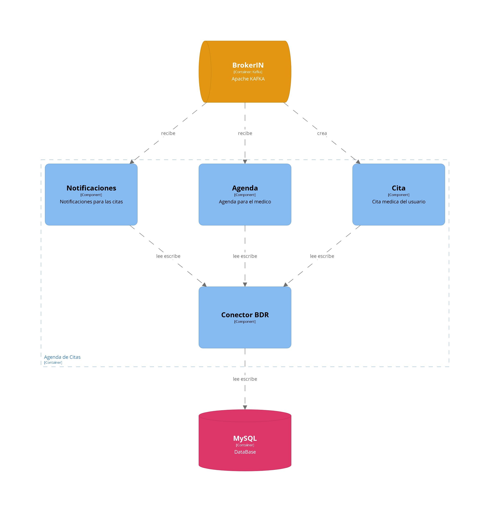
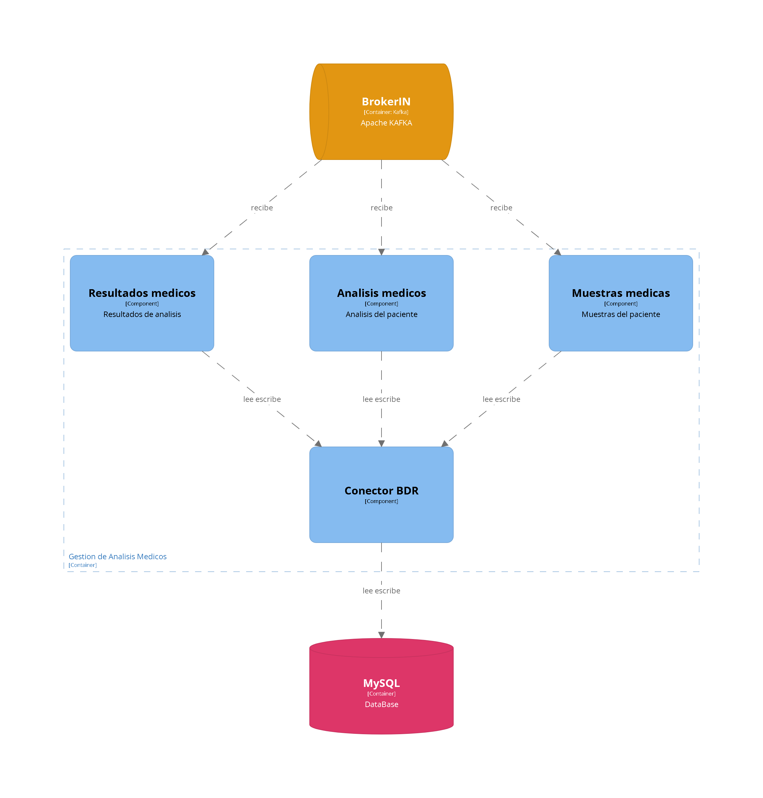
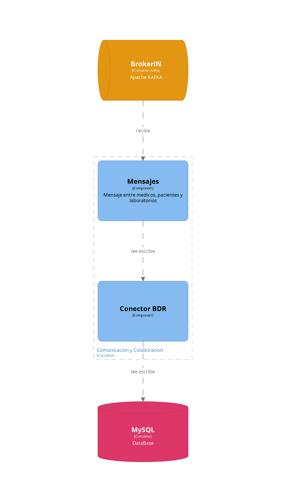
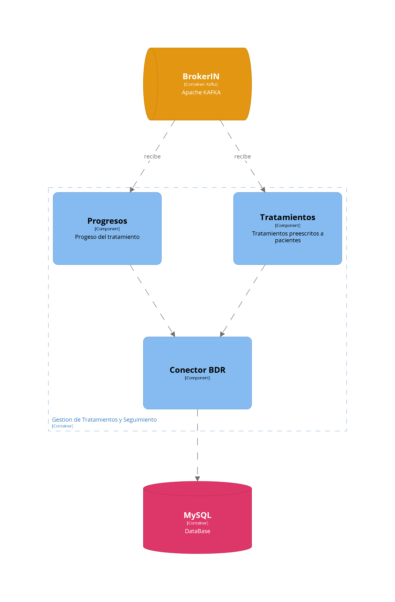
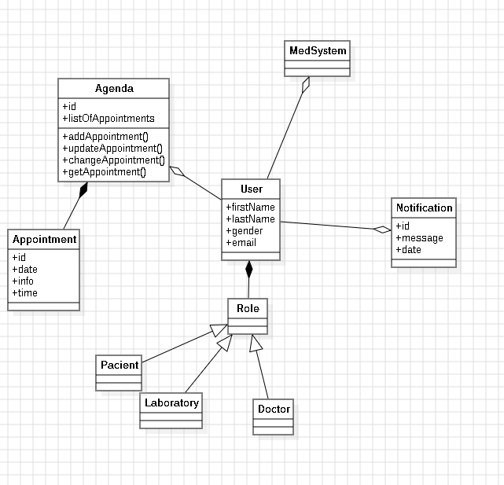
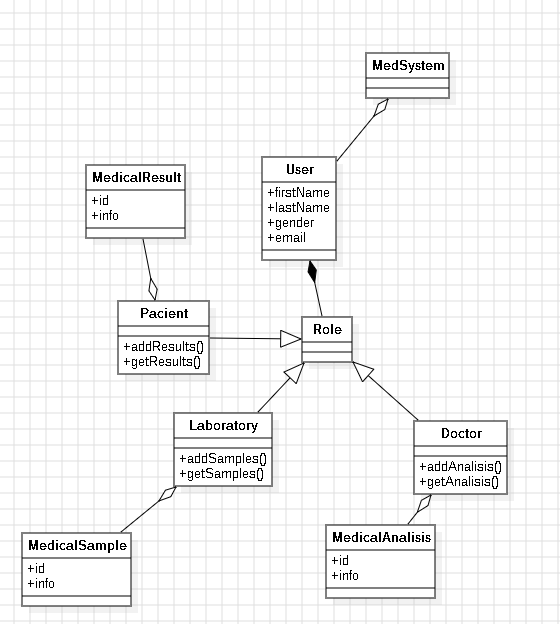
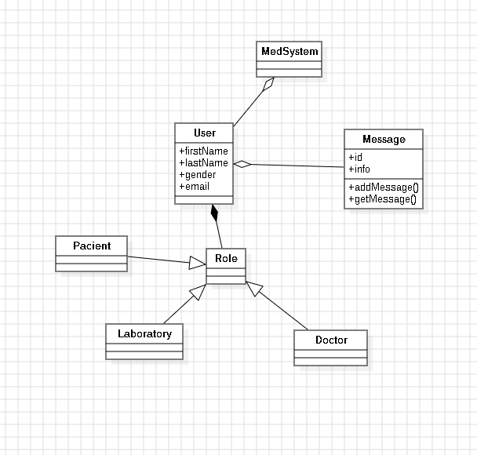

# Capítulo 4
## 4.1. Style Guidelines

Para optimizar la experiencia de todos los usuarios, dentro de nuestro landing Page proponemos un diseño de interfaz atractivo, y responsivo que se adapte a distintas dimensiones para los distintos dispositivos. Asimismo, hemos elegido colores llamativos, imágenes de buena calidad y se implementa un navbar intuitivo para que el usuario pueda desplazarse por la página de manera cómoda y fluida. Con todo esto, buscamos proporcionar una experiencia amigable y práctica para todos los usuarios.

	

### 4.1.1. General Style Guidelines

<h4><strong>Branding:</strong> </h4>

Nuestro logro hace alusión al tema que se está trabajando en este proyecto, el cual busca ayudar a los traumatólogos con un sistema médico, es por esto que en nuestro logo se ve una cruz que hace referencia a la salud de una persona. De este modo, se crea una representación visual efectiva y reconocible ante cualquier usuario que lo vea. 

<h4><strong>Typography:</strong> </h4>

En cuanto a la elección de la tipografía, se eligió la fuente “Poppins”, puesto que no solo se quería que la fuente sea solo un estilo que intentara captar la atención del usuario, sino también era fundamental que sea legible y estéticamente agradable para el usuario. Con esta fuente, se logra lo deseado y se consigue brindar la información de manera clara dentro de la página. Además, para algunos subtitulos se utiliza la fuente "Oswald", para brindar variedad; y en caso de errores se utiliza fuentes "sans-serif" en caso de que alguna de las fuentes anteriores no funcionen.

 

<h4><strong>Paleta de colores:</strong> </h4>

La paleta de colores se baso en algunos colores llamativos parecidos al color azul, que tuvo ciertas variaciones en la página, como el difuminado en la imagen representativa o el degradado que tuvo en el footer.

 
 

<h4><strong>Colores neutros:</strong> </h4>

El único color neutro que se eligió fue el blanco

### 4.1.2. Web Style Guidelines

En MedSystem, se ha elegido cuidadosamente los elementos de estilo web para que el usuario tenga una experiencia que refleje la esencia de la plataforma y atienda a las necesidades de los segmentos objetivo de pacientes, doctores y laboratorios. Los colores base elegidos son variaciones al azul, para que haya más sintonía con la página y se vea agradable a la vista. Para el estilo de letra elegido, se optó por una tipografía legible y formal, ya que se desea que el usuario logre entender la información de manera clara y efectiva, es por esto que también se emplean distintos tamaños de fuente, con el fin de dar accesibilidad a todo los usuarios, y puedan interactuar con la plataforma sin ningún problema. 

<h4><strong>Colores base:</strong> </h4>
 
 

<h4><strong>Colores neutros:</strong> </h4>

<h4><strong>Estilo de letras:</strong> </h4>
 

<h4><strong>Botones:</strong> </h4>
 

## 4.2. Information Architecture
### 4.2.1. Organization Systems
### 4.2.2. Labeling Systems
### 4.2.3. SEO Tags and Meta Tag
### 4.2.4. Searching Systems
### 4.2.5. Navigation Systems

## 4.3. Landing Page UI Design
### 4.3.1. Landing Page Wireframe

<td>

  
</td>
<td>

  
</td>
<td>

  
</td>
<td>

  
</td>  
<td>

  
</td>
<td>

  
</td>
<td>

  
</td>
<td>

  
</td>

### 4.3.2. Landing Page Mock-up

<td>

  
</td>
<td>

  
</td>
<td>

  
</td>
<td>

  
</td>
<td>

  
</td>
<td>

  
</td>
<td>

  
</td>
<td>

  
</td>

### 4.4.1. Web Applications Wireframes

Login patient
<td>

  
</td> 
Login doctor
<td>

  
</td>
Login consultancy
<td>

  
</td>
Register patient
<td>

  
</td>
Register doctor
<td>

  
</td>
Register consultancy
<td>

  
</td>
Doctor appointment
<td>

  
</td>
Doctor appointment 2
<td>

  
</td>
  Doctor chat
<td>

  
</td>
Doctor treatments for pacient
<td>

  
</td>
Doctor request history
<td>

  
</td>
Doctor request results
<td>

  
</td>

### 4.4.2. Web Applications Wireflow Diagrams

User goal 1: Como desarrollador, quiero desarrollar un sistema de gestión de citas para MedSystem, para que los docotres y pacientes puedan programar y gestionar sus citas de manera eficiente.

<td>

  
</td>
<td>

  
</td>

User goal 2: Como médico traumatológico, quiero poder comunicarme de manera segura con mis pacientes a través de la plataforma MedSystem, para poder proporcionar orientación, responder preguntas y mantener una línea abierta de comunicación durante todo el proceso de tratamiento.

<td>

  
</td>

User goal 3: Como médico traumatológico, quiero tener acceso a informes y análisis de datos sobre el progreso y la efectividad de los tratamientos de mis pacientes a lo largo del tiempo, para poder evaluar la eficacia de diferentes enfoques de tratamiento y mejorar continuamente mis prácticas médicas.

<td>

  
</td>

User goal 4: Como desarrollador, quiero incorporar una función de seguimiento de historias clínicas en MedSystem, para que los doctores puedan acceder fácilmente al historial médico de cada paciente, y puedan realizar un seguimiento preciso de su tratamiento.

<td>

  
</td>

User goal 5: Como técnico de laboratorio, quiero un sistema que registre automáticamente los resultados de los análisis y los comunique al médico a través de la aplicación para agilizar la entrega de información y mejorar la atención al paciente.

<td>

  
</td>

### 4.4.2. Web Applications Mock-ups

Login patient
<td>

  
</td> 
Login doctor
<td>

  
</td>
Login consultancy
<td>

  
</td>
Register patient
<td>

  
</td>
Register doctor
<td>

  
</td>
Register consultancy
<td>

  
</td>
Doctor appointment
<td>

  
</td>
Doctor appointment 2
<td>

  
</td>
  Doctor chat
<td>

  
</td>
Doctor treatments for pacient
<td>

  
</td>
Doctor request history
<td>

  
</td>
Doctor request results
<td>

  
</td>

### 4.4.3. Web Applications User Flow Diagrams

User goal 1: Como desarrollador, quiero desarrollar un sistema de gestión de citas para MedSystem, para que los docotres y pacientes puedan programar y gestionar sus citas de manera eficiente.

<td>

  
</td>
<td>

  
</td>

User goal 2: Como médico traumatológico, quiero poder comunicarme de manera segura con mis pacientes a través de la plataforma MedSystem, para poder proporcionar orientación, responder preguntas y mantener una línea abierta de comunicación durante todo el proceso de tratamiento.

<td>

  
</td>

User goal 3: Como médico traumatológico, quiero tener acceso a informes y análisis de datos sobre el progreso y la efectividad de los tratamientos de mis pacientes a lo largo del tiempo, para poder evaluar la eficacia de diferentes enfoques de tratamiento y mejorar continuamente mis prácticas médicas.

<td>

  
</td>

User goal 4: Como desarrollador, quiero incorporar una función de seguimiento de historias clínicas en MedSystem, para que los doctores puedan acceder fácilmente al historial médico de cada paciente, y puedan realizar un seguimiento preciso de su tratamiento.

<td>

  
</td>

User goal 5: Como técnico de laboratorio, quiero un sistema que registre automáticamente los resultados de los análisis y los comunique al médico a través de la aplicación para agilizar la entrega de información y mejorar la atención al paciente.

<td>

  
</td>

## 4.5. Web Applications Prototyping

## 4.6. Domain-Driven Software Architecture
### 4.6.1. Software Architecture Context Diagram

### 4.6.2. Software Architecture Container Diagrams

### 4.6.3. Software Architecture Components Diagrams

## 4.7. Software Object-Oriented Design
### 4.7.1. Class Diagrams

<u>Bounded Context 1</u>

<u>Bounded Context 2</u>

<u>Bounded Context 3</u>

<u>Bounded Context 4</u>

<u>Bounded Context 5</u>

### 4.7.2. Class Dictionary

## 4.8. Database Design
### 4.8.1. Database Diagram

